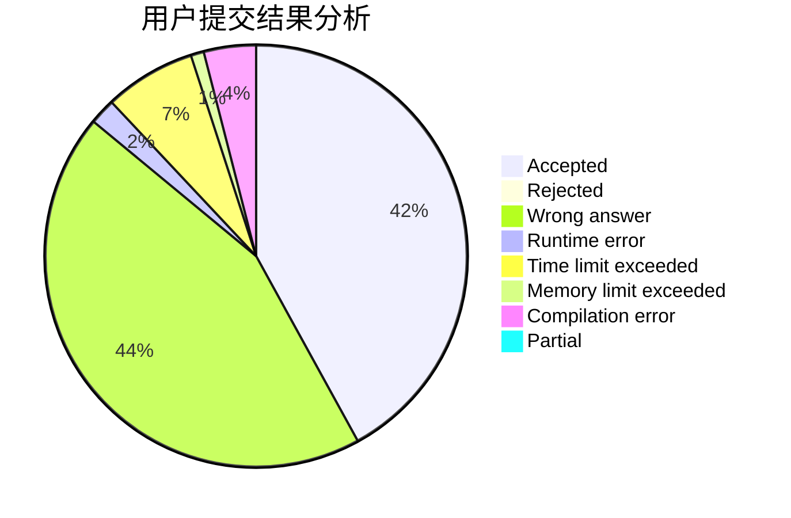
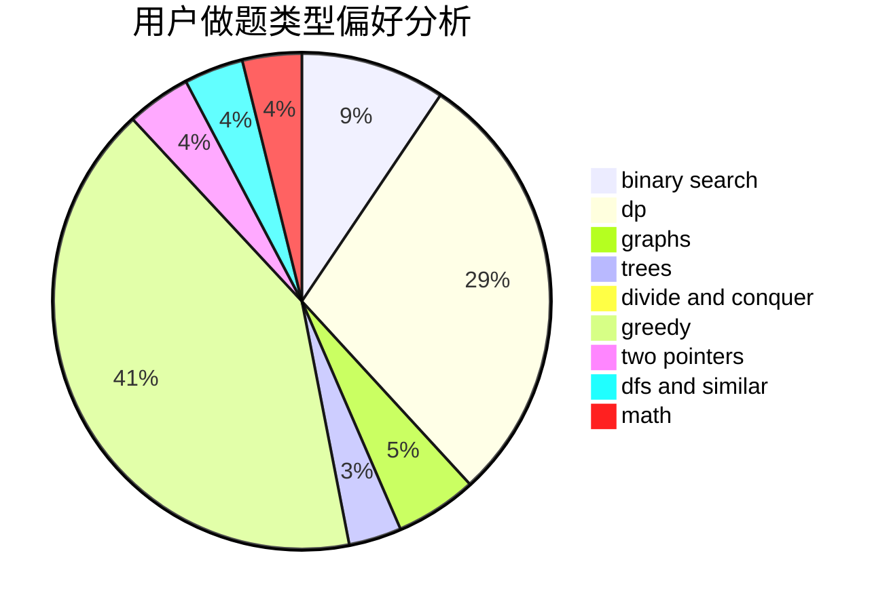

# nn020701

<!-- tabs:start -->

#### **用户提交结果分析**

#### **用户做题类型偏好分析**

<!-- tabs:end -->
# 推荐题目
[993B](https://codeforces.com/contest/993/problem/B)
[1435E](https://codeforces.com/contest/1435/problem/E)
[56A](https://codeforces.com/contest/56/problem/A)
[802N](https://codeforces.com/contest/802/problem/N)
[86C](https://codeforces.com/contest/86/problem/C)
[1272E](https://codeforces.com/contest/1272/problem/E)
[519E](https://codeforces.com/contest/519/problem/E)
[1772](https://codeforces.com/contest/177/problem/2)
[1145B](https://codeforces.com/contest/1145/problem/B)
[244C](https://codeforces.com/contest/244/problem/C)
