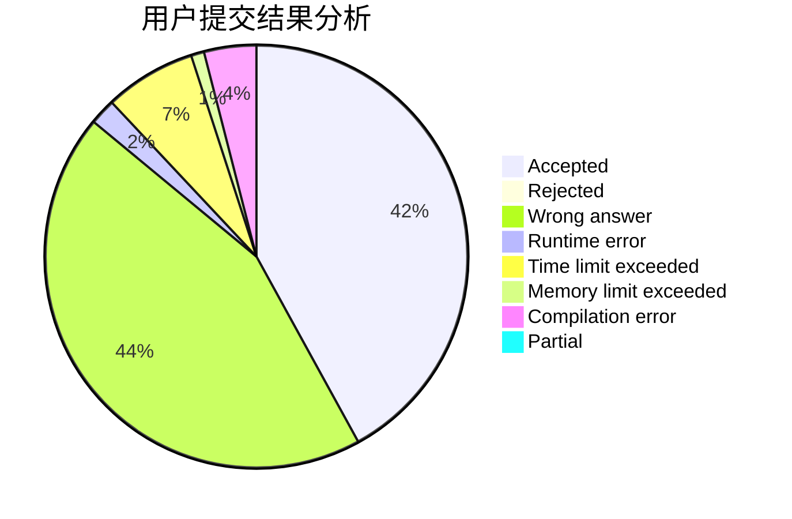
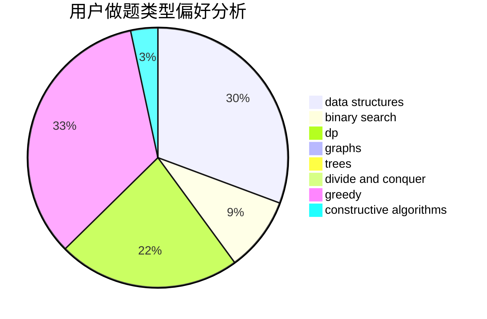
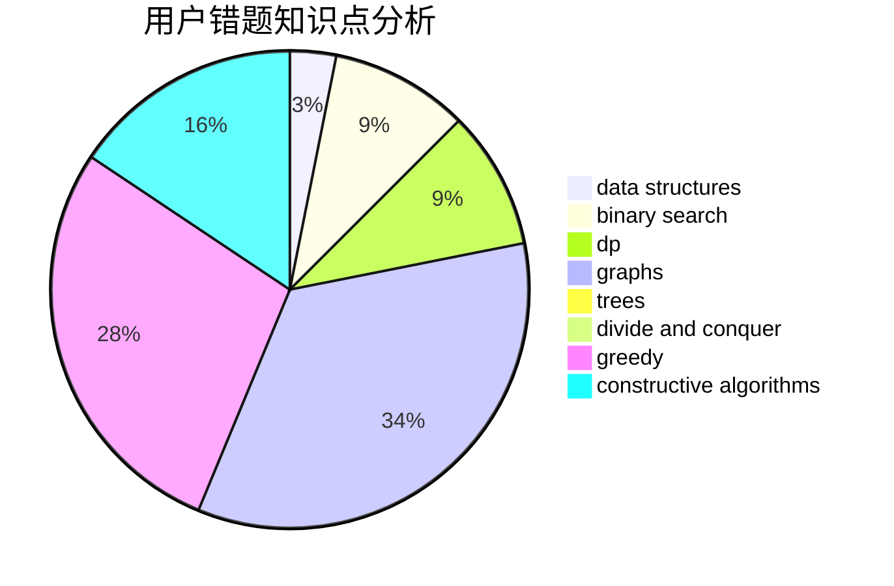

# nn020701

<!-- tabs:start -->

#### **用户提交结果分析**

#### **用户做题类型偏好分析**

#### **用户错题知识点分析**

<!-- tabs:end -->
# 推荐题目
[993B](https://codeforces.com/contest/993/problem/B)		bitmasks,
                        brute force		  
[1435E](https://codeforces.com/contest/1435/problem/E)		dsu,graphs,sortings,trees		  
[56A](https://codeforces.com/contest/56/problem/A)		implementation		  
[802N](https://codeforces.com/contest/802/problem/N)		binary search,
                        flows,
                        graphs		  
[86C](https://codeforces.com/contest/86/problem/C)		dp,
                        string suffix structures,
                        trees		  
[1272E](https://codeforces.com/contest/1272/problem/E)		dfs and similar,
                        graphs,
                        shortest paths		  
[519E](https://codeforces.com/contest/519/problem/E)		binary search,
                        data structures,
                        dfs and similar,
                        dp,
                        trees		  
[1772](https://codeforces.com/contest/177/problem/2)		dsu,graphs,sortings,trees		  
[1145B](https://codeforces.com/contest/1145/problem/B)		brute force		  
[244C](https://codeforces.com/contest/244/problem/C)		dsu,graphs,sortings,trees		  
