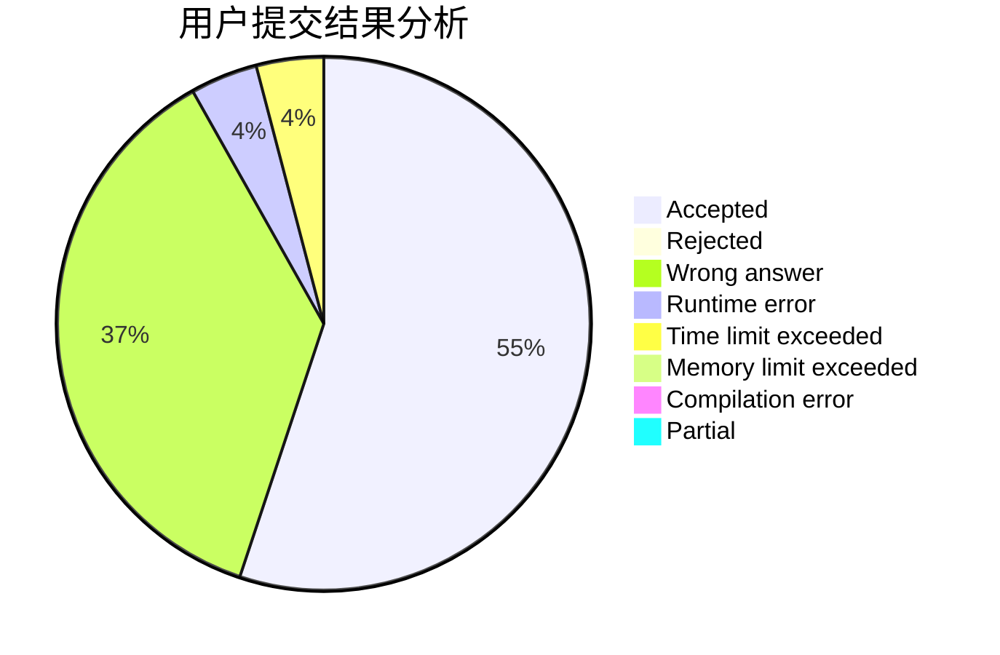
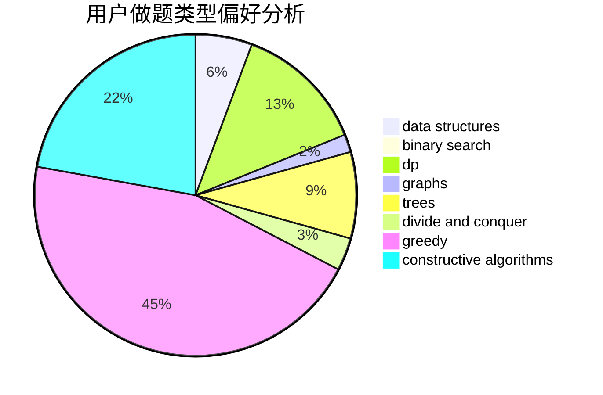
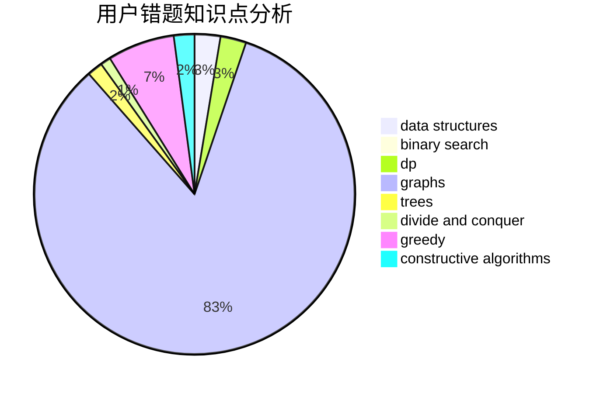

# nnm_shiraha

<!-- tabs:start -->

#### **用户提交结果分析**

#### **用户做题类型偏好分析**

#### **用户错题知识点分析**

<!-- tabs:end -->
# 推荐题目
[370A](https://codeforces.com/contest/370/problem/A)		graphs,
                        math,
                        shortest paths		  
[1256C](https://codeforces.com/contest/1256/problem/C)		greedy		  
[145C](https://codeforces.com/contest/145/problem/C)		combinatorics,
                        dp,
                        math		  
[865B](https://codeforces.com/contest/865/problem/B)		binary search,
                        sortings,
                        ternary search		  
[1044F](https://codeforces.com/contest/1044/problem/F)		data structures		  
[994A](https://codeforces.com/contest/994/problem/A)		implementation		  
[792D](https://codeforces.com/contest/792/problem/D)		bitmasks,
                        trees		  
[1064F](https://codeforces.com/contest/1064/problem/F)		dsu,graphs,sortings,trees		  
[878E](https://codeforces.com/contest/878/problem/E)		combinatorics,
                        dp		  
[780F](https://codeforces.com/contest/780/problem/F)		bitmasks,
                        dp,
                        graphs,
                        matrices		  
