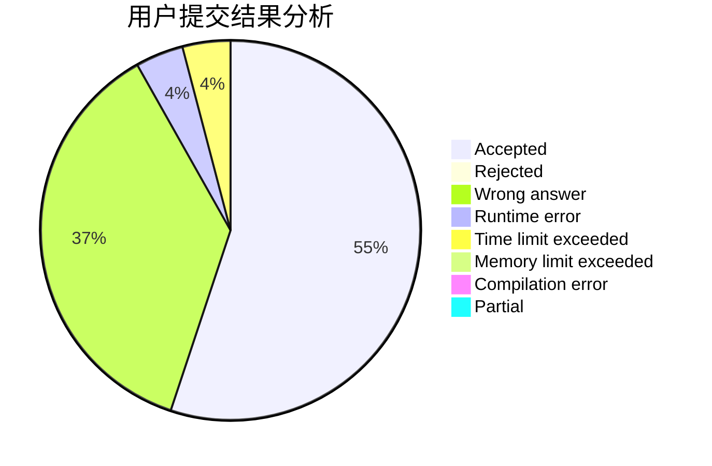
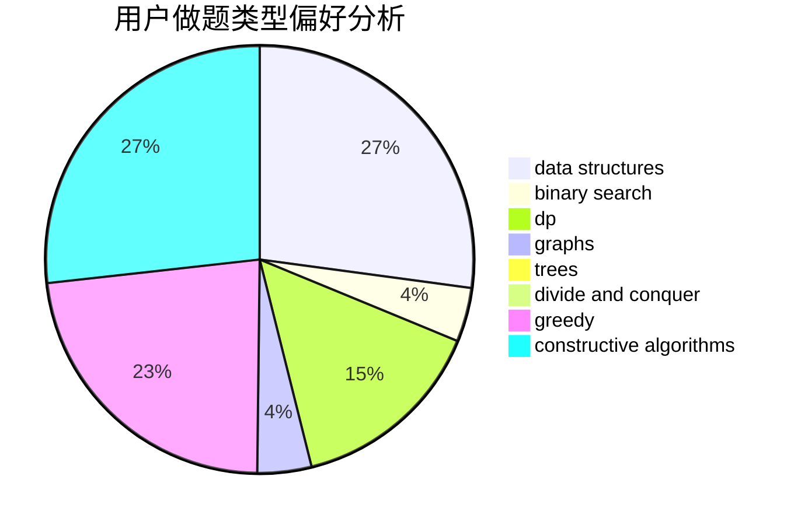
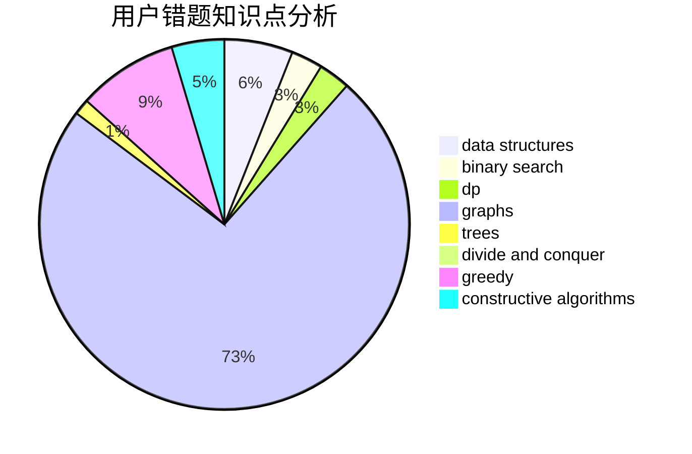

# nnm_shiraha

<!-- tabs:start -->

#### **用户提交结果分析**

#### **用户做题类型偏好分析**

#### **用户错题知识点分析**

<!-- tabs:end -->
# 推荐题目
[343E](https://codeforces.com/contest/343/problem/E)		brute force,
                        dfs and similar,
                        divide and conquer,
                        flows,
                        graphs,
                        greedy,
                        trees		  
[1251B](https://codeforces.com/contest/1251/problem/B)		greedy,
                        strings		  
[1451C](https://codeforces.com/contest/1451/problem/C)		dp,
                        greedy,
                        hashing,
                        implementation,
                        strings		  
[847B](https://codeforces.com/contest/847/problem/B)		binary search,
                        data structures		  
[1044A](https://codeforces.com/contest/1044/problem/A)		binary search,
                        two pointers		  
[97A](https://codeforces.com/contest/97/problem/A)		brute force,
                        implementation		  
[773D](https://codeforces.com/contest/773/problem/D)		dp,
                        graphs,
                        shortest paths		  
[1064C](https://codeforces.com/contest/1064/problem/C)		dsu,graphs,sortings,trees		  
[860E](https://codeforces.com/contest/860/problem/E)		data structures,
                        dfs and similar,
                        trees		  
[762B](https://codeforces.com/contest/762/problem/B)		greedy,
                        implementation,
                        sortings,
                        two pointers		  
