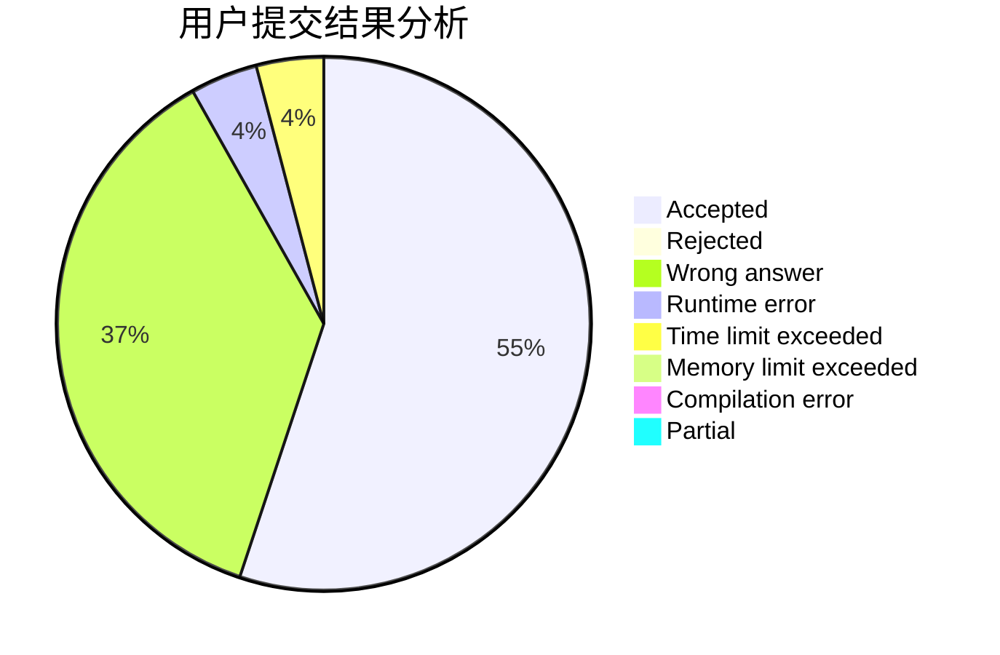
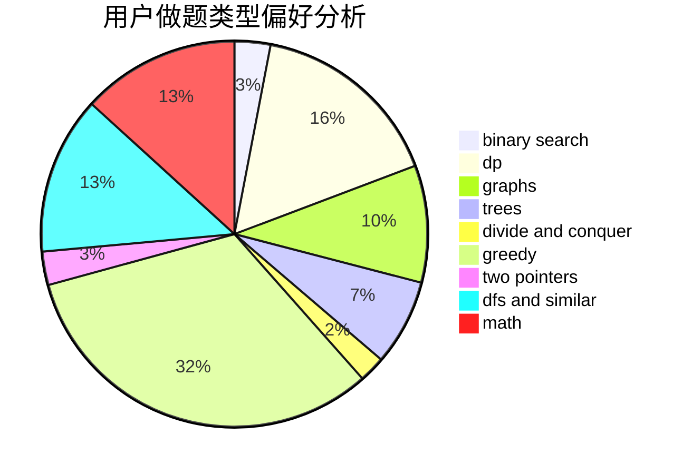

# nnm_shiraha

<!-- tabs:start -->

#### **用户提交结果分析**

#### **用户做题类型偏好分析**

<!-- tabs:end -->
# 推荐题目
[370A](https://codeforces.com/contest/370/problem/A)
[1256C](https://codeforces.com/contest/1256/problem/C)
[145C](https://codeforces.com/contest/145/problem/C)
[865B](https://codeforces.com/contest/865/problem/B)
[1044F](https://codeforces.com/contest/1044/problem/F)
[994A](https://codeforces.com/contest/994/problem/A)
[792D](https://codeforces.com/contest/792/problem/D)
[1064F](https://codeforces.com/contest/1064/problem/F)
[878E](https://codeforces.com/contest/878/problem/E)
[780F](https://codeforces.com/contest/780/problem/F)
