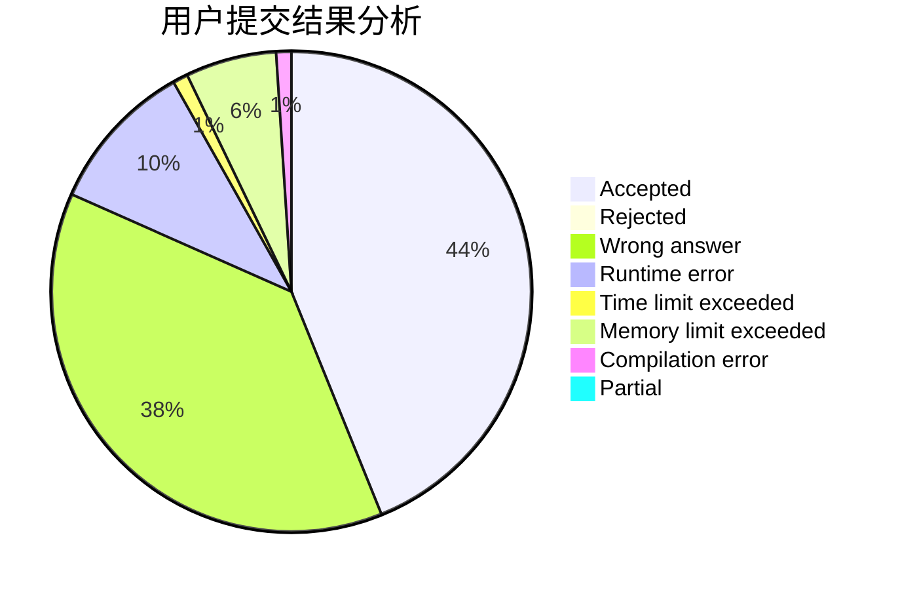
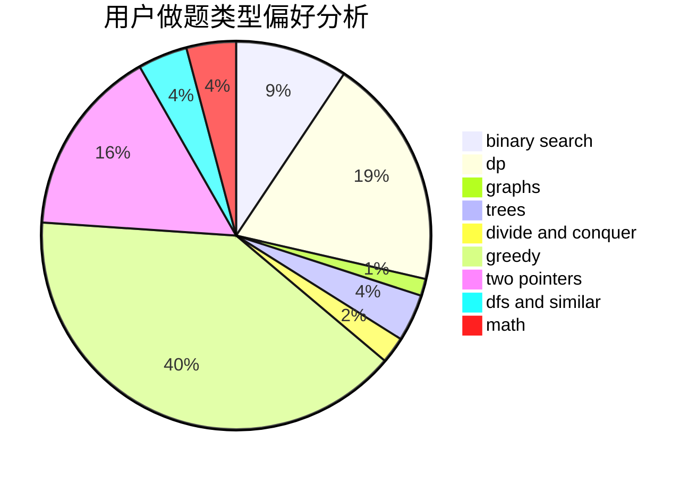

# nocriz

<!-- tabs:start -->

#### **用户提交结果分析**

#### **用户做题类型偏好分析**

<!-- tabs:end -->
# 推荐题目
[1455D](https://codeforces.com/contest/1455/problem/D)
[1436E](https://codeforces.com/contest/1436/problem/E)
[1393D](https://codeforces.com/contest/1393/problem/D)
[935B](https://codeforces.com/contest/935/problem/B)
[962C](https://codeforces.com/contest/962/problem/C)
[898A](https://codeforces.com/contest/898/problem/A)
[414B](https://codeforces.com/contest/414/problem/B)
[976E](https://codeforces.com/contest/976/problem/E)
[1017B](https://codeforces.com/contest/1017/problem/B)
[879D](https://codeforces.com/contest/879/problem/D)
