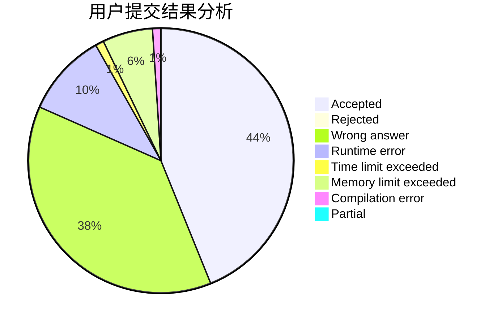
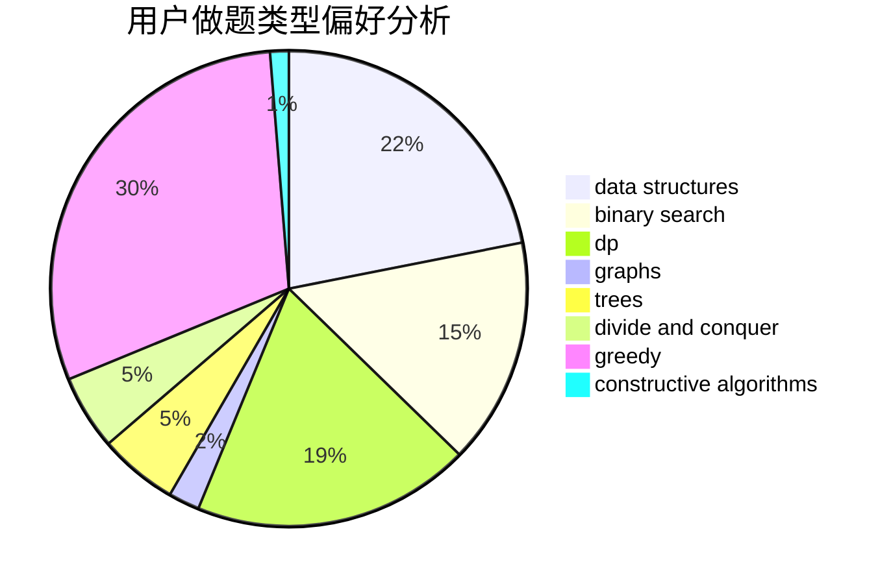
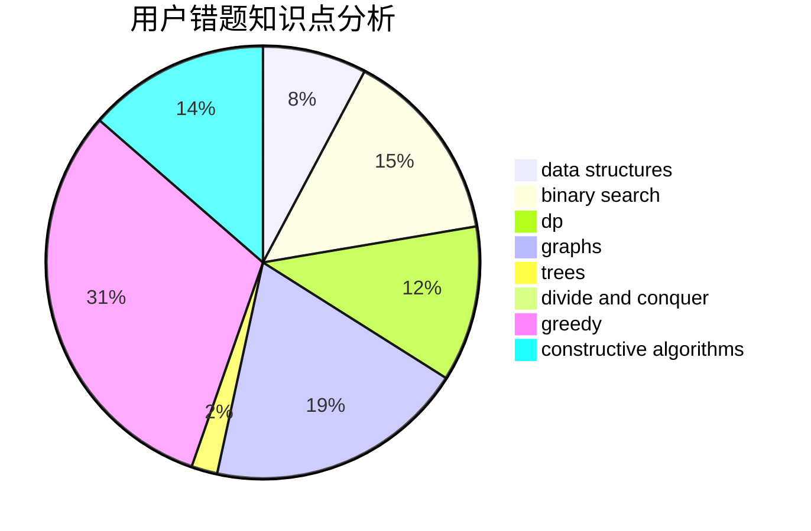

# nocriz

<!-- tabs:start -->

#### **用户提交结果分析**

#### **用户做题类型偏好分析**

#### **用户错题知识点分析**

<!-- tabs:end -->
# 推荐题目
[1455D](https://codeforces.com/contest/1455/problem/D)		dp,
                        greedy,
                        sortings		  
[1436E](https://codeforces.com/contest/1436/problem/E)		binary search,
                        data structures,
                        two pointers		  
[1393D](https://codeforces.com/contest/1393/problem/D)		dfs and similar,
                        dp,
                        implementation,
                        shortest paths		  
[935B](https://codeforces.com/contest/935/problem/B)		implementation		  
[962C](https://codeforces.com/contest/962/problem/C)		brute force,
                        implementation,
                        math		  
[898A](https://codeforces.com/contest/898/problem/A)		implementation,
                        math		  
[414B](https://codeforces.com/contest/414/problem/B)		combinatorics,
                        dp,
                        number theory		  
[976E](https://codeforces.com/contest/976/problem/E)		greedy,
                        sortings		  
[1017B](https://codeforces.com/contest/1017/problem/B)		implementation,
                        math		  
[879D](https://codeforces.com/contest/879/problem/D)		dsu,graphs,sortings,trees		  
