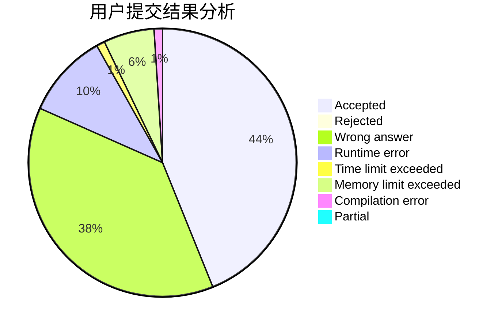
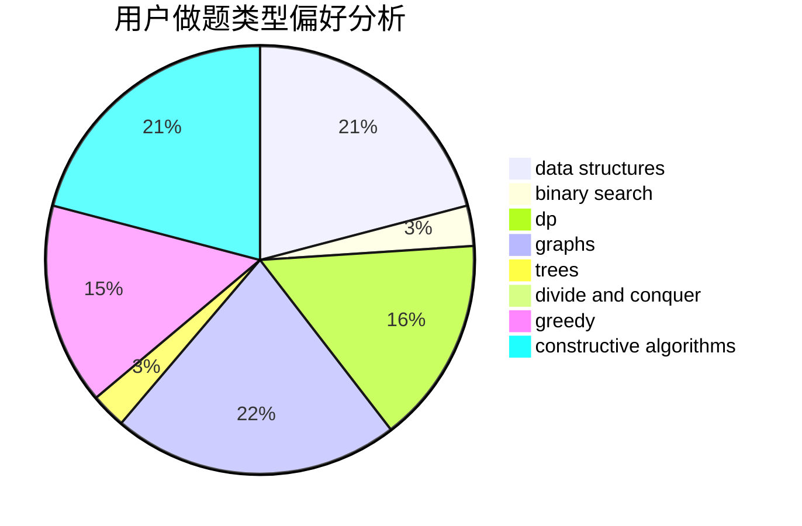
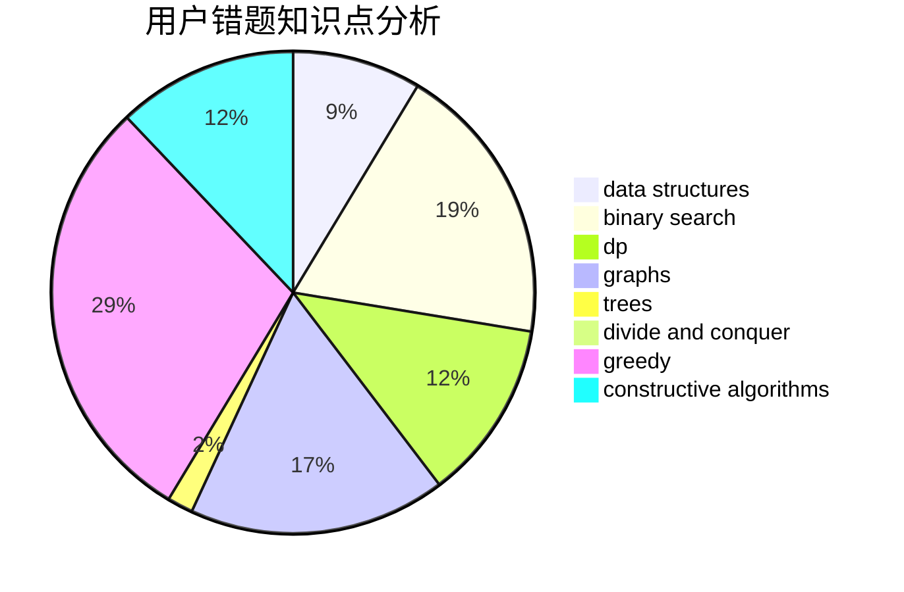

# nocriz

<!-- tabs:start -->

#### **用户提交结果分析**

#### **用户做题类型偏好分析**

#### **用户错题知识点分析**

<!-- tabs:end -->
# 推荐题目
[1446B](https://codeforces.com/contest/1446/problem/B)		dp,
                        strings		  
[1427G](https://codeforces.com/contest/1427/problem/G)		flows,
                        graphs		  
[1384A](https://codeforces.com/contest/1384/problem/A)		constructive algorithms,
                        greedy,
                        strings		  
[915C](https://codeforces.com/contest/915/problem/C)		dp,
                        greedy		  
[940F](https://codeforces.com/contest/940/problem/F)		brute force,
                        data structures		  
[877B](https://codeforces.com/contest/877/problem/B)		brute force,
                        dp		  
[383A](https://codeforces.com/contest/383/problem/A)		data structures,
                        greedy		  
[954H](https://codeforces.com/contest/954/problem/H)		combinatorics,
                        dp		  
[1016F](https://codeforces.com/contest/1016/problem/F)		dfs and similar,
                        dp,
                        trees		  
[862A](https://codeforces.com/contest/862/problem/A)		greedy,
                        implementation		  
