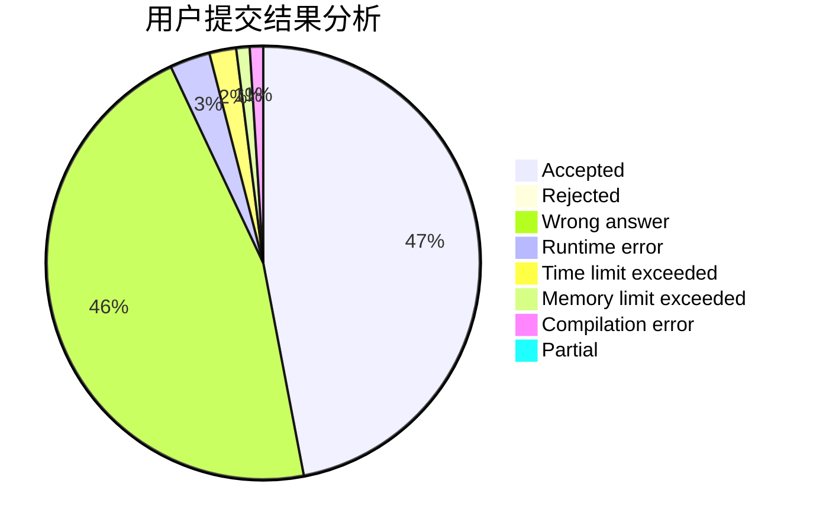
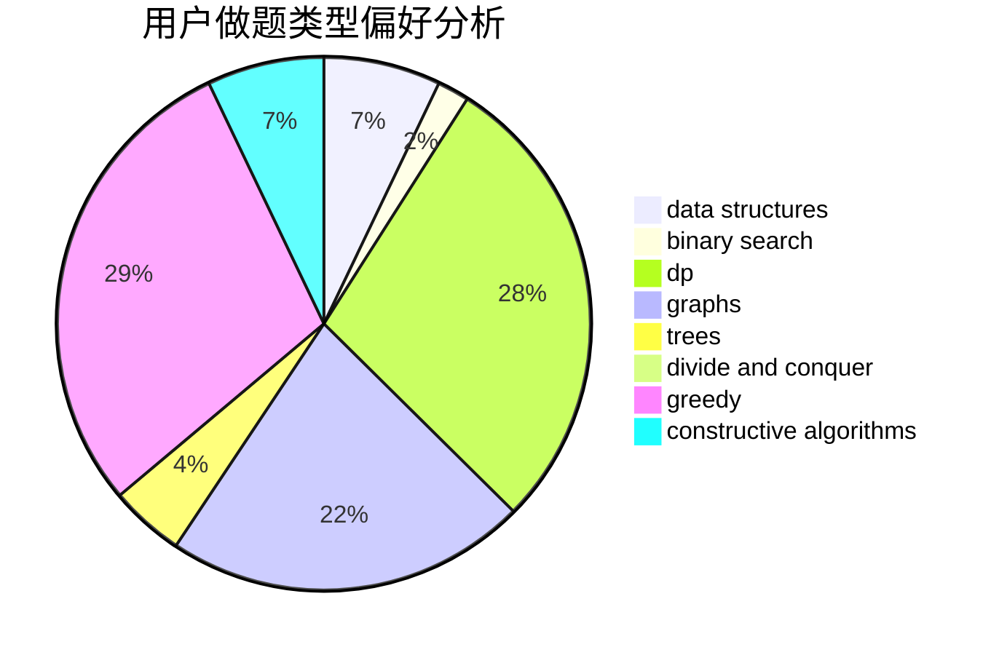

# noob_fatguy

<!-- tabs:start -->

#### **用户提交结果分析**

#### **用户做题类型偏好分析**

#### **用户错题知识点分析**

<!-- tabs:end -->
# 推荐题目
[1067E](https://codeforces.com/contest/1067/problem/E)		dp,
                        graph matchings,
                        math,
                        trees		  
[1291E](https://codeforces.com/contest/1291/problem/E)		dsu,graphs,sortings,trees		  
[427D](https://codeforces.com/contest/427/problem/D)		dp,
                        string suffix structures,
                        strings		  
[1144G](https://codeforces.com/contest/1144/problem/G)		dp,
                        greedy		  
[277D](https://codeforces.com/contest/277/problem/D)		dp,
                        probabilities		  
[44B](https://codeforces.com/contest/44/problem/B)		implementation		  
[633D](https://codeforces.com/contest/633/problem/D)		brute force,
                        dp,
                        hashing,
                        implementation,
                        math		  
[15D](https://codeforces.com/contest/15/problem/D)		data structures,
                        implementation,
                        sortings		  
[309B](https://codeforces.com/contest/309/problem/B)		dp,
                        two pointers		  
[354D](https://codeforces.com/contest/354/problem/D)		dp		  
