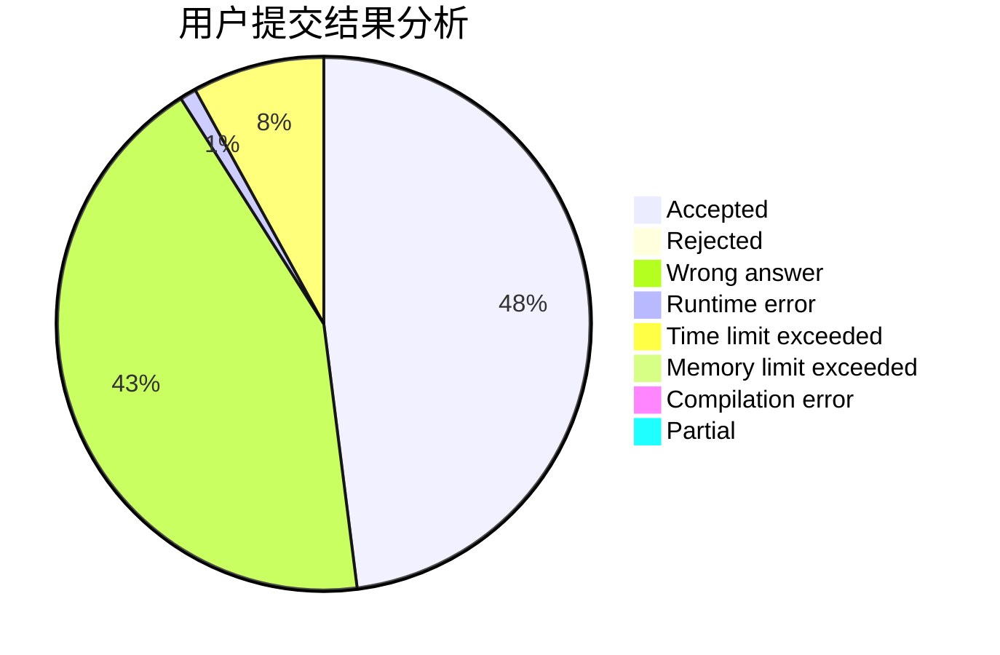
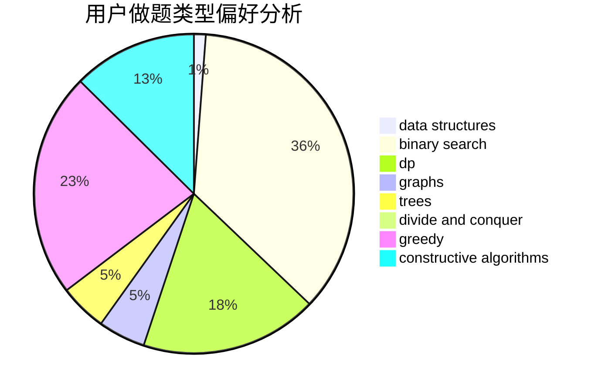
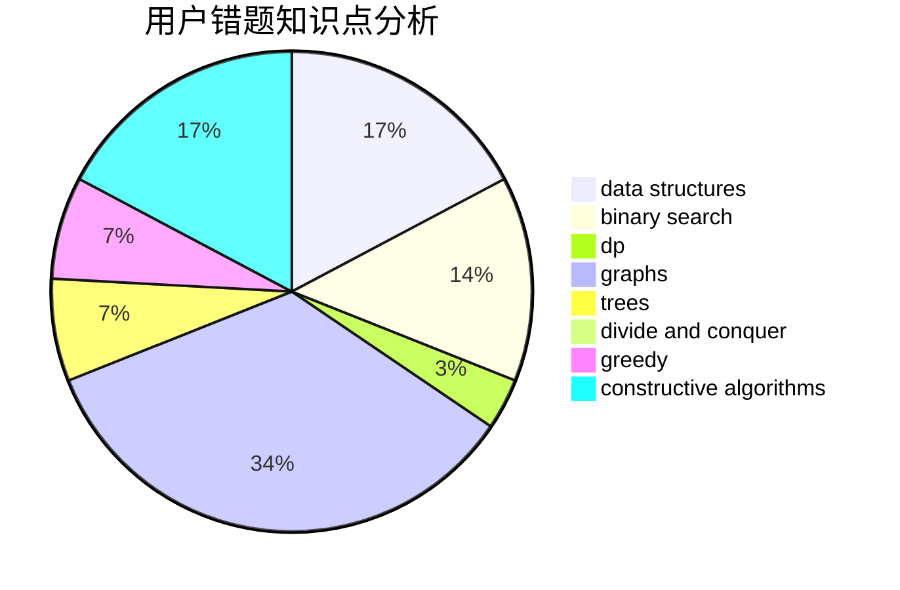

# npucfy

<!-- tabs:start -->

#### **用户提交结果分析**

#### **用户做题类型偏好分析**

#### **用户错题知识点分析**

<!-- tabs:end -->
# 推荐题目
[864D](https://codeforces.com/contest/864/problem/D)		greedy,
                        implementation,
                        math		  
[1157D](https://codeforces.com/contest/1157/problem/D)		constructive algorithms,
                        greedy,
                        math		  
[370A](https://codeforces.com/contest/370/problem/A)		graphs,
                        math,
                        shortest paths		  
[983C](https://codeforces.com/contest/983/problem/C)		dp,
                        graphs,
                        shortest paths		  
[1115G2](https://codeforces.com/contest/1115G/problem/2)		*special problem		  
[501C](https://codeforces.com/contest/501/problem/C)		constructive algorithms,
                        data structures,
                        greedy,
                        sortings,
                        trees		  
[931A](https://codeforces.com/contest/931/problem/A)		brute force,
                        greedy,
                        implementation,
                        math		  
[1257C](https://codeforces.com/contest/1257/problem/C)		greedy,
                        implementation,
                        sortings,
                        strings,
                        two pointers		  
[1511D](https://codeforces.com/contest/1511/problem/D)		brute force,
                        constructive algorithms,
                        graphs,
                        greedy,
                        strings		  
[1366F](https://codeforces.com/contest/1366/problem/F)		binary search,
                        dp,
                        geometry,
                        graphs		  
