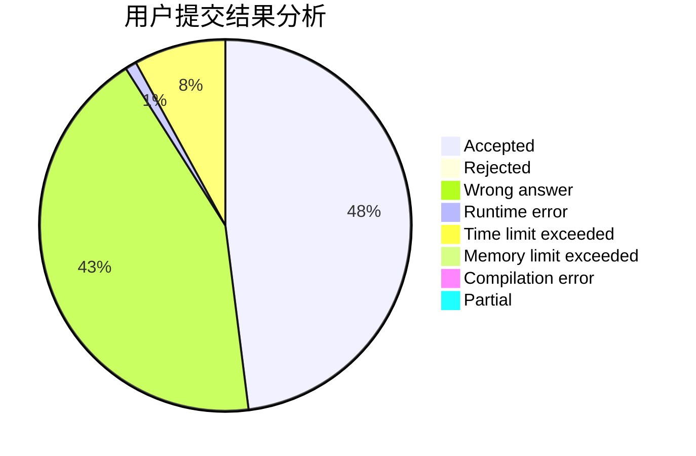
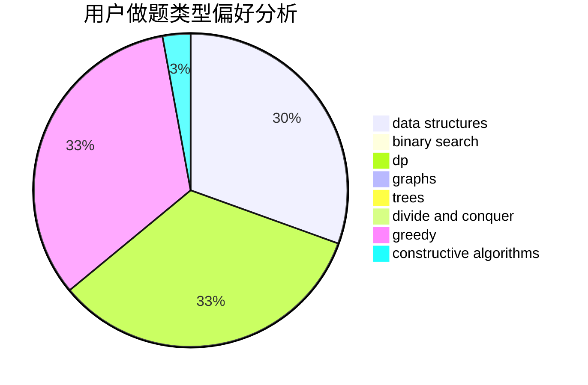
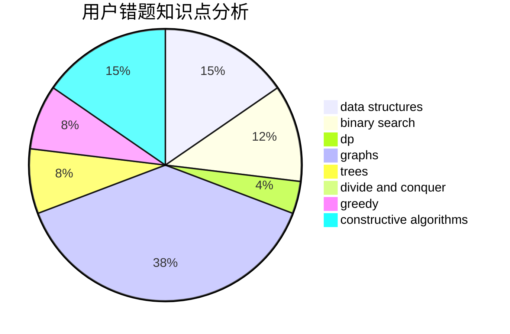

# npucfy

<!-- tabs:start -->

#### **用户提交结果分析**

#### **用户做题类型偏好分析**

#### **用户错题知识点分析**

<!-- tabs:end -->
# 推荐题目
[884A](https://codeforces.com/contest/884/problem/A)		implementation		  
[1159F](https://codeforces.com/contest/1159/problem/F)		dsu,graphs,sortings,trees		  
[3C](https://codeforces.com/contest/3/problem/C)		brute force,
                        games,
                        implementation		  
[999B](https://codeforces.com/contest/999/problem/B)		implementation		  
[11162](https://codeforces.com/contest/1116/problem/2)		dsu,graphs,sortings,trees		  
[523A](https://codeforces.com/contest/523/problem/A)		*special problem,
                        implementation		  
[952A](https://codeforces.com/contest/952/problem/A)		math		  
[1264C](https://codeforces.com/contest/1264/problem/C)		data structures,
                        probabilities		  
[16A](https://codeforces.com/contest/16/problem/A)		implementation		  
[1373E](https://codeforces.com/contest/1373/problem/E)		brute force,
                        constructive algorithms,
                        dp,
                        greedy		  
