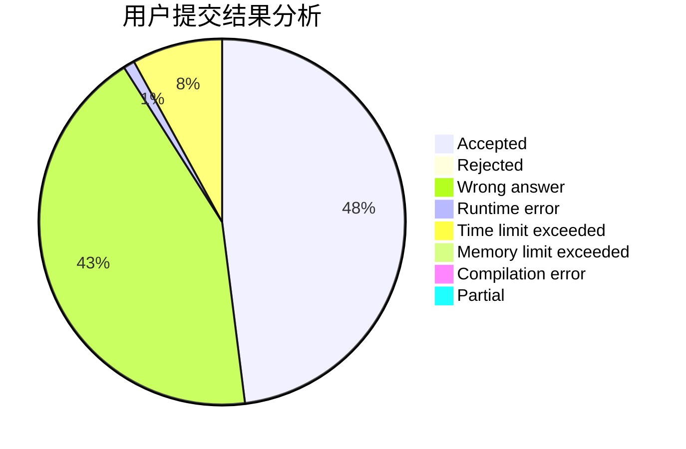
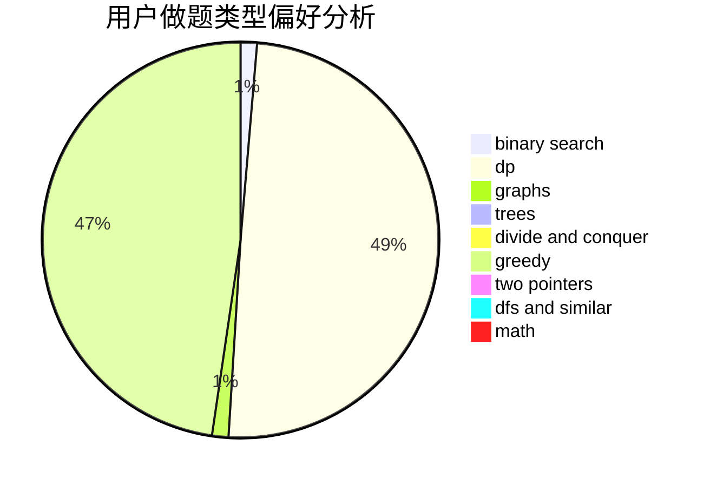

# npucfy

<!-- tabs:start -->

#### **用户提交结果分析**

#### **用户做题类型偏好分析**

<!-- tabs:end -->
# 推荐题目
[884A](https://codeforces.com/contest/884/problem/A)
[1159F](https://codeforces.com/contest/1159/problem/F)
[3C](https://codeforces.com/contest/3/problem/C)
[999B](https://codeforces.com/contest/999/problem/B)
[11162](https://codeforces.com/contest/1116/problem/2)
[523A](https://codeforces.com/contest/523/problem/A)
[952A](https://codeforces.com/contest/952/problem/A)
[1264C](https://codeforces.com/contest/1264/problem/C)
[16A](https://codeforces.com/contest/16/problem/A)
[1373E](https://codeforces.com/contest/1373/problem/E)
