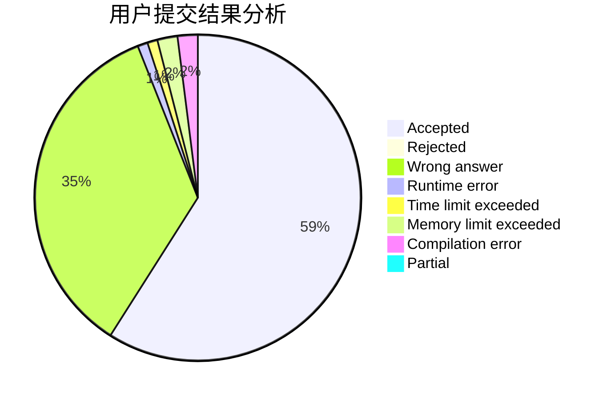
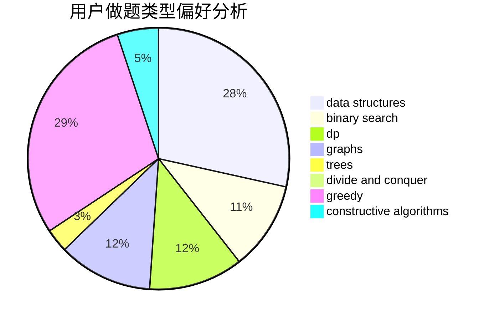

# nqiiii

<!-- tabs:start -->

#### **用户提交结果分析**

#### **用户做题类型偏好分析**

#### **用户错题知识点分析**

<!-- tabs:end -->
# 推荐题目
[1237F](https://codeforces.com/contest/1237/problem/F)		combinatorics,
                        dp		  
[1290F](https://codeforces.com/contest/1290/problem/F)		dp		  
[1262C](https://codeforces.com/contest/1262/problem/C)		dsu,graphs,sortings,trees		  
[688D](https://codeforces.com/contest/688/problem/D)		dsu,graphs,sortings,trees		  
[34A](https://codeforces.com/contest/34/problem/A)		implementation		  
[381A](https://codeforces.com/contest/381/problem/A)		greedy,
                        implementation,
                        two pointers		  
[801C](https://codeforces.com/contest/801/problem/C)		dsu,graphs,sortings,trees		  
[514D](https://codeforces.com/contest/514/problem/D)		binary search,
                        data structures,
                        two pointers		  
[1016D](https://codeforces.com/contest/1016/problem/D)		constructive algorithms,
                        flows,
                        math		  
[268E](https://codeforces.com/contest/268/problem/E)		math,
                        probabilities,
                        sortings		  
