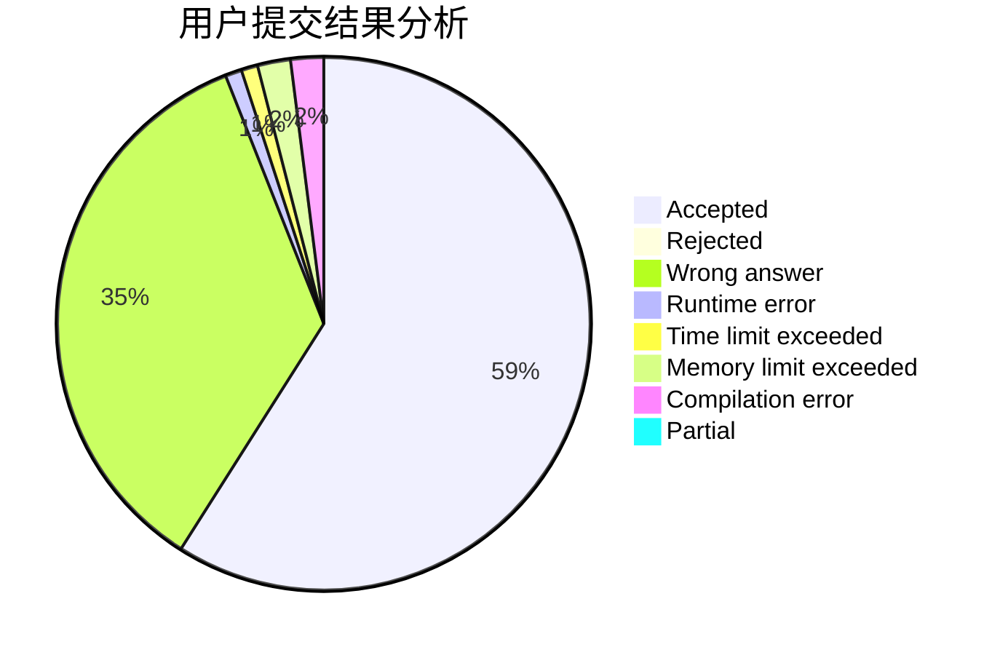
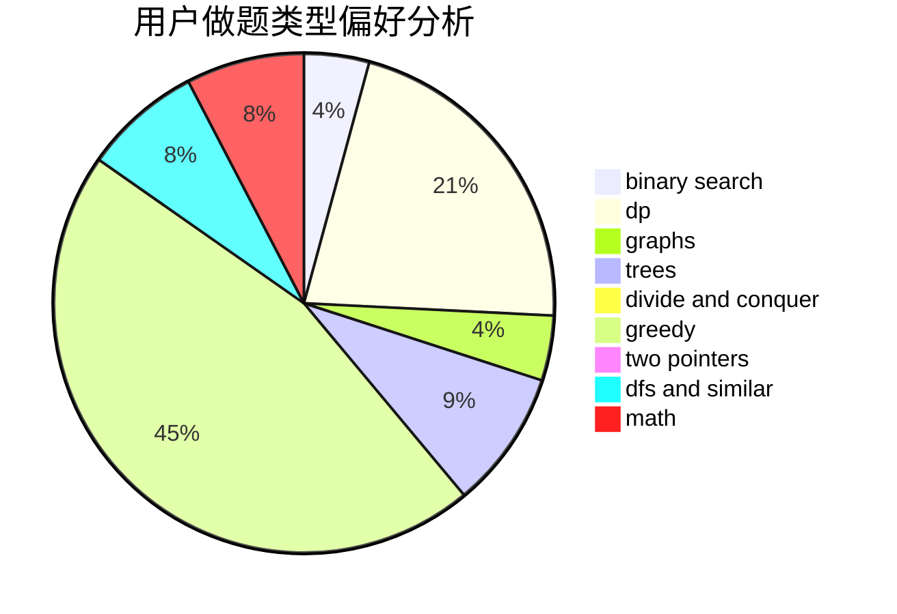

# nqiiii

<!-- tabs:start -->

#### **用户提交结果分析**

#### **用户做题类型偏好分析**

<!-- tabs:end -->
# 推荐题目
[1237F](https://codeforces.com/contest/1237/problem/F)
[1290F](https://codeforces.com/contest/1290/problem/F)
[1262C](https://codeforces.com/contest/1262/problem/C)
[688D](https://codeforces.com/contest/688/problem/D)
[34A](https://codeforces.com/contest/34/problem/A)
[381A](https://codeforces.com/contest/381/problem/A)
[801C](https://codeforces.com/contest/801/problem/C)
[514D](https://codeforces.com/contest/514/problem/D)
[1016D](https://codeforces.com/contest/1016/problem/D)
[268E](https://codeforces.com/contest/268/problem/E)
