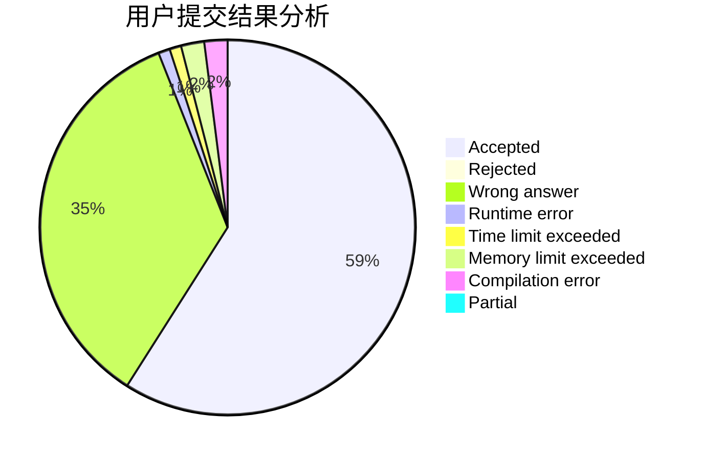
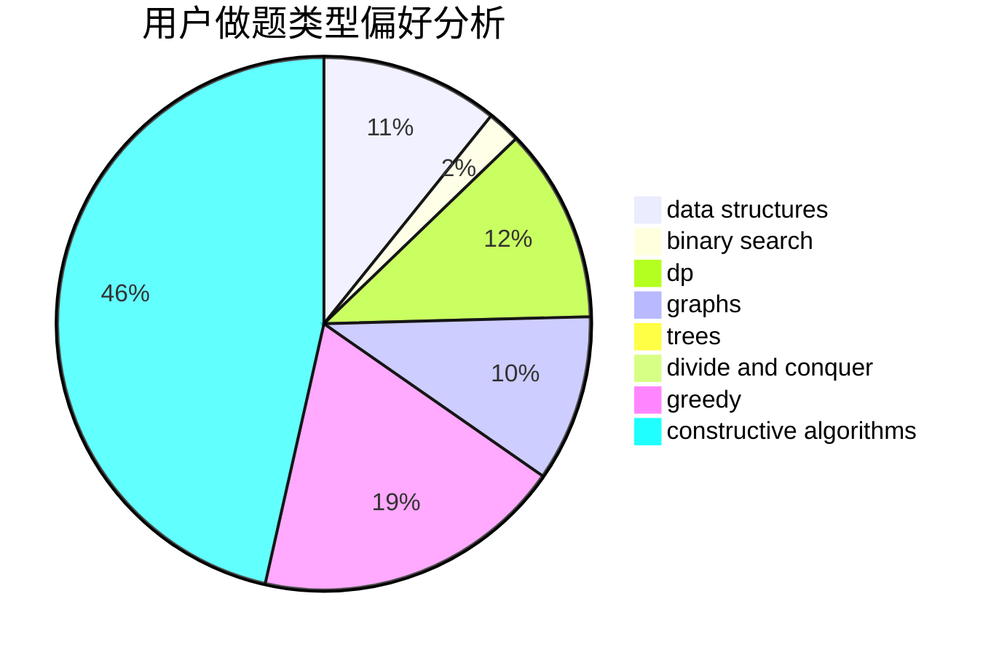

# nqiiii

<!-- tabs:start -->

#### **用户提交结果分析**

#### **用户做题类型偏好分析**

#### **用户错题知识点分析**

<!-- tabs:end -->
# 推荐题目
[1229B](https://codeforces.com/contest/1229/problem/B)		dsu,graphs,sortings,trees		  
[1283F](https://codeforces.com/contest/1283/problem/F)		constructive algorithms,
                        greedy,
                        trees		  
[1255C](https://codeforces.com/contest/1255/problem/C)		constructive algorithms,
                        implementation		  
[666E](https://codeforces.com/contest/666/problem/E)		data structures,
                        string suffix structures		  
[319B](https://codeforces.com/contest/319/problem/B)		data structures,
                        implementation		  
[356B](https://codeforces.com/contest/356/problem/B)		implementation,
                        math		  
[784C](https://codeforces.com/contest/784/problem/C)		*special problem,
                        implementation		  
[494C](https://codeforces.com/contest/494/problem/C)		dp,
                        probabilities		  
[1016A](https://codeforces.com/contest/1016/problem/A)		greedy,
                        implementation,
                        math		  
[24D](https://codeforces.com/contest/24/problem/D)		dp,
                        math,
                        probabilities		  
