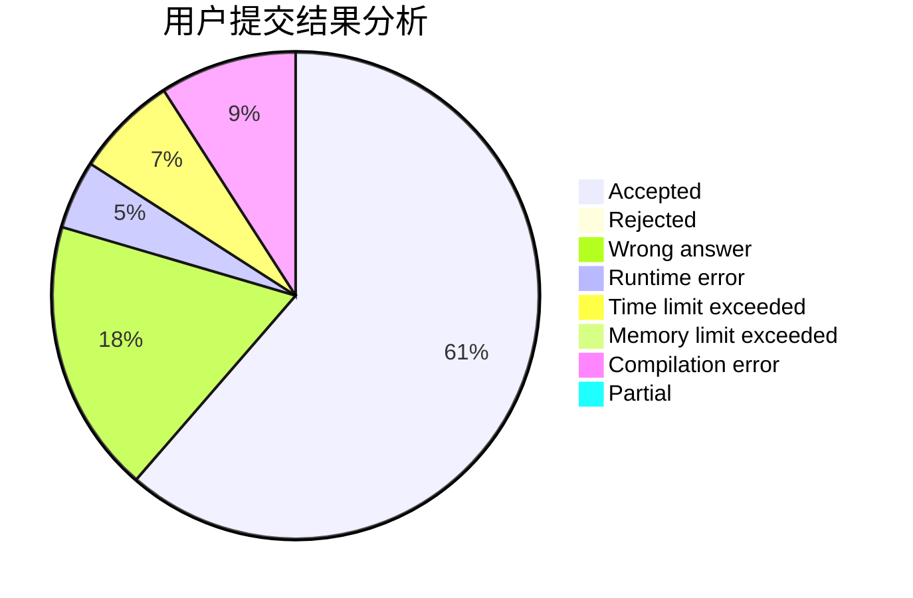
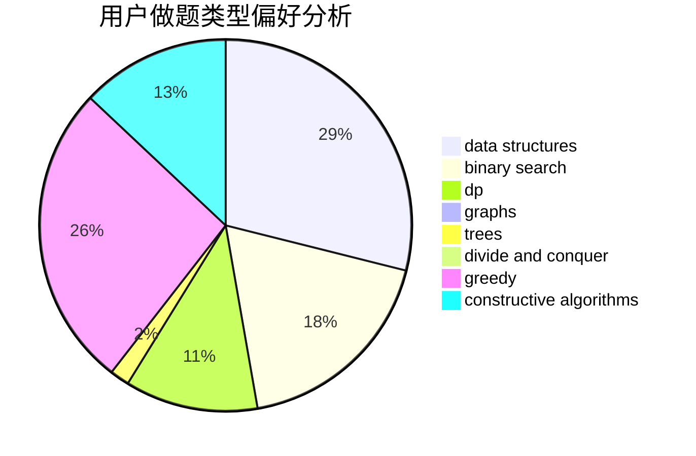
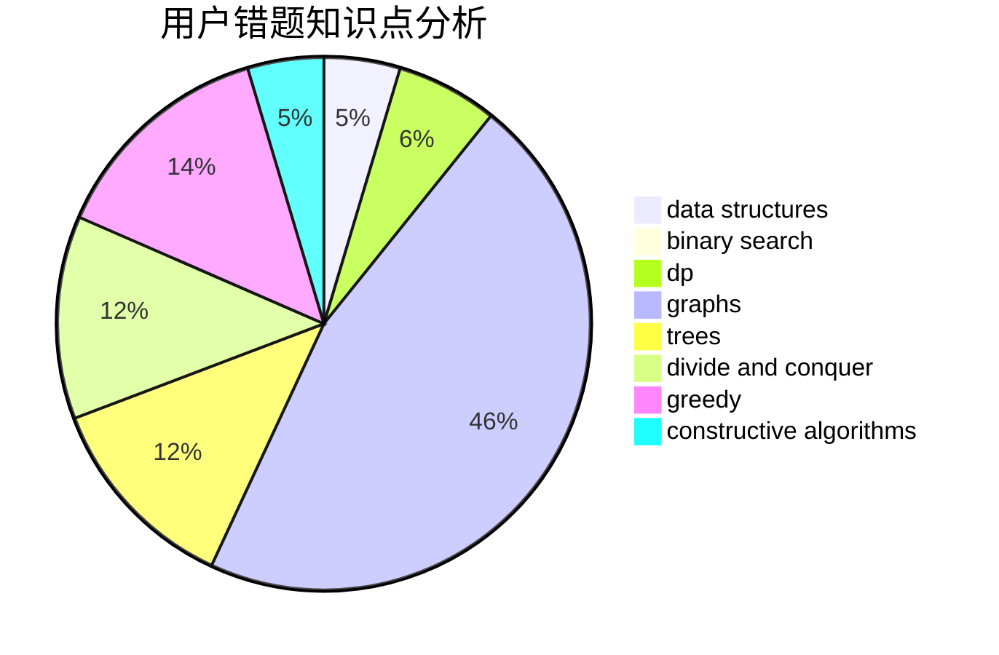

# ntftxdy

<!-- tabs:start -->

#### **用户提交结果分析**

#### **用户做题类型偏好分析**

#### **用户错题知识点分析**

<!-- tabs:end -->
# 推荐题目
[1090F](https://codeforces.com/contest/1090/problem/F)		constructive algorithms,
                        interactive		  
[1183G](https://codeforces.com/contest/1183/problem/G)		greedy,
                        implementation,
                        sortings		  
[1291E](https://codeforces.com/contest/1291/problem/E)		dsu,graphs,sortings,trees		  
[984D](https://codeforces.com/contest/984/problem/D)		dsu,graphs,sortings,trees		  
[171B](https://codeforces.com/contest/171/problem/B)		*special problem,
                        combinatorics		  
[28C](https://codeforces.com/contest/28/problem/C)		combinatorics,
                        dp,
                        probabilities		  
[584B](https://codeforces.com/contest/584/problem/B)		combinatorics		  
[370A](https://codeforces.com/contest/370/problem/A)		graphs,
                        math,
                        shortest paths		  
[877C](https://codeforces.com/contest/877/problem/C)		constructive algorithms		  
[1310D](https://codeforces.com/contest/1310/problem/D)		dp,
                        graphs,
                        probabilities		  
