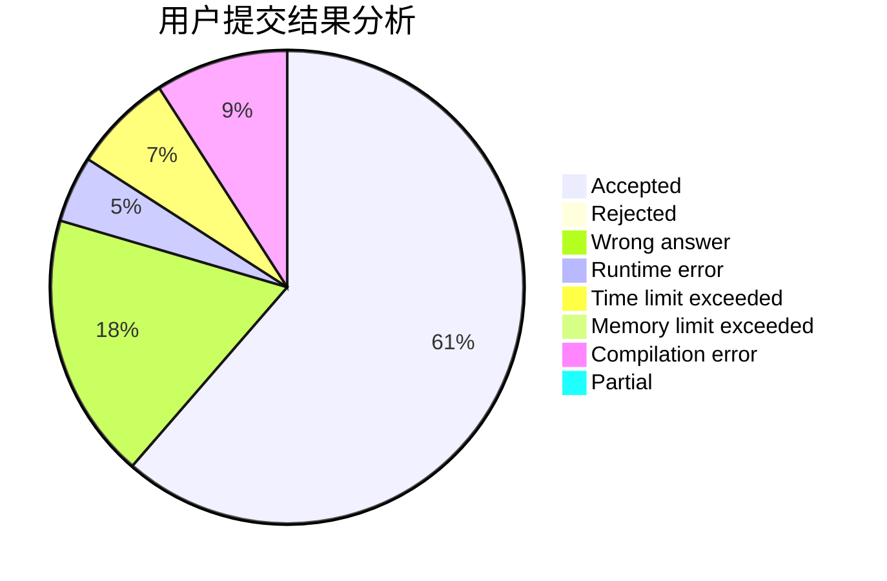
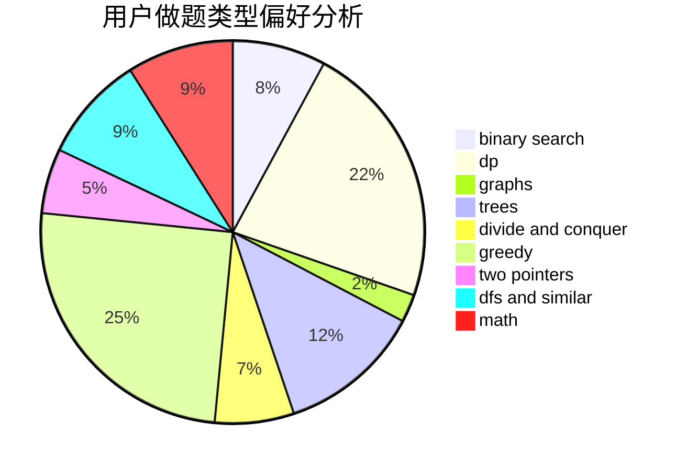

# ntftxdy

<!-- tabs:start -->

#### **用户提交结果分析**

#### **用户做题类型偏好分析**

<!-- tabs:end -->
# 推荐题目
[1091B](https://codeforces.com/contest/1091/problem/B)
[1186F](https://codeforces.com/contest/1186/problem/F)
[1298D](https://codeforces.com/contest/1298/problem/D)
[99C](https://codeforces.com/contest/99/problem/C)
[198B](https://codeforces.com/contest/198/problem/B)
[304C](https://codeforces.com/contest/304/problem/C)
[604B](https://codeforces.com/contest/604/problem/B)
[3C](https://codeforces.com/contest/3/problem/C)
[898B](https://codeforces.com/contest/898/problem/B)
[131A](https://codeforces.com/contest/131/problem/A)
