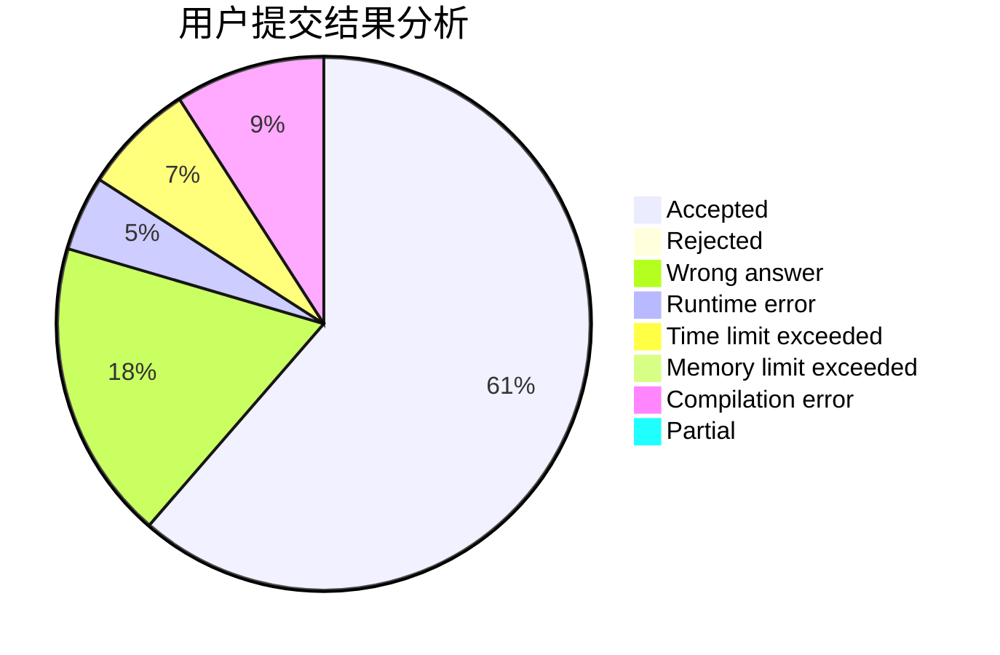
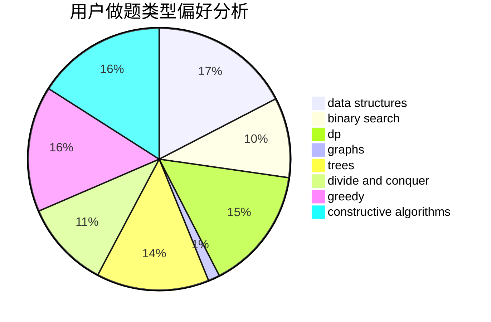
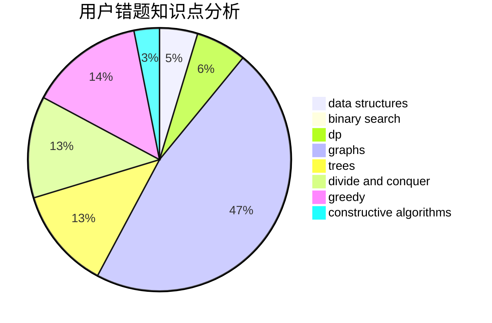

# ntftxdy

<!-- tabs:start -->

#### **用户提交结果分析**

#### **用户做题类型偏好分析**

#### **用户错题知识点分析**

<!-- tabs:end -->
# 推荐题目
[1091B](https://codeforces.com/contest/1091/problem/B)		brute force,
                        constructive algorithms,
                        greedy,
                        implementation		  
[1186F](https://codeforces.com/contest/1186/problem/F)		dfs and similar,
                        graphs,
                        greedy,
                        implementation		  
[1298D](https://codeforces.com/contest/1298/problem/D)		dsu,graphs,sortings,trees		  
[99C](https://codeforces.com/contest/99/problem/C)		dsu,graphs,sortings,trees		  
[198B](https://codeforces.com/contest/198/problem/B)		shortest paths		  
[304C](https://codeforces.com/contest/304/problem/C)		dsu,graphs,sortings,trees		  
[604B](https://codeforces.com/contest/604/problem/B)		binary search,
                        greedy		  
[3C](https://codeforces.com/contest/3/problem/C)		brute force,
                        games,
                        implementation		  
[898B](https://codeforces.com/contest/898/problem/B)		brute force,
                        implementation,
                        number theory		  
[131A](https://codeforces.com/contest/131/problem/A)		implementation,
                        strings		  
