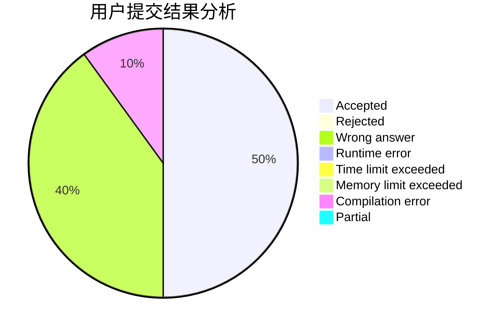
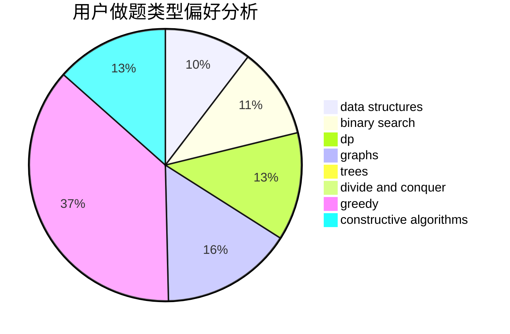
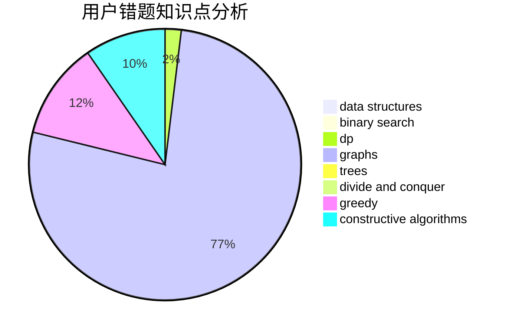

# nth233

<!-- tabs:start -->

#### **用户提交结果分析**

#### **用户做题类型偏好分析**

#### **用户错题知识点分析**

<!-- tabs:end -->
# 推荐题目
[1043B](https://codeforces.com/contest/1043/problem/B)		implementation		  
[453D](https://codeforces.com/contest/453/problem/D)		dp,
                        matrices		  
[858F](https://codeforces.com/contest/858/problem/F)		constructive algorithms,
                        dfs and similar,
                        graphs		  
[438A](https://codeforces.com/contest/438/problem/A)		dsu,graphs,sortings,trees		  
[886F](https://codeforces.com/contest/886/problem/F)		geometry		  
[483B](https://codeforces.com/contest/483/problem/B)		binary search,
                        math		  
[678E](https://codeforces.com/contest/678/problem/E)		bitmasks,
                        dp,
                        math,
                        probabilities		  
[1166E](https://codeforces.com/contest/1166/problem/E)		bitmasks,
                        brute force,
                        constructive algorithms,
                        math,
                        number theory		  
[1357B2](https://codeforces.com/contest/1357B/problem/2)		nan		  
[725A](https://codeforces.com/contest/725/problem/A)		implementation		  
