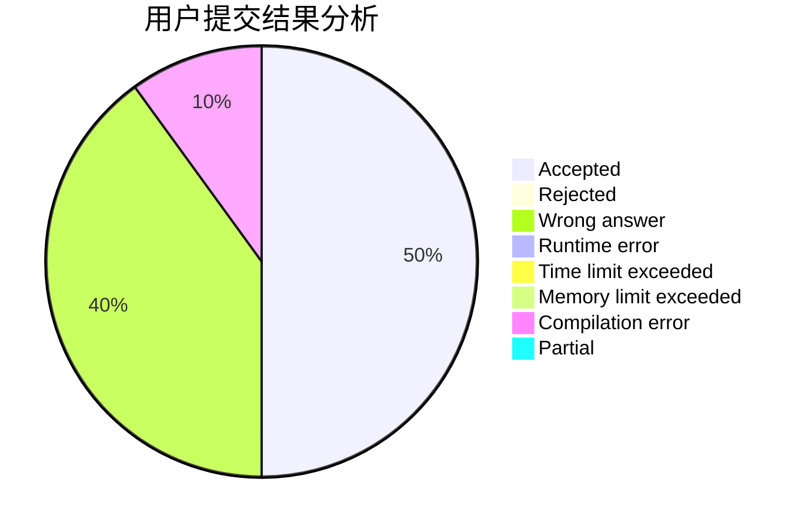
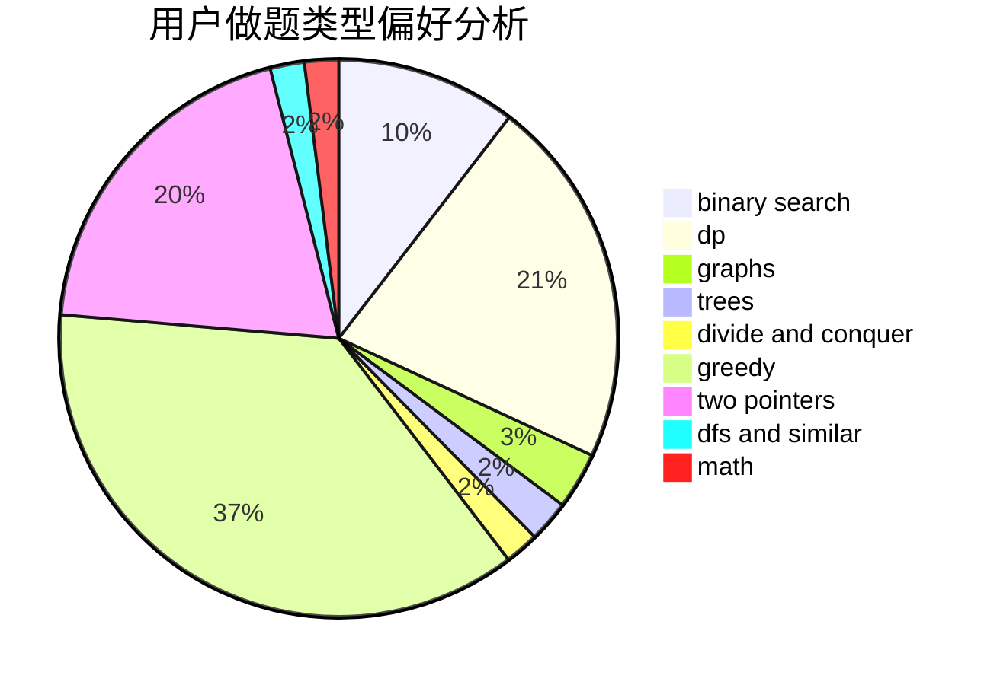

# nth233

<!-- tabs:start -->

#### **用户提交结果分析**

#### **用户做题类型偏好分析**

<!-- tabs:end -->
# 推荐题目
[1043E](https://codeforces.com/contest/1043/problem/E)
[475D](https://codeforces.com/contest/475/problem/D)
[876C](https://codeforces.com/contest/876/problem/C)
[45D](https://codeforces.com/contest/45/problem/D)
[906A](https://codeforces.com/contest/906/problem/A)
[504A](https://codeforces.com/contest/504/problem/A)
[702C](https://codeforces.com/contest/702/problem/C)
[116A](https://codeforces.com/contest/116/problem/A)
[1364E](https://codeforces.com/contest/1364/problem/E)
[742E](https://codeforces.com/contest/742/problem/E)
