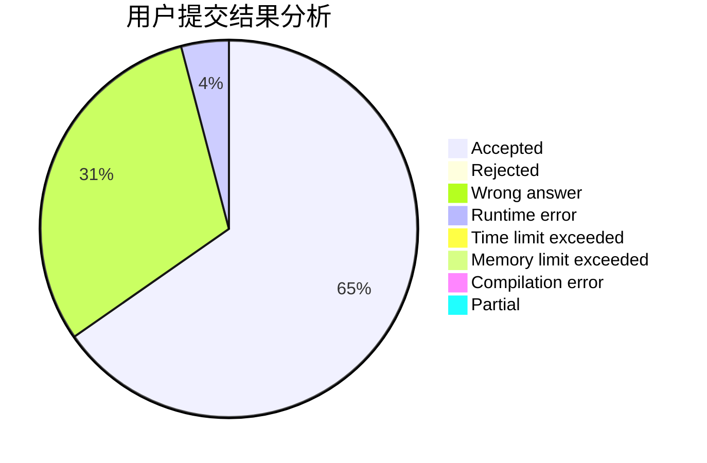
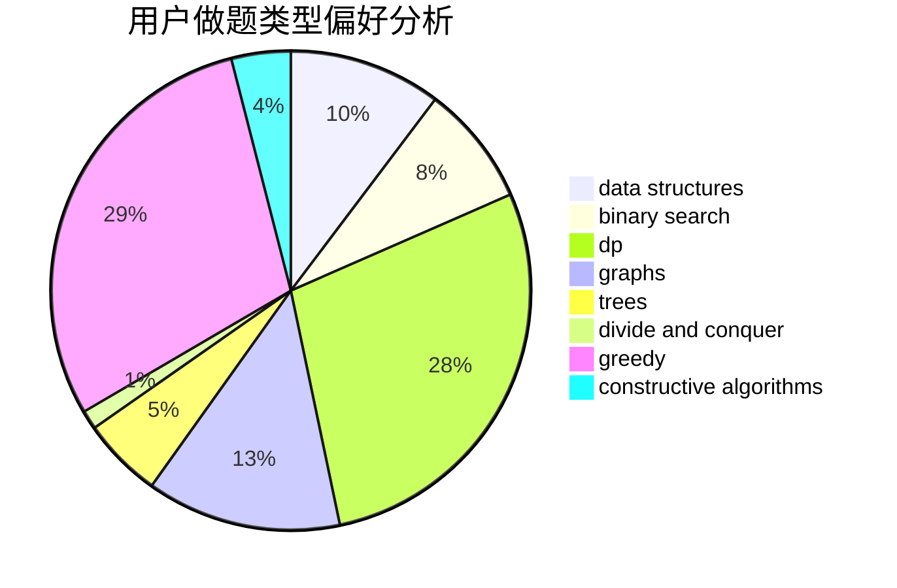

# BronyTown187

<!-- tabs:start -->

#### **用户提交结果分析**

#### **用户做题类型偏好分析**

#### **用户错题知识点分析**

<!-- tabs:end -->
# 推荐题目
[1349B](https://codeforces.com/contest/1349/problem/B)		constructive algorithms,
                        greedy,
                        math		  
[587E](https://codeforces.com/contest/587/problem/E)		data structures		  
[1041C](https://codeforces.com/contest/1041/problem/C)		binary search,
                        data structures,
                        greedy,
                        two pointers		  
[577A](https://codeforces.com/contest/577/problem/A)		implementation,
                        number theory		  
[1096D](https://codeforces.com/contest/1096/problem/D)		dp		  
[462A](https://codeforces.com/contest/462/problem/A)		brute force,
                        implementation		  
[1248E](https://codeforces.com/contest/1248/problem/E)		dsu,graphs,sortings,trees		  
[587D](https://codeforces.com/contest/587/problem/D)		2-sat,
                        binary search		  
[1210D](https://codeforces.com/contest/1210/problem/D)		graphs		  
[1090F](https://codeforces.com/contest/1090/problem/F)		constructive algorithms,
                        interactive		  
