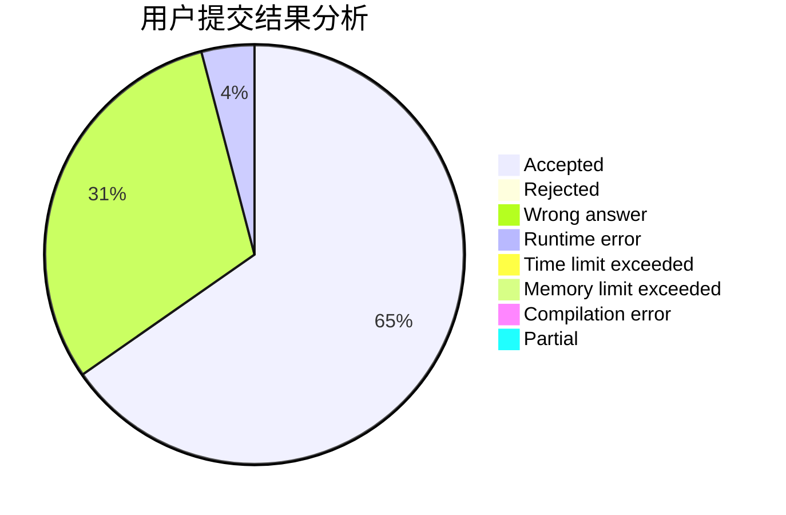
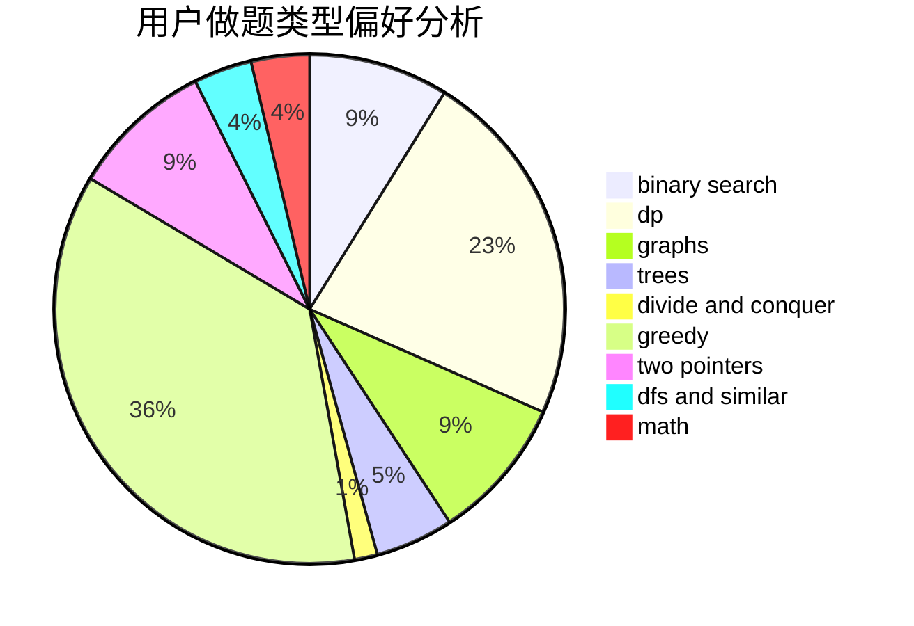

# BronyTown187

<!-- tabs:start -->

#### **用户提交结果分析**

#### **用户做题类型偏好分析**

<!-- tabs:end -->
# 推荐题目
[1349B](https://codeforces.com/contest/1349/problem/B)
[587E](https://codeforces.com/contest/587/problem/E)
[1041C](https://codeforces.com/contest/1041/problem/C)
[577A](https://codeforces.com/contest/577/problem/A)
[1096D](https://codeforces.com/contest/1096/problem/D)
[462A](https://codeforces.com/contest/462/problem/A)
[1248E](https://codeforces.com/contest/1248/problem/E)
[587D](https://codeforces.com/contest/587/problem/D)
[1210D](https://codeforces.com/contest/1210/problem/D)
[1090F](https://codeforces.com/contest/1090/problem/F)
