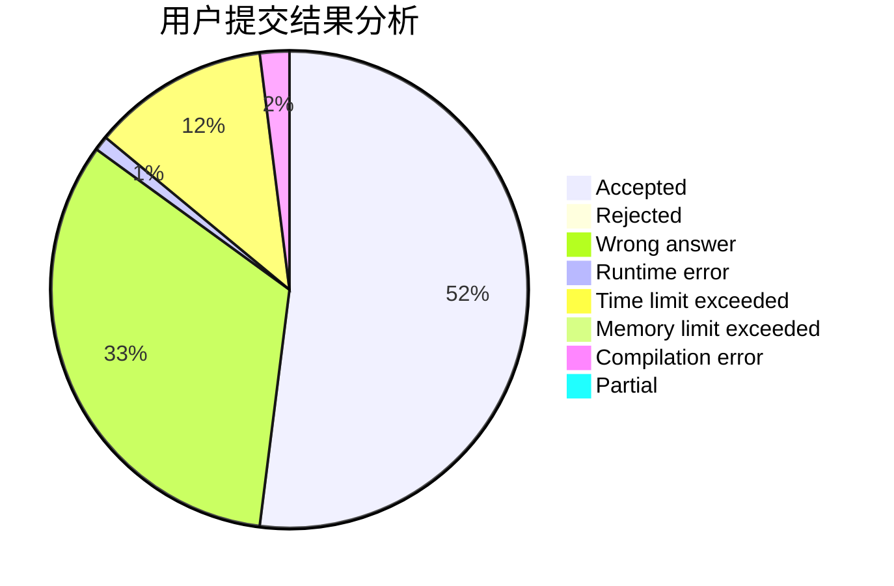
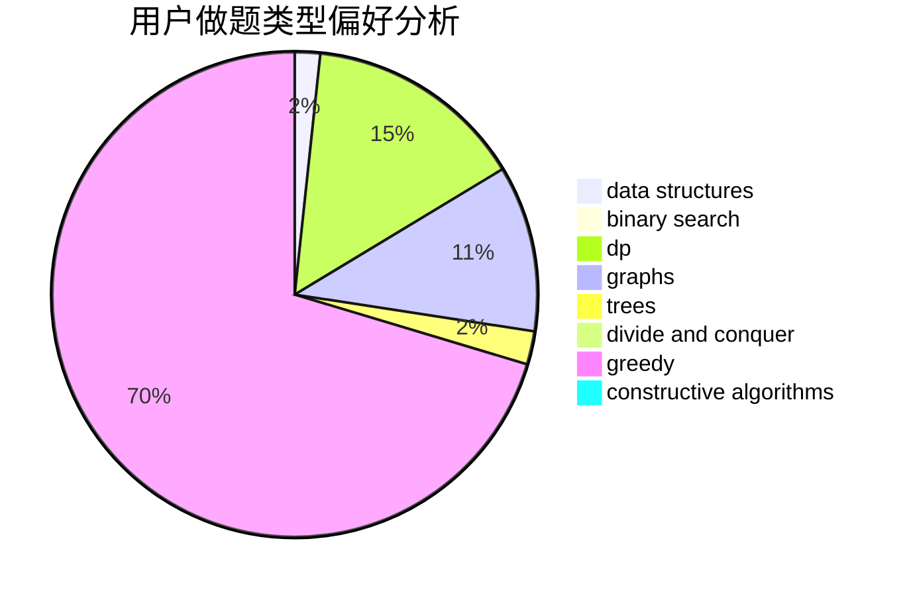
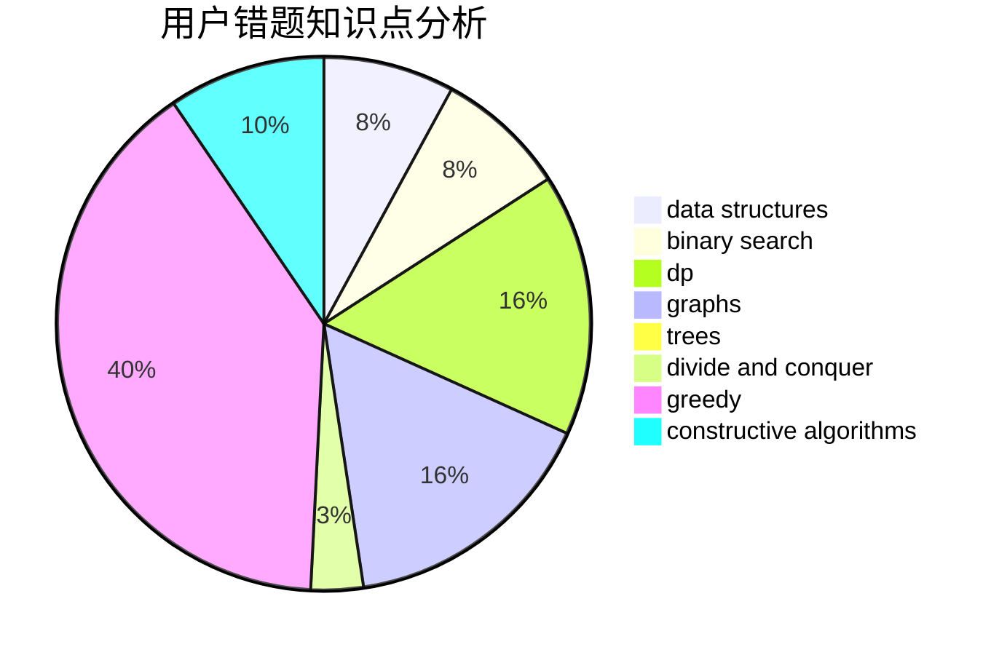

# ntwbvdbl_oe

<!-- tabs:start -->

#### **用户提交结果分析**

#### **用户做题类型偏好分析**

#### **用户错题知识点分析**

<!-- tabs:end -->
# 推荐题目
[1267B](https://codeforces.com/contest/1267/problem/B)		nan		  
[883G](https://codeforces.com/contest/883/problem/G)		dfs and similar,
                        graphs		  
[225D](https://codeforces.com/contest/225/problem/D)		bitmasks,
                        dfs and similar,
                        graphs,
                        implementation		  
[496B](https://codeforces.com/contest/496/problem/B)		brute force,
                        constructive algorithms,
                        implementation		  
[748C](https://codeforces.com/contest/748/problem/C)		constructive algorithms,
                        math		  
[1082F](https://codeforces.com/contest/1082/problem/F)		dp,
                        strings,
                        trees		  
[1254E](https://codeforces.com/contest/1254/problem/E)		combinatorics,
                        dfs and similar,
                        dsu,
                        trees		  
[1356A1](https://codeforces.com/contest/1356A/problem/1)		*special problem		  
[252A](https://codeforces.com/contest/252/problem/A)		brute force,
                        implementation		  
[1310D](https://codeforces.com/contest/1310/problem/D)		dp,
                        graphs,
                        probabilities		  
