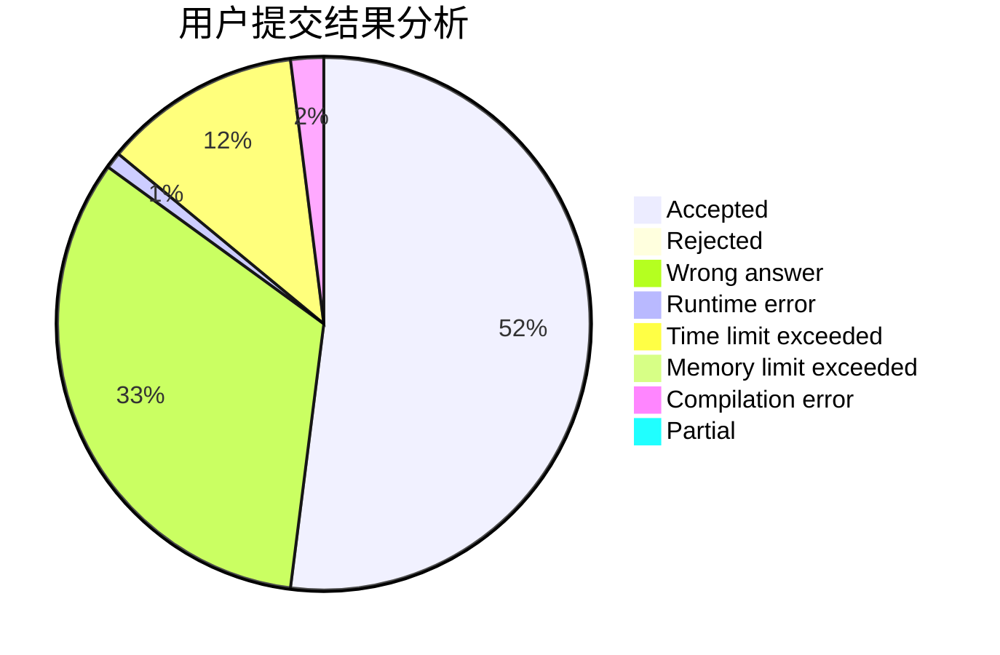
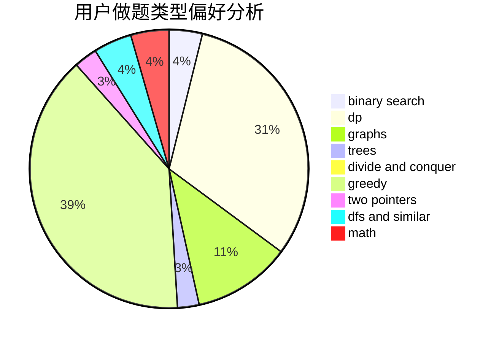

# ntwbvdbl_oe

<!-- tabs:start -->

#### **用户提交结果分析**

#### **用户做题类型偏好分析**

<!-- tabs:end -->
# 推荐题目
[1272E](https://codeforces.com/contest/1272/problem/E)
[901A](https://codeforces.com/contest/901/problem/A)
[243D](https://codeforces.com/contest/243/problem/D)
[515E](https://codeforces.com/contest/515/problem/E)
[767D](https://codeforces.com/contest/767/problem/D)
[1083B](https://codeforces.com/contest/1083/problem/B)
[12622](https://codeforces.com/contest/1262/problem/2)
[1362F](https://codeforces.com/contest/1362/problem/F)
[26B](https://codeforces.com/contest/26/problem/B)
[131A](https://codeforces.com/contest/131/problem/A)
