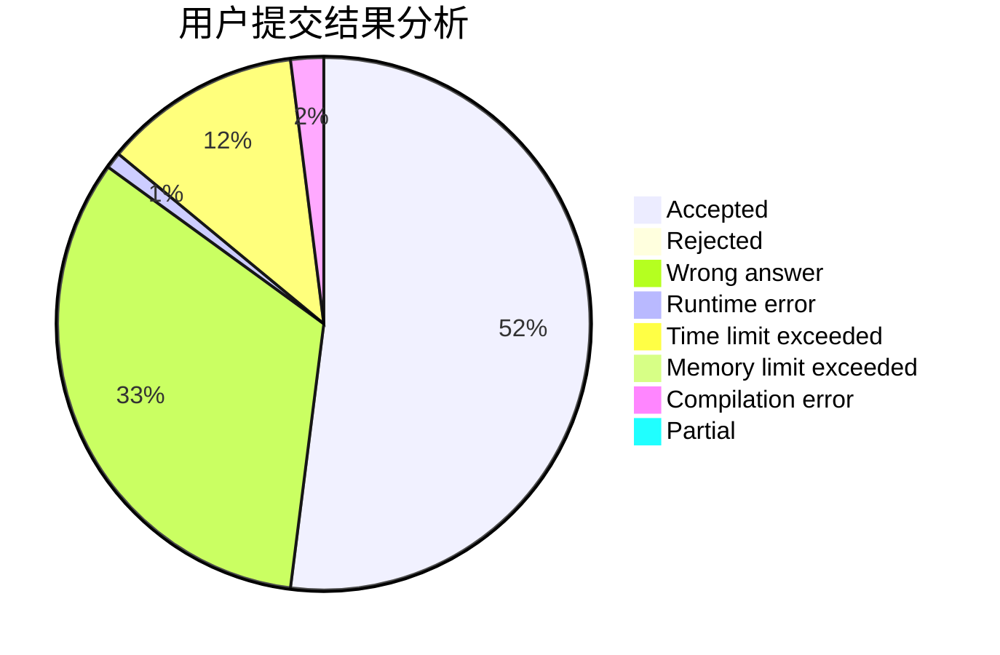
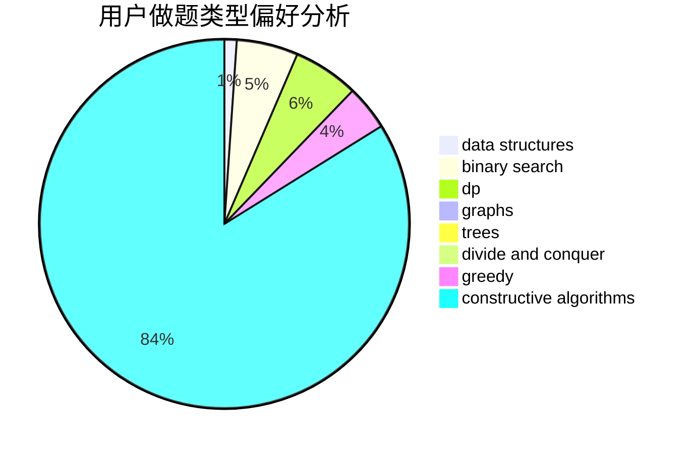
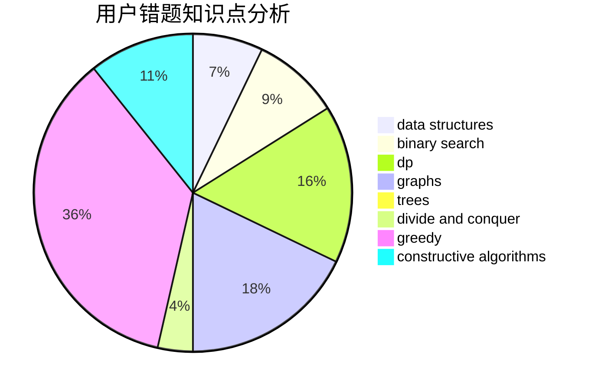

# ntwbvdbl_oe

<!-- tabs:start -->

#### **用户提交结果分析**

#### **用户做题类型偏好分析**

#### **用户错题知识点分析**

<!-- tabs:end -->
# 推荐题目
[1272E](https://codeforces.com/contest/1272/problem/E)		dfs and similar,
                        graphs,
                        shortest paths		  
[901A](https://codeforces.com/contest/901/problem/A)		constructive algorithms,
                        trees		  
[243D](https://codeforces.com/contest/243/problem/D)		data structures,
                        dp,
                        geometry,
                        two pointers		  
[515E](https://codeforces.com/contest/515/problem/E)		data structures		  
[767D](https://codeforces.com/contest/767/problem/D)		binary search,
                        data structures,
                        greedy,
                        sortings,
                        two pointers		  
[1083B](https://codeforces.com/contest/1083/problem/B)		greedy,
                        strings		  
[12622](https://codeforces.com/contest/1262/problem/2)		dsu,graphs,sortings,trees		  
[1362F](https://codeforces.com/contest/1362/problem/F)		dsu,graphs,sortings,trees		  
[26B](https://codeforces.com/contest/26/problem/B)		greedy		  
[131A](https://codeforces.com/contest/131/problem/A)		implementation,
                        strings		  
