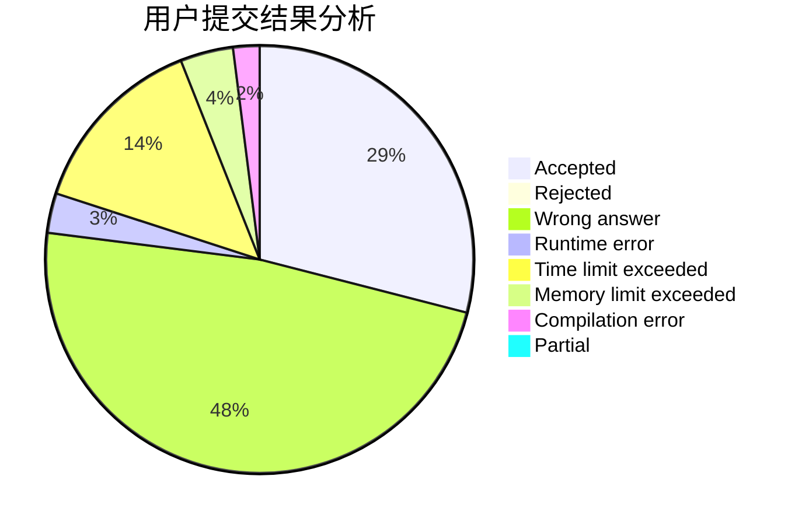
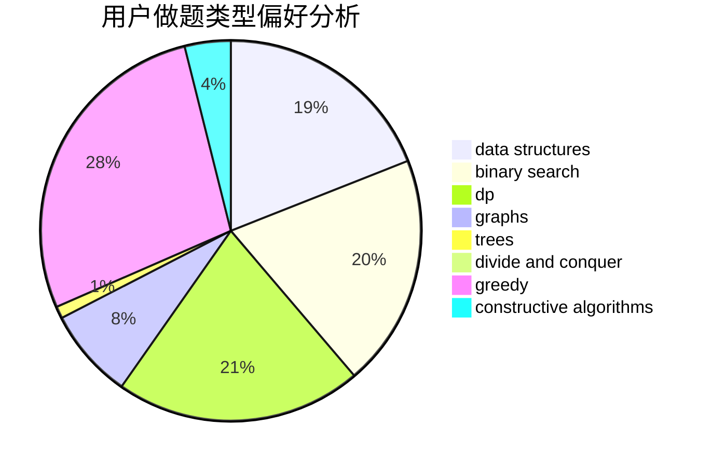
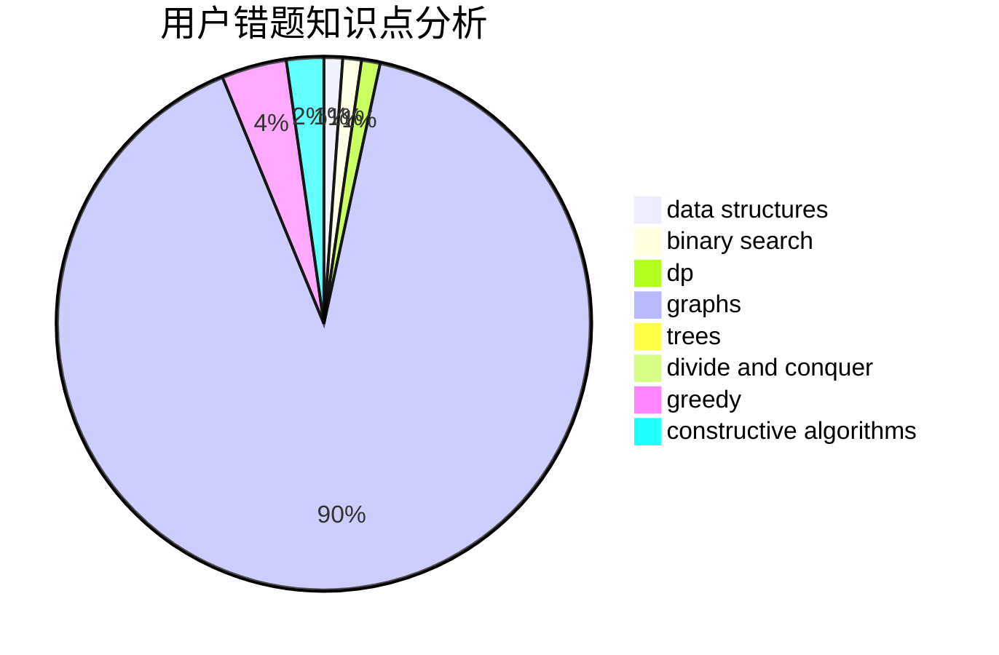

# nuchenghao
<!-- tabs:start -->
#### **用户提交结果分析**

#### **用户做题类型偏好分析**

#### **用户错题知识点分析**

<!-- tabs:end -->
# 推荐题目
[Xenolith? Hippodrome?](http://codeforces.com/problemset/problem/1505/D)		number theory		  
[Root of quantum Fourier transform](http://codeforces.com/problemset/problem/1357/E2)		nan		  
[Berland Beauty](http://codeforces.com/problemset/problem/1296/F)		constructive algorithms,
                        dfs and similar,
                        greedy,
                        sortings,
                        trees		  
[Binary String Constructing](http://codeforces.com/problemset/problem/1003/B)		constructive algorithms		  
[Borya's Diagnosis](http://codeforces.com/problemset/problem/879/A)		implementation		  
[Candy Bags](http://codeforces.com/problemset/problem/334/A)		implementation		  
[Views Matter](http://codeforces.com/problemset/problem/1061/B)		greedy,
                        implementation,
                        sortings		  
[Delivery Oligopoly](http://codeforces.com/problemset/problem/1155/F)		brute force,
                        dp,
                        graphs		  
[Dasha and Puzzle](http://codeforces.com/problemset/problem/761/E)		constructive algorithms,
                        dfs and similar,
                        graphs,
                        greedy,
                        trees		  
[Toy Train (Simplified)](https://codeforces.com/contest/1130/problem/D1)		brute force,
                        greedy		  
<!-- tabs:start -->
#### **data structures**
[Xenolith? Hippodrome?](http://codeforces.com/problemset/problem/837/G)		data structures		  
[Root of quantum Fourier transform](http://codeforces.com/problemset/problem/1167/F)		combinatorics,
                        data structures,
                        math,
                        sortings		  
[Berland Beauty](http://codeforces.com/problemset/problem/1469/F)		binary search,
                        data structures,
                        greedy		  
[Binary String Constructing](http://codeforces.com/problemset/problem/372/C)		data structures,
                        dp,
                        math		  
[Borya's Diagnosis](http://codeforces.com/problemset/problem/611/E)		data structures,
                        greedy,
                        sortings		  
[Candy Bags](http://codeforces.com/problemset/problem/1379/F1)		binary search,
                        data structures		  
[Views Matter](https://codeforces.com/contest/1341/problem/C)		brute force,
                        data structures,
                        greedy,
                        implementation		  
[Delivery Oligopoly](http://codeforces.com/problemset/problem/1207/G)		data structures,
                        dfs and similar,
                        hashing,
                        string suffix structures,
                        strings,
                        trees		  
[Dasha and Puzzle](http://codeforces.com/problemset/problem/1492/C)		binary search,
                        data structures,
                        dp,
                        greedy,
                        two pointers		  
[Toy Train (Simplified)](http://codeforces.com/problemset/problem/1490/G)		binary search,
                        data structures,
                        math		  
#### **binary search**
[Xenolith? Hippodrome?](http://codeforces.com/problemset/problem/1469/F)		binary search,
                        data structures,
                        greedy		  
[Root of quantum Fourier transform](http://codeforces.com/problemset/problem/16/C)		binary search,
                        number theory		  
[Berland Beauty](http://codeforces.com/problemset/problem/1260/D)		binary search,
                        dp,
                        greedy,
                        sortings		  
[Binary String Constructing](http://codeforces.com/problemset/problem/1379/F1)		binary search,
                        data structures		  
[Borya's Diagnosis](http://codeforces.com/problemset/problem/1492/C)		binary search,
                        data structures,
                        dp,
                        greedy,
                        two pointers		  
[Candy Bags](http://codeforces.com/problemset/problem/1463/D)		binary search,
                        constructive algorithms,
                        greedy,
                        two pointers		  
[Views Matter](http://codeforces.com/problemset/problem/1490/G)		binary search,
                        data structures,
                        math		  
[Delivery Oligopoly](http://codeforces.com/problemset/problem/1479/D)		binary search,
                        bitmasks,
                        brute force,
                        data structures,
                        probabilities,
                        trees		  
[Dasha and Puzzle](http://codeforces.com/problemset/problem/1436/E)		binary search,
                        data structures,
                        two pointers		  
[Toy Train (Simplified)](http://codeforces.com/problemset/problem/1461/D)		binary search,
                        brute force,
                        data structures,
                        divide and conquer,
                        implementation,
                        sortings		  
#### **dp**
[Xenolith? Hippodrome?](http://codeforces.com/problemset/problem/1155/F)		brute force,
                        dp,
                        graphs		  
[Root of quantum Fourier transform](http://codeforces.com/problemset/problem/482/D)		combinatorics,
                        dp,
                        trees		  
[Berland Beauty](http://codeforces.com/problemset/problem/1234/F)		bitmasks,
                        dp		  
[Binary String Constructing](http://codeforces.com/problemset/problem/1307/C)		brute force,
                        dp,
                        math,
                        strings		  
[Borya's Diagnosis](https://codeforces.com/contest/544/problem/C)		dp		  
[Candy Bags](https://codeforces.com/contest/1341/problem/E)		dfs and similar,
                        dp,
                        graphs,
                        shortest paths		  
[Views Matter](https://codeforces.com/contest/1241/problem/D)		dp,
                        greedy,
                        two pointers		  
[Delivery Oligopoly](http://codeforces.com/problemset/problem/662/E)		brute force,
                        dp,
                        greedy		  
[Dasha and Puzzle](http://codeforces.com/problemset/problem/372/C)		data structures,
                        dp,
                        math		  
[Toy Train (Simplified)](http://codeforces.com/problemset/problem/1260/D)		binary search,
                        dp,
                        greedy,
                        sortings		  
#### **graph**
[Xenolith? Hippodrome?](http://codeforces.com/problemset/problem/1155/F)		brute force,
                        dp,
                        graphs		  
[Root of quantum Fourier transform](http://codeforces.com/problemset/problem/761/E)		constructive algorithms,
                        dfs and similar,
                        graphs,
                        greedy,
                        trees		  
[Berland Beauty](https://codeforces.com/contest/1341/problem/E)		dfs and similar,
                        dp,
                        graphs,
                        shortest paths		  
[Binary String Constructing](https://codeforces.com/contest/782/problem/E)		constructive algorithms,
                        dfs and similar,
                        graphs		  
[Borya's Diagnosis](http://codeforces.com/problemset/problem/1495/C)		constructive algorithms,
                        graphs		  
[Candy Bags](http://codeforces.com/problemset/problem/81/E)		dfs and similar,
                        dp,
                        dsu,
                        graphs,
                        implementation,
                        trees		  
[Views Matter](http://codeforces.com/problemset/problem/1487/C)		brute force,
                        constructive algorithms,
                        dfs and similar,
                        graphs,
                        greedy,
                        implementation,
                        math		  
[Delivery Oligopoly](http://codeforces.com/problemset/problem/1437/C)		dp,
                        flows,
                        graph matchings,
                        greedy,
                        math,
                        sortings		  
[Dasha and Puzzle](http://codeforces.com/problemset/problem/1470/D)		constructive algorithms,
                        dfs and similar,
                        graph matchings,
                        graphs,
                        greedy		  
[Toy Train (Simplified)](http://codeforces.com/problemset/problem/1476/C)		dp,
                        graphs,
                        greedy		  
#### **trees**
[Xenolith? Hippodrome?](http://codeforces.com/problemset/problem/1296/F)		constructive algorithms,
                        dfs and similar,
                        greedy,
                        sortings,
                        trees		  
[Root of quantum Fourier transform](http://codeforces.com/problemset/problem/761/E)		constructive algorithms,
                        dfs and similar,
                        graphs,
                        greedy,
                        trees		  
[Berland Beauty](http://codeforces.com/problemset/problem/482/D)		combinatorics,
                        dp,
                        trees		  
[Binary String Constructing](http://codeforces.com/problemset/problem/802/K)		dp,
                        trees		  
[Borya's Diagnosis](http://codeforces.com/problemset/problem/81/E)		dfs and similar,
                        dp,
                        dsu,
                        graphs,
                        implementation,
                        trees		  
[Candy Bags](http://codeforces.com/problemset/problem/1207/G)		data structures,
                        dfs and similar,
                        hashing,
                        string suffix structures,
                        strings,
                        trees		  
[Views Matter](http://codeforces.com/problemset/problem/1479/D)		binary search,
                        bitmasks,
                        brute force,
                        data structures,
                        probabilities,
                        trees		  
[Delivery Oligopoly](http://codeforces.com/problemset/problem/1511/C)		brute force,
                        data structures,
                        implementation,
                        trees		  
[Dasha and Puzzle](http://codeforces.com/problemset/problem/1499/F)		combinatorics,
                        dfs and similar,
                        dp,
                        trees		  
[Toy Train (Simplified)](http://codeforces.com/problemset/problem/1491/E)		brute force,
                        dfs and similar,
                        divide and conquer,
                        number theory,
                        trees		  
#### **divide and conquer**
[Xenolith? Hippodrome?](http://codeforces.com/problemset/problem/1461/D)		binary search,
                        brute force,
                        data structures,
                        divide and conquer,
                        implementation,
                        sortings		  
[Root of quantum Fourier transform](http://codeforces.com/problemset/problem/1466/G)		combinatorics,
                        divide and conquer,
                        hashing,
                        math,
                        string suffix structures,
                        strings		  
[Berland Beauty](http://codeforces.com/problemset/problem/1490/D)		dfs and similar,
                        divide and conquer,
                        implementation		  
[Binary String Constructing](https://codeforces.com/contest/1483/problem/C)		data structures,
                        divide and conquer,
                        dp		  
[Borya's Diagnosis](http://codeforces.com/problemset/problem/1491/E)		brute force,
                        dfs and similar,
                        divide and conquer,
                        number theory,
                        trees		  
[Candy Bags](http://codeforces.com/problemset/problem/1303/G)		data structures,
                        divide and conquer,
                        geometry,
                        trees		  
[Views Matter](http://codeforces.com/problemset/problem/1494/D)		constructive algorithms,
                        data structures,
                        dfs and similar,
                        divide and conquer,
                        dsu,
                        greedy,
                        sortings,
                        trees		  
[Delivery Oligopoly](http://codeforces.com/problemset/problem/1482/E)		data structures,
                        divide and conquer,
                        dp		  
[Dasha and Puzzle](http://codeforces.com/problemset/problem/566/C)		dfs and similar,
                        divide and conquer,
                        trees		  
[Toy Train (Simplified)](http://codeforces.com/problemset/problem/1428/F)		binary search,
                        data structures,
                        divide and conquer,
                        dp,
                        two pointers		  
#### **greedy**
[Xenolith? Hippodrome?](http://codeforces.com/problemset/problem/1296/F)		constructive algorithms,
                        dfs and similar,
                        greedy,
                        sortings,
                        trees		  
[Root of quantum Fourier transform](http://codeforces.com/problemset/problem/1061/B)		greedy,
                        implementation,
                        sortings		  
[Berland Beauty](http://codeforces.com/problemset/problem/761/E)		constructive algorithms,
                        dfs and similar,
                        graphs,
                        greedy,
                        trees		  
[Binary String Constructing](https://codeforces.com/contest/1130/problem/D1)		brute force,
                        greedy		  
[Borya's Diagnosis](http://codeforces.com/problemset/problem/1008/B)		greedy,
                        sortings		  
[Candy Bags](http://codeforces.com/problemset/problem/33/C)		greedy		  
[Views Matter](http://codeforces.com/problemset/problem/1469/F)		binary search,
                        data structures,
                        greedy		  
[Delivery Oligopoly](http://codeforces.com/problemset/problem/870/B)		greedy		  
[Dasha and Puzzle](http://codeforces.com/problemset/problem/701/A)		greedy,
                        implementation		  
[Toy Train (Simplified)](https://codeforces.com/contest/1241/problem/D)		dp,
                        greedy,
                        two pointers		  
#### **constructive algorithms**
[Xenolith? Hippodrome?](http://codeforces.com/problemset/problem/1296/F)		constructive algorithms,
                        dfs and similar,
                        greedy,
                        sortings,
                        trees		  
[Root of quantum Fourier transform](http://codeforces.com/problemset/problem/1003/B)		constructive algorithms		  
[Berland Beauty](http://codeforces.com/problemset/problem/761/E)		constructive algorithms,
                        dfs and similar,
                        graphs,
                        greedy,
                        trees		  
[Binary String Constructing](http://codeforces.com/problemset/problem/756/A)		constructive algorithms,
                        dfs and similar		  
[Borya's Diagnosis](https://codeforces.com/contest/782/problem/E)		constructive algorithms,
                        dfs and similar,
                        graphs		  
[Candy Bags](http://codeforces.com/problemset/problem/804/C)		constructive algorithms,
                        dfs and similar,
                        greedy		  
[Views Matter](http://codeforces.com/problemset/problem/1495/C)		constructive algorithms,
                        graphs		  
[Delivery Oligopoly](http://codeforces.com/problemset/problem/1493/A)		constructive algorithms,
                        greedy		  
[Dasha and Puzzle](http://codeforces.com/problemset/problem/1463/D)		binary search,
                        constructive algorithms,
                        greedy,
                        two pointers		  
[Toy Train (Simplified)](https://codeforces.com/contest/1456/problem/B)		bitmasks,
                        brute force,
                        constructive algorithms		  
#### **sortings**
[Xenolith? Hippodrome?](http://codeforces.com/problemset/problem/1296/F)		constructive algorithms,
                        dfs and similar,
                        greedy,
                        sortings,
                        trees		  
[Root of quantum Fourier transform](http://codeforces.com/problemset/problem/1061/B)		greedy,
                        implementation,
                        sortings		  
[Berland Beauty](http://codeforces.com/problemset/problem/1008/B)		greedy,
                        sortings		  
[Binary String Constructing](http://codeforces.com/problemset/problem/1167/F)		combinatorics,
                        data structures,
                        math,
                        sortings		  
[Borya's Diagnosis](http://codeforces.com/problemset/problem/611/E)		data structures,
                        greedy,
                        sortings		  
[Candy Bags](http://codeforces.com/problemset/problem/1260/D)		binary search,
                        dp,
                        greedy,
                        sortings		  
[Views Matter](http://codeforces.com/problemset/problem/437/D)		dsu,
                        sortings		  
[Delivery Oligopoly](https://codeforces.com/contest/1496/problem/C)		geometry,
                        greedy,
                        math,
                        sortings		  
[Dasha and Puzzle](http://codeforces.com/problemset/problem/1495/A)		geometry,
                        greedy,
                        math,
                        sortings		  
[Toy Train (Simplified)](http://codeforces.com/problemset/problem/1497/A)		brute force,
                        data structures,
                        greedy,
                        sortings		  
<!-- tabs:end -->
