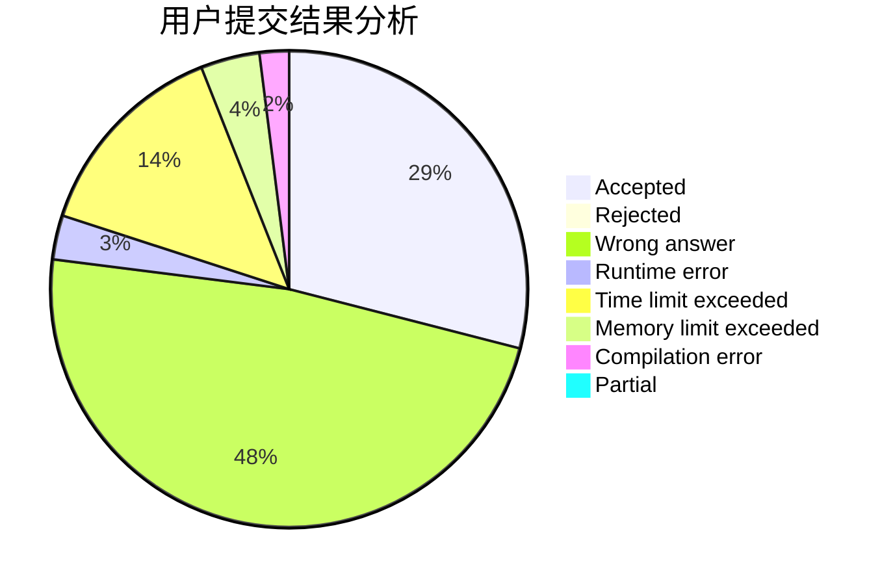
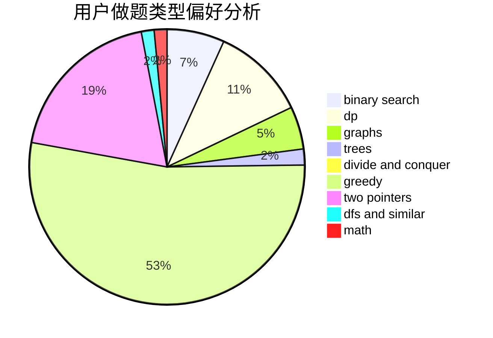

# nuchenghao

<!-- tabs:start -->

#### **用户提交结果分析**

#### **用户做题类型偏好分析**

<!-- tabs:end -->
# 推荐题目
[152E](https://codeforces.com/contest/152/problem/E)
[1061F](https://codeforces.com/contest/1061/problem/F)
[746A](https://codeforces.com/contest/746/problem/A)
[1008E](https://codeforces.com/contest/1008/problem/E)
[13042](https://codeforces.com/contest/1304/problem/2)
[120H](https://codeforces.com/contest/120/problem/H)
[297C](https://codeforces.com/contest/297/problem/C)
[1315D](https://codeforces.com/contest/1315/problem/D)
[367C](https://codeforces.com/contest/367/problem/C)
[1240C](https://codeforces.com/contest/1240/problem/C)
