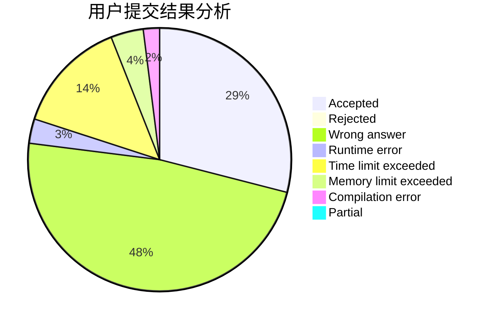
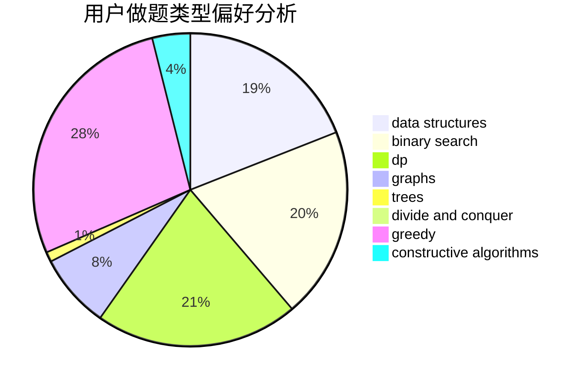
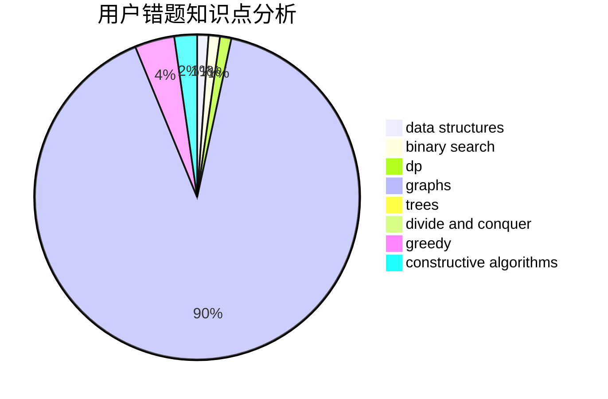

# nuchenghao

<!-- tabs:start -->

#### **用户提交结果分析**

#### **用户做题类型偏好分析**

#### **用户错题知识点分析**

<!-- tabs:end -->
# 推荐题目
[1505D](https://codeforces.com/contest/1505/problem/D)		number theory		  
[1061B](https://codeforces.com/contest/1061/problem/B)		greedy,
                        implementation,
                        sortings		  
[729A](https://codeforces.com/contest/729/problem/A)		implementation,
                        strings		  
[1008B](https://codeforces.com/contest/1008/problem/B)		greedy,
                        sortings		  
[1296F](https://codeforces.com/contest/1296/problem/F)		constructive algorithms,
                        dfs and similar,
                        greedy,
                        sortings,
                        trees		  
[1205E](https://codeforces.com/contest/1205/problem/E)		combinatorics,
                        strings		  
[281A](https://codeforces.com/contest/281/problem/A)		implementation,
                        strings		  
[1307C](https://codeforces.com/contest/1307/problem/C)		brute force,
                        dp,
                        math,
                        strings		  
[33C](https://codeforces.com/contest/33/problem/C)		greedy		  
[1234F](https://codeforces.com/contest/1234/problem/F)		bitmasks,
                        dp		  
