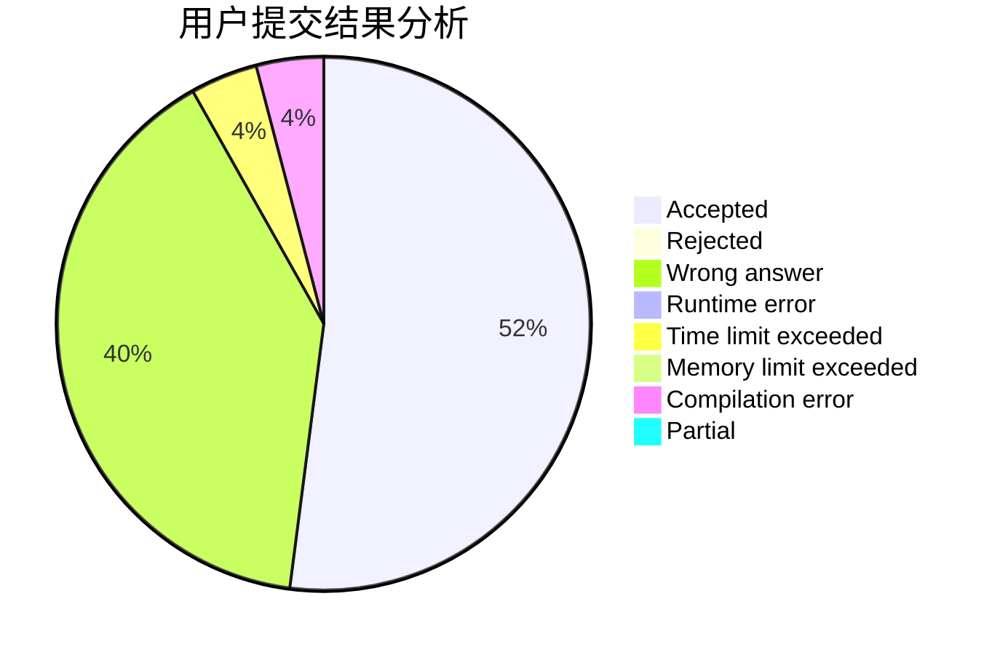
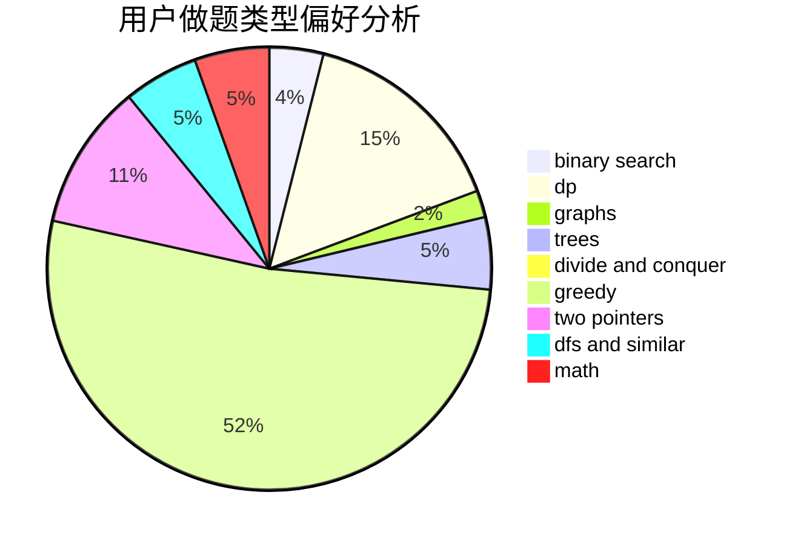

# null73

<!-- tabs:start -->

#### **用户提交结果分析**

#### **用户做题类型偏好分析**

<!-- tabs:end -->
# 推荐题目
[1265D](https://codeforces.com/contest/1265/problem/D)
[962A](https://codeforces.com/contest/962/problem/A)
[1016B](https://codeforces.com/contest/1016/problem/B)
[576A](https://codeforces.com/contest/576/problem/A)
[1146E](https://codeforces.com/contest/1146/problem/E)
[1037G](https://codeforces.com/contest/1037/problem/G)
[486B](https://codeforces.com/contest/486/problem/B)
[764E](https://codeforces.com/contest/764/problem/E)
[952C](https://codeforces.com/contest/952/problem/C)
[554A](https://codeforces.com/contest/554/problem/A)
