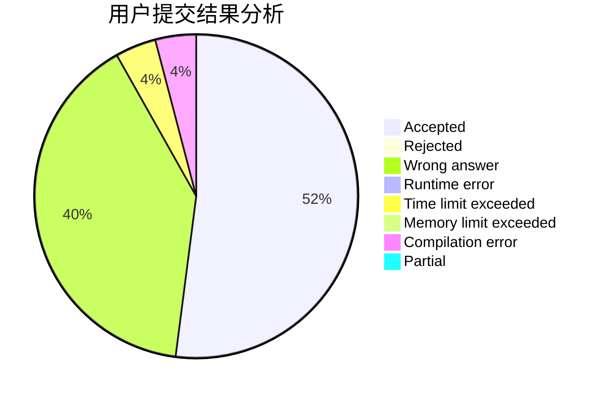
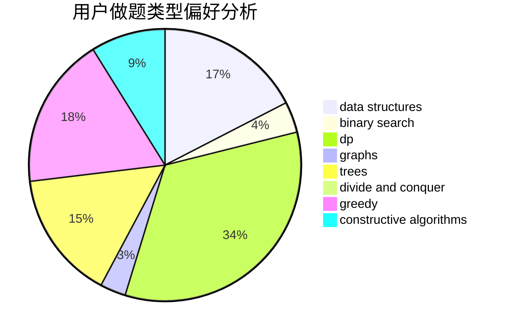
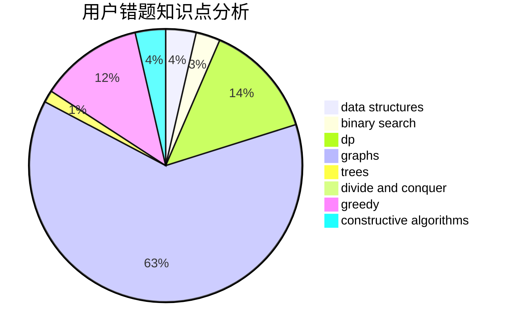

# null73

<!-- tabs:start -->

#### **用户提交结果分析**

#### **用户做题类型偏好分析**

#### **用户错题知识点分析**

<!-- tabs:end -->
# 推荐题目
[1265D](https://codeforces.com/contest/1265/problem/D)		dsu,graphs,sortings,trees		  
[962A](https://codeforces.com/contest/962/problem/A)		implementation		  
[1016B](https://codeforces.com/contest/1016/problem/B)		brute force,
                        implementation		  
[576A](https://codeforces.com/contest/576/problem/A)		math,
                        number theory		  
[1146E](https://codeforces.com/contest/1146/problem/E)		bitmasks,
                        data structures,
                        divide and conquer,
                        implementation		  
[1037G](https://codeforces.com/contest/1037/problem/G)		games		  
[486B](https://codeforces.com/contest/486/problem/B)		greedy,
                        hashing,
                        implementation		  
[764E](https://codeforces.com/contest/764/problem/E)		dsu,graphs,sortings,trees		  
[952C](https://codeforces.com/contest/952/problem/C)		implementation		  
[554A](https://codeforces.com/contest/554/problem/A)		brute force,
                        math,
                        strings		  
