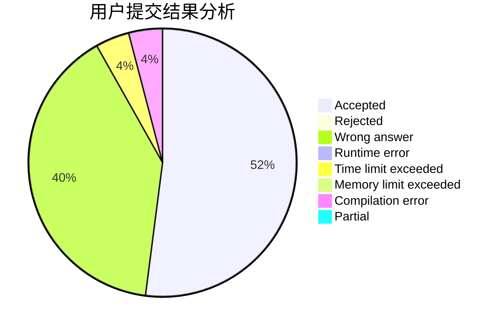
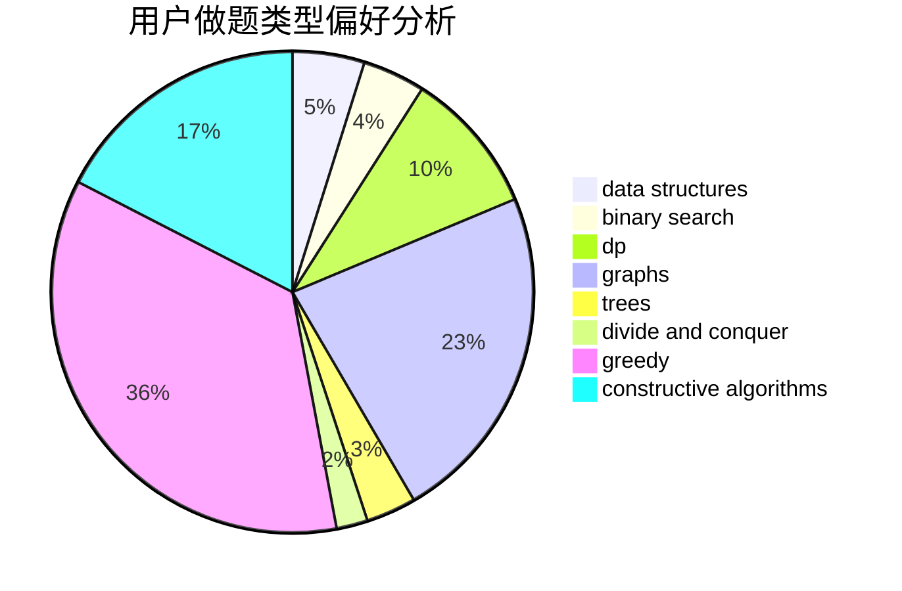
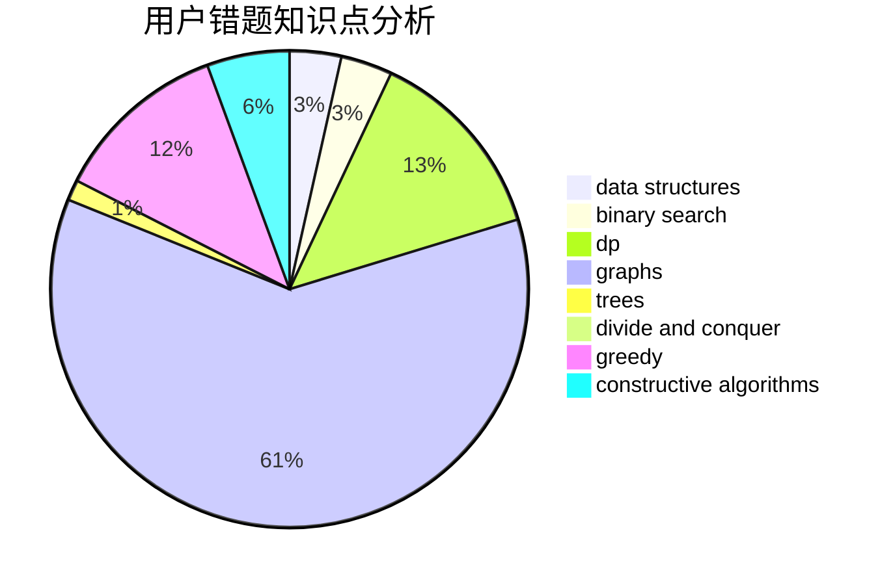

# null73
<!-- tabs:start -->
#### **用户提交结果分析**

#### **用户做题类型偏好分析**

#### **用户错题知识点分析**

<!-- tabs:end -->
# 推荐题目
[Alena And The Heater](http://codeforces.com/problemset/problem/940/D)		binary search,
                        implementation		  
[No Game No Life](http://codeforces.com/problemset/problem/1411/G)		bitmasks,
                        games,
                        math,
                        matrices		  
[Two progressions](http://codeforces.com/problemset/problem/125/D)		constructive algorithms,
                        greedy		  
[Stars Drawing (Hard Edition)](http://codeforces.com/problemset/problem/1015/E2)		binary search,
                        dp,
                        greedy		  
[Special Olympics](http://codeforces.com/problemset/problem/199/B)		geometry		  
[Find Number (1 point)](https://codeforces.com/contest/1164/problem/G)		nan		  
[GCD of Polynomials](https://codeforces.com/contest/902/problem/D)		constructive algorithms,
                        math		  
[Beautiful Decomposition](http://codeforces.com/problemset/problem/279/E)		dp,
                        games,
                        greedy,
                        number theory		  
[Hongcow Draws a Circle](http://codeforces.com/problemset/problem/744/D)		geometry		  
[Lipshitz Sequence](http://codeforces.com/problemset/problem/601/B)		data structures,
                        math		  
<!-- tabs:start -->
#### **data structures**
[Alena And The Heater](http://codeforces.com/problemset/problem/601/B)		data structures,
                        math		  
[No Game No Life](https://codeforces.com/contest/1150/problem/E)		data structures,
                        implementation,
                        trees		  
[Two progressions](http://codeforces.com/problemset/problem/258/E)		data structures,
                        dfs and similar,
                        trees		  
[Stars Drawing (Hard Edition)](http://codeforces.com/problemset/problem/138/C)		binary search,
                        data structures,
                        probabilities,
                        sortings		  
[Special Olympics](http://codeforces.com/problemset/problem/13/E)		data structures,
                        dsu		  
[Find Number (1 point)](http://codeforces.com/problemset/problem/961/E)		data structures		  
[GCD of Polynomials](https://codeforces.com/contest/1440/problem/E)		binary search,
                        data structures,
                        divide and conquer,
                        greedy,
                        implementation		  
[Beautiful Decomposition](http://codeforces.com/problemset/problem/1492/C)		binary search,
                        data structures,
                        dp,
                        greedy,
                        two pointers		  
[Hongcow Draws a Circle](http://codeforces.com/problemset/problem/1490/G)		binary search,
                        data structures,
                        math		  
[Lipshitz Sequence](http://codeforces.com/problemset/problem/1479/D)		binary search,
                        bitmasks,
                        brute force,
                        data structures,
                        probabilities,
                        trees		  
#### **binary search**
[Alena And The Heater](http://codeforces.com/problemset/problem/940/D)		binary search,
                        implementation		  
[No Game No Life](http://codeforces.com/problemset/problem/1015/E2)		binary search,
                        dp,
                        greedy		  
[Two progressions](https://codeforces.com/contest/967/problem/D)		binary search,
                        implementation,
                        sortings		  
[Stars Drawing (Hard Edition)](http://codeforces.com/problemset/problem/230/B)		binary search,
                        implementation,
                        math,
                        number theory		  
[Special Olympics](https://codeforces.com/contest/779/problem/D)		binary search,
                        greedy,
                        strings		  
[Find Number (1 point)](http://codeforces.com/problemset/problem/1485/C)		binary search,
                        brute force,
                        math,
                        number theory		  
[GCD of Polynomials](http://codeforces.com/problemset/problem/138/C)		binary search,
                        data structures,
                        probabilities,
                        sortings		  
[Beautiful Decomposition](http://codeforces.com/problemset/problem/1158/A)		binary search,
                        constructive algorithms,
                        greedy,
                        implementation,
                        math,
                        sortings,
                        two pointers		  
[Hongcow Draws a Circle](https://codeforces.com/contest/1440/problem/E)		binary search,
                        data structures,
                        divide and conquer,
                        greedy,
                        implementation		  
[Lipshitz Sequence](http://codeforces.com/problemset/problem/1492/C)		binary search,
                        data structures,
                        dp,
                        greedy,
                        two pointers		  
#### **dp**
[Alena And The Heater](http://codeforces.com/problemset/problem/1015/E2)		binary search,
                        dp,
                        greedy		  
[No Game No Life](http://codeforces.com/problemset/problem/279/E)		dp,
                        games,
                        greedy,
                        number theory		  
[Two progressions](http://codeforces.com/problemset/problem/533/B)		dfs and similar,
                        dp,
                        graphs,
                        strings,
                        trees		  
[Stars Drawing (Hard Edition)](http://codeforces.com/problemset/problem/466/D)		combinatorics,
                        dp		  
[Special Olympics](http://codeforces.com/problemset/problem/773/F)		combinatorics,
                        divide and conquer,
                        dp,
                        fft,
                        math,
                        number theory		  
[Find Number (1 point)](http://codeforces.com/problemset/problem/1492/C)		binary search,
                        data structures,
                        dp,
                        greedy,
                        two pointers		  
[GCD of Polynomials](https://codeforces.com/contest/1457/problem/C)		brute force,
                        dp,
                        implementation		  
[Beautiful Decomposition](http://codeforces.com/problemset/problem/1491/C)		brute force,
                        data structures,
                        dp,
                        greedy,
                        implementation		  
[Hongcow Draws a Circle](http://codeforces.com/problemset/problem/1437/C)		dp,
                        flows,
                        graph matchings,
                        greedy,
                        math,
                        sortings		  
[Lipshitz Sequence](http://codeforces.com/problemset/problem/1499/B)		brute force,
                        dp,
                        greedy,
                        implementation		  
#### **graph**
[Alena And The Heater](http://codeforces.com/problemset/problem/533/B)		dfs and similar,
                        dp,
                        graphs,
                        strings,
                        trees		  
[No Game No Life](http://codeforces.com/problemset/problem/1037/D)		dfs and similar,
                        graphs,
                        shortest paths,
                        trees		  
[Two progressions](http://codeforces.com/problemset/problem/387/D)		graph matchings		  
[Stars Drawing (Hard Edition)](http://codeforces.com/problemset/problem/243/B)		graphs,
                        sortings		  
[Special Olympics](http://codeforces.com/problemset/problem/1487/C)		brute force,
                        constructive algorithms,
                        dfs and similar,
                        graphs,
                        greedy,
                        implementation,
                        math		  
[Find Number (1 point)](http://codeforces.com/problemset/problem/1437/C)		dp,
                        flows,
                        graph matchings,
                        greedy,
                        math,
                        sortings		  
[GCD of Polynomials](http://codeforces.com/problemset/problem/1470/D)		constructive algorithms,
                        dfs and similar,
                        graph matchings,
                        graphs,
                        greedy		  
[Beautiful Decomposition](http://codeforces.com/problemset/problem/1476/C)		dp,
                        graphs,
                        greedy		  
[Hongcow Draws a Circle](http://codeforces.com/problemset/problem/1304/D)		constructive algorithms,
                        graphs,
                        greedy,
                        two pointers		  
[Lipshitz Sequence](http://codeforces.com/problemset/problem/1475/C)		combinatorics,
                        graphs,
                        math		  
#### **trees**
[Alena And The Heater](http://codeforces.com/problemset/problem/533/B)		dfs and similar,
                        dp,
                        graphs,
                        strings,
                        trees		  
[No Game No Life](http://codeforces.com/problemset/problem/1037/D)		dfs and similar,
                        graphs,
                        shortest paths,
                        trees		  
[Two progressions](https://codeforces.com/contest/1150/problem/E)		data structures,
                        implementation,
                        trees		  
[Stars Drawing (Hard Edition)](http://codeforces.com/problemset/problem/258/E)		data structures,
                        dfs and similar,
                        trees		  
[Special Olympics](https://codeforces.com/contest/1247/problem/F)		constructive algorithms,
                        greedy,
                        trees		  
[Find Number (1 point)](http://codeforces.com/problemset/problem/1479/D)		binary search,
                        bitmasks,
                        brute force,
                        data structures,
                        probabilities,
                        trees		  
[GCD of Polynomials](http://codeforces.com/problemset/problem/1511/C)		brute force,
                        data structures,
                        implementation,
                        trees		  
[Beautiful Decomposition](http://codeforces.com/problemset/problem/1499/F)		combinatorics,
                        dfs and similar,
                        dp,
                        trees		  
[Hongcow Draws a Circle](http://codeforces.com/problemset/problem/1491/E)		brute force,
                        dfs and similar,
                        divide and conquer,
                        number theory,
                        trees		  
[Lipshitz Sequence](http://codeforces.com/problemset/problem/1466/D)		data structures,
                        greedy,
                        sortings,
                        trees		  
#### **divide and conquer**
[Alena And The Heater](http://codeforces.com/problemset/problem/773/F)		combinatorics,
                        divide and conquer,
                        dp,
                        fft,
                        math,
                        number theory		  
[No Game No Life](https://codeforces.com/contest/1440/problem/E)		binary search,
                        data structures,
                        divide and conquer,
                        greedy,
                        implementation		  
[Two progressions](http://codeforces.com/problemset/problem/1461/D)		binary search,
                        brute force,
                        data structures,
                        divide and conquer,
                        implementation,
                        sortings		  
[Stars Drawing (Hard Edition)](http://codeforces.com/problemset/problem/1466/G)		combinatorics,
                        divide and conquer,
                        hashing,
                        math,
                        string suffix structures,
                        strings		  
[Special Olympics](http://codeforces.com/problemset/problem/1490/D)		dfs and similar,
                        divide and conquer,
                        implementation		  
[Find Number (1 point)](https://codeforces.com/contest/1483/problem/C)		data structures,
                        divide and conquer,
                        dp		  
[GCD of Polynomials](http://codeforces.com/problemset/problem/1491/E)		brute force,
                        dfs and similar,
                        divide and conquer,
                        number theory,
                        trees		  
[Beautiful Decomposition](http://codeforces.com/problemset/problem/1303/G)		data structures,
                        divide and conquer,
                        geometry,
                        trees		  
[Hongcow Draws a Circle](http://codeforces.com/problemset/problem/1494/D)		constructive algorithms,
                        data structures,
                        dfs and similar,
                        divide and conquer,
                        dsu,
                        greedy,
                        sortings,
                        trees		  
[Lipshitz Sequence](http://codeforces.com/problemset/problem/1482/E)		data structures,
                        divide and conquer,
                        dp		  
#### **greedy**
[Alena And The Heater](http://codeforces.com/problemset/problem/125/D)		constructive algorithms,
                        greedy		  
[No Game No Life](http://codeforces.com/problemset/problem/1015/E2)		binary search,
                        dp,
                        greedy		  
[Two progressions](http://codeforces.com/problemset/problem/279/E)		dp,
                        games,
                        greedy,
                        number theory		  
[Stars Drawing (Hard Edition)](http://codeforces.com/problemset/problem/4/B)		constructive algorithms,
                        greedy		  
[Special Olympics](http://codeforces.com/problemset/problem/142/B)		constructive algorithms,
                        greedy,
                        implementation		  
[Find Number (1 point)](http://codeforces.com/problemset/problem/1144/D)		constructive algorithms,
                        greedy		  
[GCD of Polynomials](https://codeforces.com/contest/299/problem/C)		games,
                        greedy		  
[Beautiful Decomposition](https://codeforces.com/contest/779/problem/D)		binary search,
                        greedy,
                        strings		  
[Hongcow Draws a Circle](http://codeforces.com/problemset/problem/1307/B)		geometry,
                        greedy,
                        math		  
[Lipshitz Sequence](http://codeforces.com/problemset/problem/1055/D)		greedy,
                        implementation,
                        strings		  
#### **constructive algorithms**
[Alena And The Heater](http://codeforces.com/problemset/problem/125/D)		constructive algorithms,
                        greedy		  
[No Game No Life](https://codeforces.com/contest/902/problem/D)		constructive algorithms,
                        math		  
[Two progressions](http://codeforces.com/problemset/problem/4/B)		constructive algorithms,
                        greedy		  
[Stars Drawing (Hard Edition)](http://codeforces.com/problemset/problem/675/B)		brute force,
                        constructive algorithms,
                        math		  
[Special Olympics](http://codeforces.com/problemset/problem/142/B)		constructive algorithms,
                        greedy,
                        implementation		  
[Find Number (1 point)](http://codeforces.com/problemset/problem/1144/D)		constructive algorithms,
                        greedy		  
[GCD of Polynomials](http://codeforces.com/problemset/problem/1205/F)		constructive algorithms,
                        math		  
[Beautiful Decomposition](https://codeforces.com/contest/1247/problem/F)		constructive algorithms,
                        greedy,
                        trees		  
[Hongcow Draws a Circle](http://codeforces.com/problemset/problem/1158/A)		binary search,
                        constructive algorithms,
                        greedy,
                        implementation,
                        math,
                        sortings,
                        two pointers		  
[Lipshitz Sequence](http://codeforces.com/problemset/problem/1493/A)		constructive algorithms,
                        greedy		  
#### **sortings**
[Alena And The Heater](https://codeforces.com/contest/967/problem/D)		binary search,
                        implementation,
                        sortings		  
[No Game No Life](http://codeforces.com/problemset/problem/551/A)		brute force,
                        implementation,
                        sortings		  
[Two progressions](http://codeforces.com/problemset/problem/243/B)		graphs,
                        sortings		  
[Stars Drawing (Hard Edition)](http://codeforces.com/problemset/problem/138/C)		binary search,
                        data structures,
                        probabilities,
                        sortings		  
[Special Olympics](http://codeforces.com/problemset/problem/1158/A)		binary search,
                        constructive algorithms,
                        greedy,
                        implementation,
                        math,
                        sortings,
                        two pointers		  
[Find Number (1 point)](https://codeforces.com/contest/1496/problem/C)		geometry,
                        greedy,
                        math,
                        sortings		  
[GCD of Polynomials](http://codeforces.com/problemset/problem/1495/A)		geometry,
                        greedy,
                        math,
                        sortings		  
[Beautiful Decomposition](http://codeforces.com/problemset/problem/1497/A)		brute force,
                        data structures,
                        greedy,
                        sortings		  
[Hongcow Draws a Circle](http://codeforces.com/problemset/problem/1427/A)		math,
                        sortings		  
[Lipshitz Sequence](http://codeforces.com/problemset/problem/1461/D)		binary search,
                        brute force,
                        data structures,
                        divide and conquer,
                        implementation,
                        sortings		  
<!-- tabs:end -->
