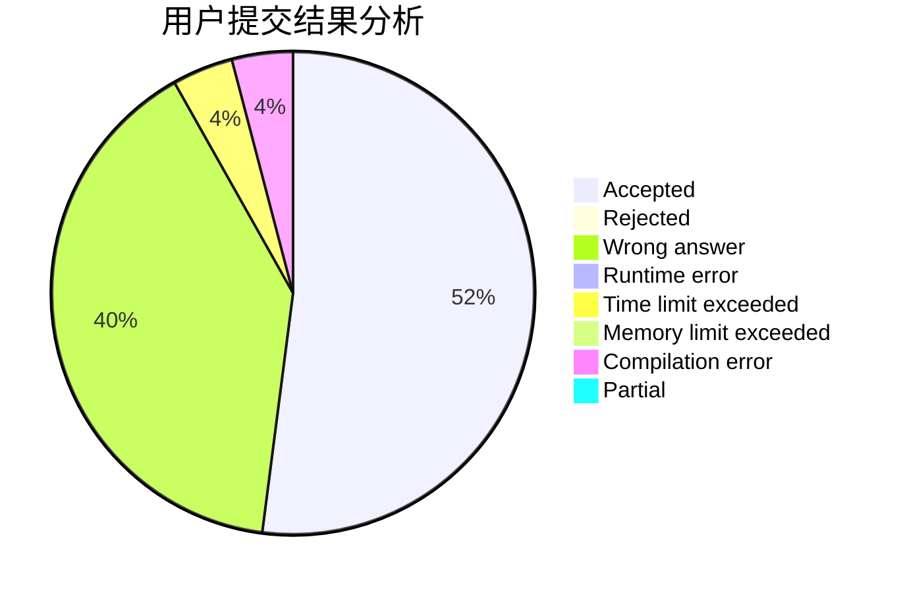
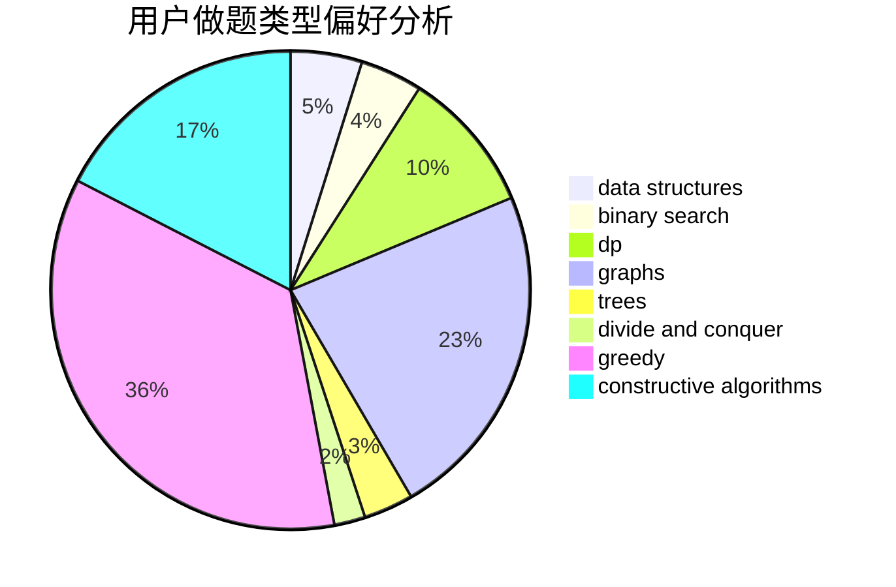
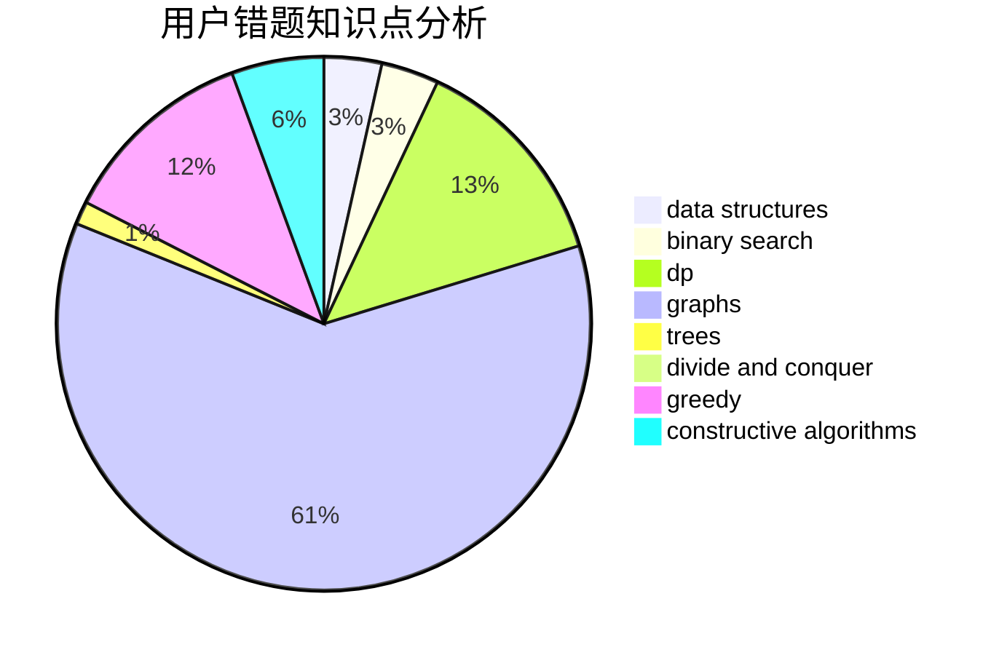

# null73

<!-- tabs:start -->

#### **用户提交结果分析**

#### **用户做题类型偏好分析**

#### **用户错题知识点分析**

<!-- tabs:end -->
# 推荐题目
[125D](https://codeforces.com/contest/125/problem/D)		constructive algorithms,
                        greedy		  
[940D](https://codeforces.com/contest/940/problem/D)		binary search,
                        implementation		  
[1015E2](https://codeforces.com/contest/1015E/problem/2)		binary search,
                        dp,
                        greedy		  
[551A](https://codeforces.com/contest/551/problem/A)		brute force,
                        implementation,
                        sortings		  
[1144D](https://codeforces.com/contest/1144/problem/D)		constructive algorithms,
                        greedy		  
[1037D](https://codeforces.com/contest/1037/problem/D)		dfs and similar,
                        graphs,
                        shortest paths,
                        trees		  
[466D](https://codeforces.com/contest/466/problem/D)		combinatorics,
                        dp		  
[744D](https://codeforces.com/contest/744/problem/D)		geometry		  
[931C](https://codeforces.com/contest/931/problem/C)		implementation,
                        math		  
[533B](https://codeforces.com/contest/533/problem/B)		dfs and similar,
                        dp,
                        graphs,
                        strings,
                        trees		  
