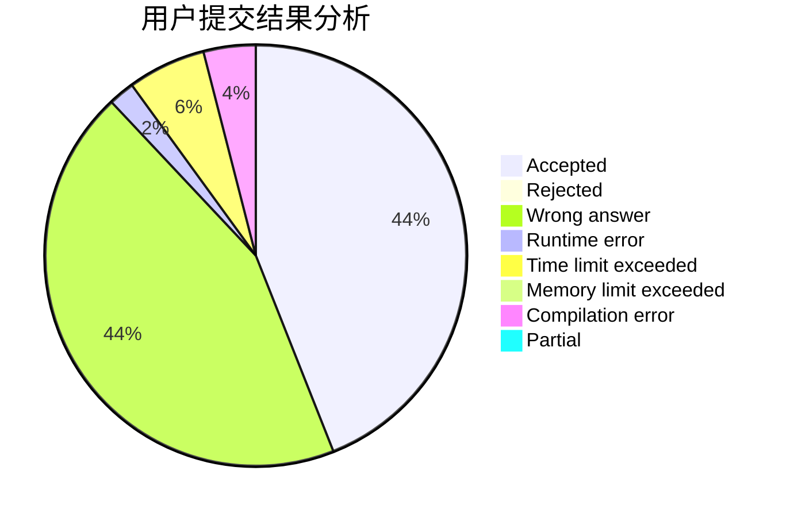
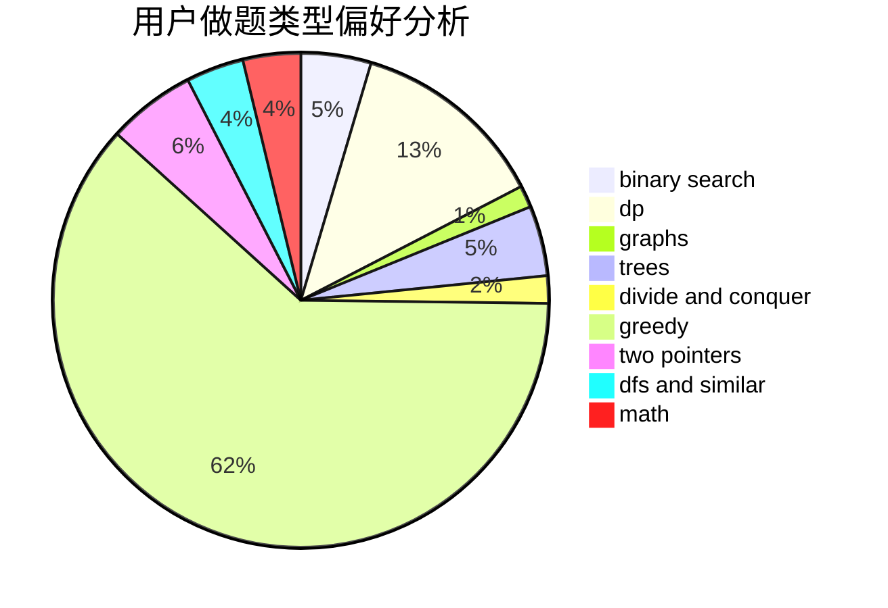

# nullccxsy

<!-- tabs:start -->

#### **用户提交结果分析**

#### **用户做题类型偏好分析**

<!-- tabs:end -->
# 推荐题目
[1394A](https://codeforces.com/contest/1394/problem/A)
[1468N](https://codeforces.com/contest/1468/problem/N)
[1028D](https://codeforces.com/contest/1028/problem/D)
[1345B](https://codeforces.com/contest/1345/problem/B)
[306D](https://codeforces.com/contest/306/problem/D)
[1200B](https://codeforces.com/contest/1200/problem/B)
[14472](https://codeforces.com/contest/1447/problem/2)
[1023C](https://codeforces.com/contest/1023/problem/C)
[360E](https://codeforces.com/contest/360/problem/E)
[12471](https://codeforces.com/contest/1247/problem/1)
