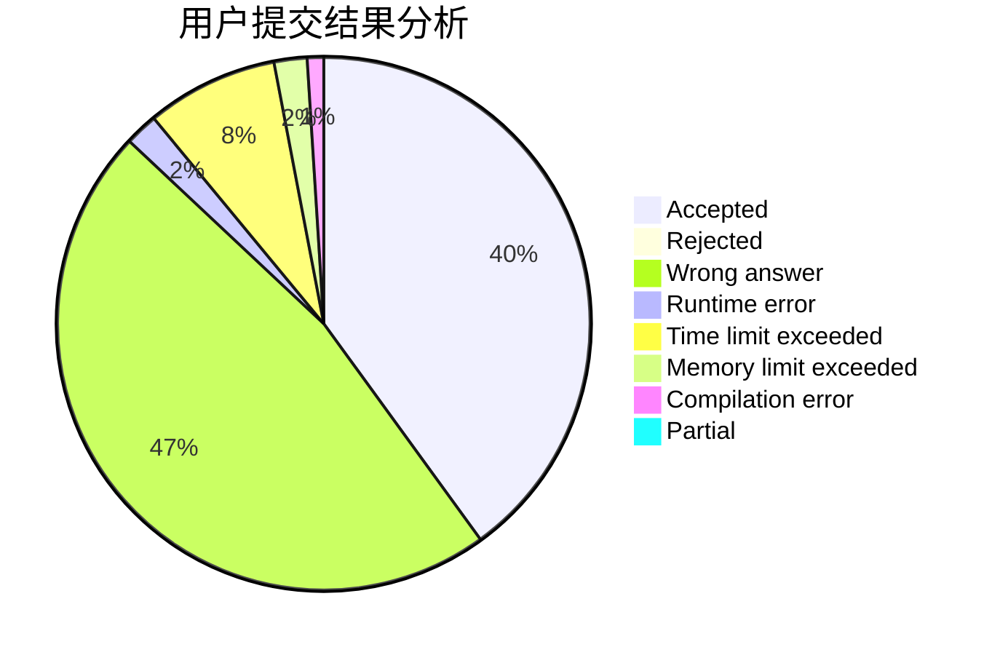
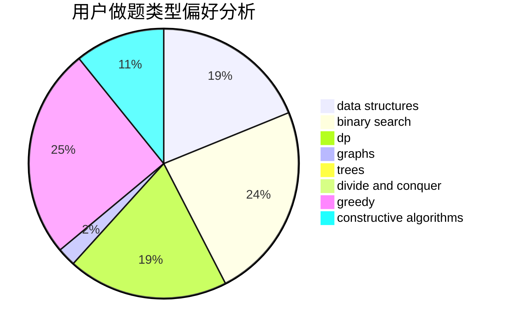
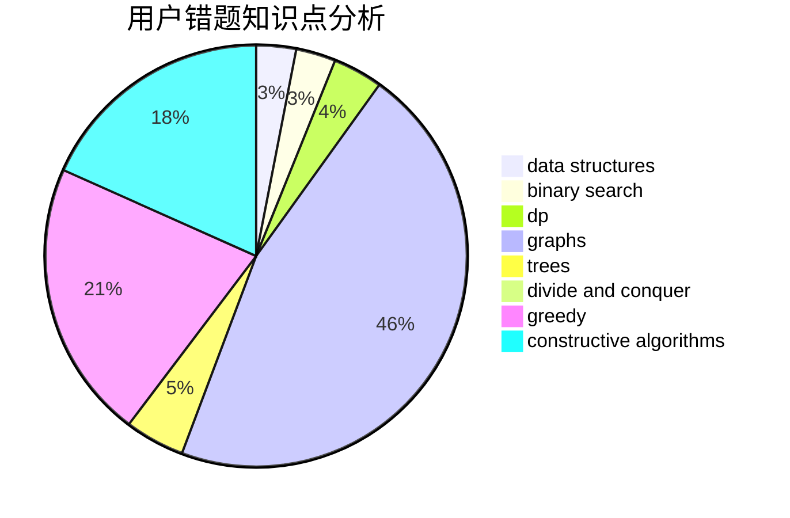

# num73

<!-- tabs:start -->

#### **用户提交结果分析**

#### **用户做题类型偏好分析**

#### **用户错题知识点分析**

<!-- tabs:end -->
# 推荐题目
[900A](https://codeforces.com/contest/900/problem/A)		geometry,
                        implementation		  
[1358F](https://codeforces.com/contest/1358/problem/F)		binary search,
                        constructive algorithms,
                        greedy,
                        implementation		  
[1136C](https://codeforces.com/contest/1136/problem/C)		constructive algorithms,
                        sortings		  
[616B](https://codeforces.com/contest/616/problem/B)		games,
                        greedy		  
[1247E](https://codeforces.com/contest/1247/problem/E)		dsu,graphs,sortings,trees		  
[588A](https://codeforces.com/contest/588/problem/A)		greedy		  
[936D](https://codeforces.com/contest/936/problem/D)		dp,
                        greedy		  
[1195D2](https://codeforces.com/contest/1195D/problem/2)		combinatorics,
                        math,
                        number theory		  
[634A](https://codeforces.com/contest/634/problem/A)		constructive algorithms,
                        implementation		  
[712C](https://codeforces.com/contest/712/problem/C)		greedy,
                        math		  
