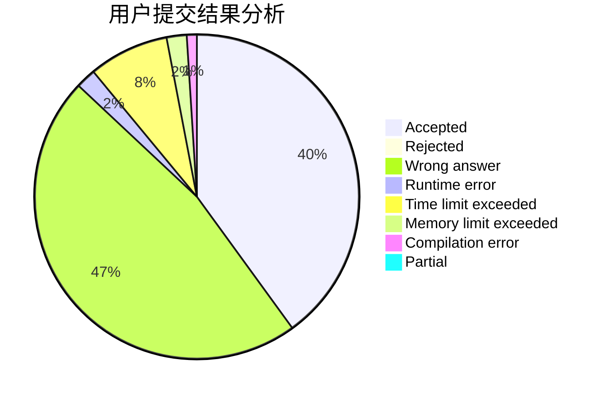
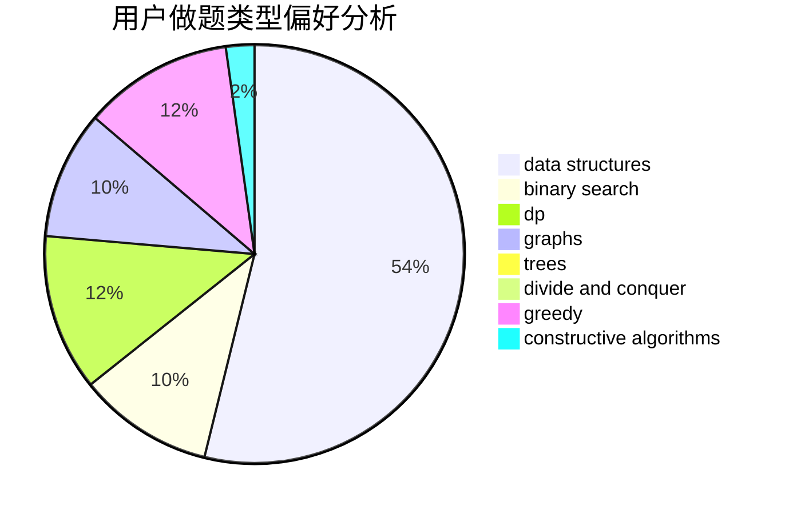
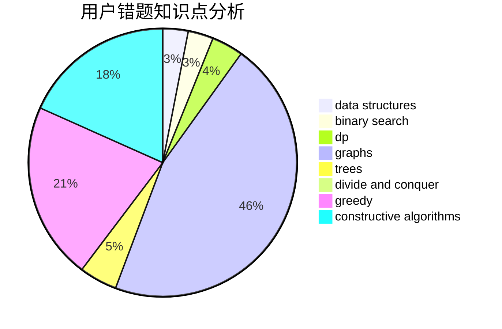

# num73

<!-- tabs:start -->

#### **用户提交结果分析**

#### **用户做题类型偏好分析**

#### **用户错题知识点分析**

<!-- tabs:end -->
# 推荐题目
[916D](https://codeforces.com/contest/916/problem/D)		data structures,
                        interactive,
                        trees		  
[13671](https://codeforces.com/contest/1367/problem/1)		dsu,graphs,sortings,trees		  
[1138E](https://codeforces.com/contest/1138/problem/E)		dsu,graphs,sortings,trees		  
[633G](https://codeforces.com/contest/633/problem/G)		bitmasks,
                        data structures,
                        dfs and similar,
                        math,
                        number theory		  
[1251D](https://codeforces.com/contest/1251/problem/D)		binary search,
                        greedy,
                        sortings		  
[608C](https://codeforces.com/contest/608/problem/C)		dsu,graphs,sortings,trees		  
[9583](https://codeforces.com/contest/958/problem/3)		dsu,graphs,sortings,trees		  
[119A](https://codeforces.com/contest/119/problem/A)		implementation		  
[666D](https://codeforces.com/contest/666/problem/D)		brute force,
                        geometry		  
[731E](https://codeforces.com/contest/731/problem/E)		dp,
                        games		  
