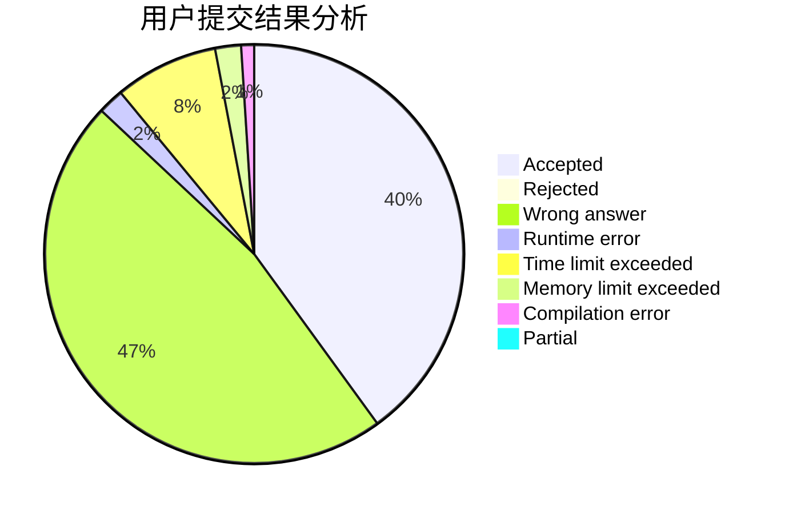
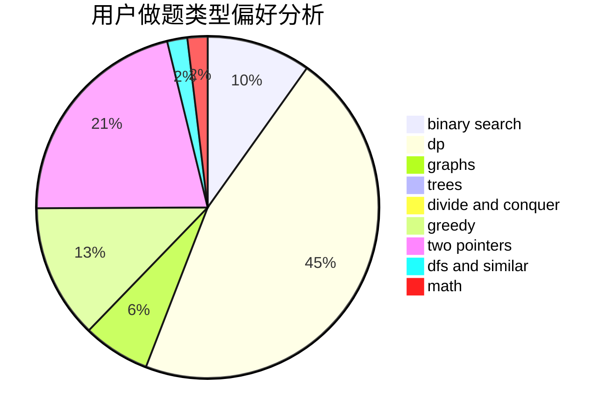

# num73

<!-- tabs:start -->

#### **用户提交结果分析**

#### **用户做题类型偏好分析**

<!-- tabs:end -->
# 推荐题目
[916D](https://codeforces.com/contest/916/problem/D)
[13671](https://codeforces.com/contest/1367/problem/1)
[1138E](https://codeforces.com/contest/1138/problem/E)
[633G](https://codeforces.com/contest/633/problem/G)
[1251D](https://codeforces.com/contest/1251/problem/D)
[608C](https://codeforces.com/contest/608/problem/C)
[9583](https://codeforces.com/contest/958/problem/3)
[119A](https://codeforces.com/contest/119/problem/A)
[666D](https://codeforces.com/contest/666/problem/D)
[731E](https://codeforces.com/contest/731/problem/E)
