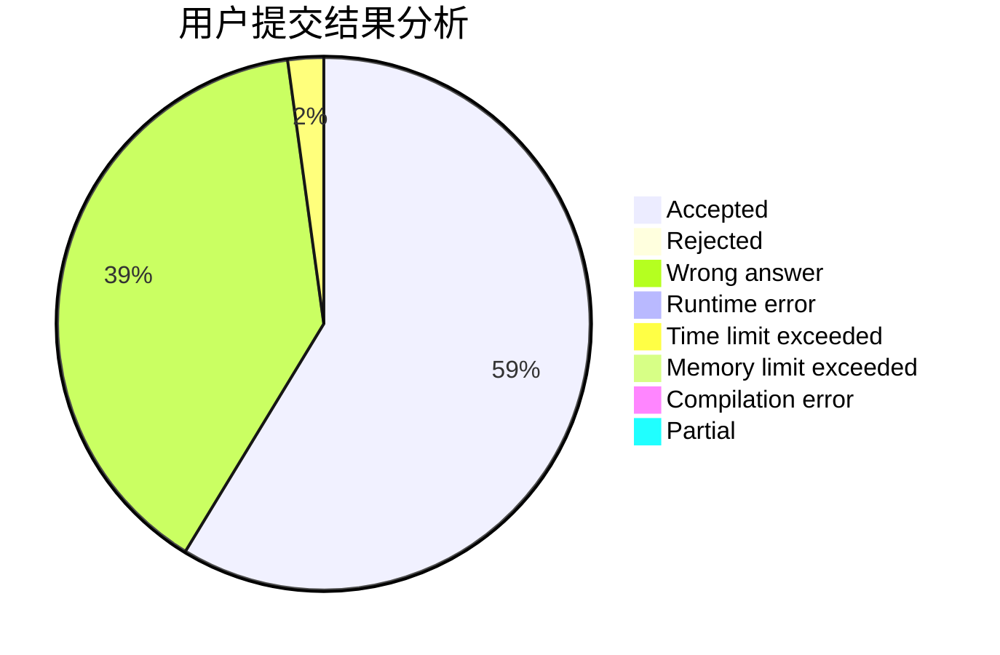
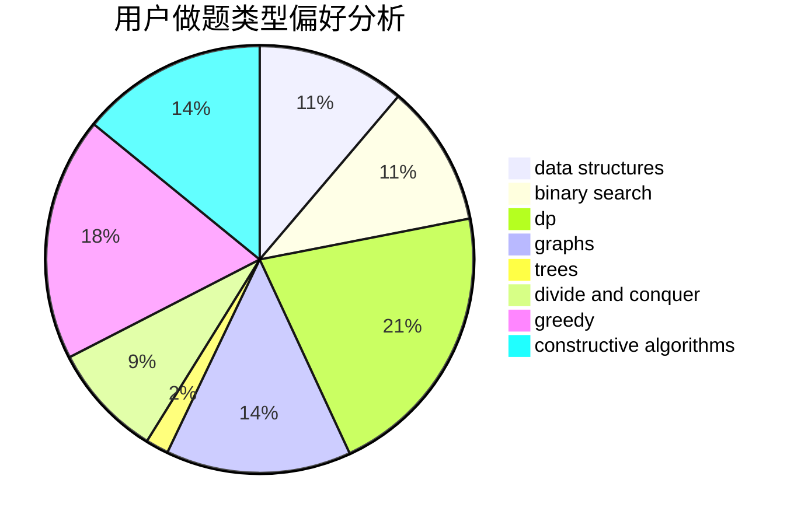

# nxzhoubz

<!-- tabs:start -->

#### **用户提交结果分析**

#### **用户做题类型偏好分析**

#### **用户错题知识点分析**

<!-- tabs:end -->
# 推荐题目
[883I](https://codeforces.com/contest/883/problem/I)		binary search,
                        dp		  
[1211B](https://codeforces.com/contest/1211/problem/B)		*special problem,
                        implementation		  
[551B](https://codeforces.com/contest/551/problem/B)		brute force,
                        constructive algorithms,
                        implementation,
                        strings		  
[108C](https://codeforces.com/contest/108/problem/C)		dsu,graphs,sortings,trees		  
[932C](https://codeforces.com/contest/932/problem/C)		brute force,
                        constructive algorithms		  
[675A](https://codeforces.com/contest/675/problem/A)		math		  
[910A](https://codeforces.com/contest/910/problem/A)		dfs and similar,
                        dp,
                        greedy,
                        implementation		  
[76D](https://codeforces.com/contest/76/problem/D)		dp,
                        greedy,
                        math		  
[449B](https://codeforces.com/contest/449/problem/B)		graphs,
                        greedy,
                        shortest paths		  
[924B](https://codeforces.com/contest/924/problem/B)		binary search,
                        greedy,
                        two pointers		  
