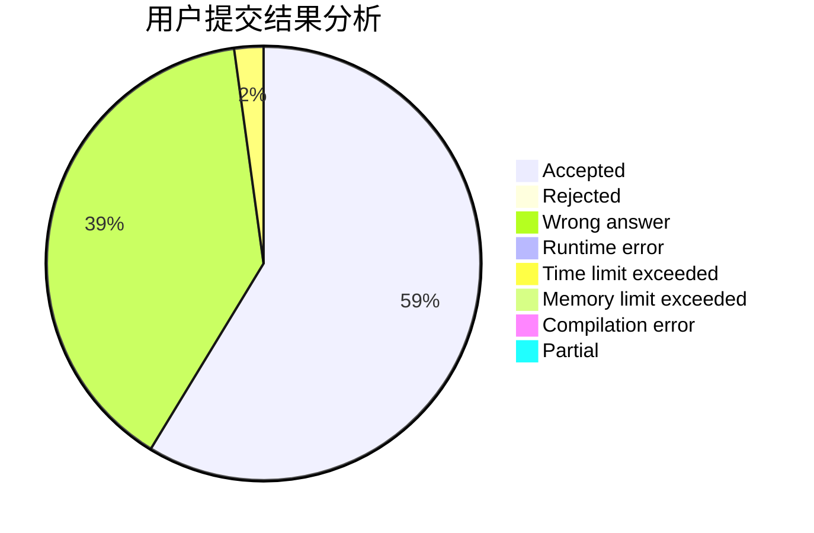
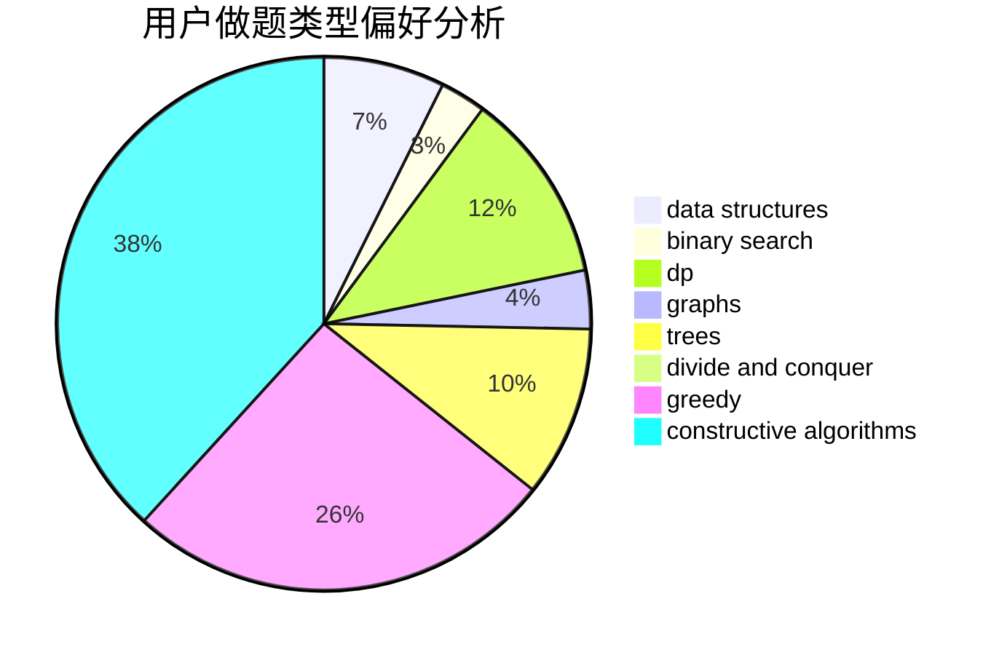

# nxzhoubz

<!-- tabs:start -->

#### **用户提交结果分析**

#### **用户做题类型偏好分析**

#### **用户错题知识点分析**

<!-- tabs:end -->
# 推荐题目
[901C](https://codeforces.com/contest/901/problem/C)		binary search,
                        data structures,
                        dfs and similar,
                        dsu,
                        graphs,
                        two pointers		  
[1217B](https://codeforces.com/contest/1217/problem/B)		greedy,
                        math		  
[576C](https://codeforces.com/contest/576/problem/C)		constructive algorithms,
                        divide and conquer,
                        geometry,
                        greedy,
                        sortings		  
[1090D](https://codeforces.com/contest/1090/problem/D)		constructive algorithms		  
[954C](https://codeforces.com/contest/954/problem/C)		implementation		  
[69A](https://codeforces.com/contest/69/problem/A)		implementation,
                        math		  
[925C](https://codeforces.com/contest/925/problem/C)		constructive algorithms,
                        math		  
[78C](https://codeforces.com/contest/78/problem/C)		dp,
                        games,
                        number theory		  
[468E](https://codeforces.com/contest/468/problem/E)		dp,
                        graph matchings,
                        math,
                        meet-in-the-middle		  
[947E](https://codeforces.com/contest/947/problem/E)		dsu,graphs,sortings,trees		  
