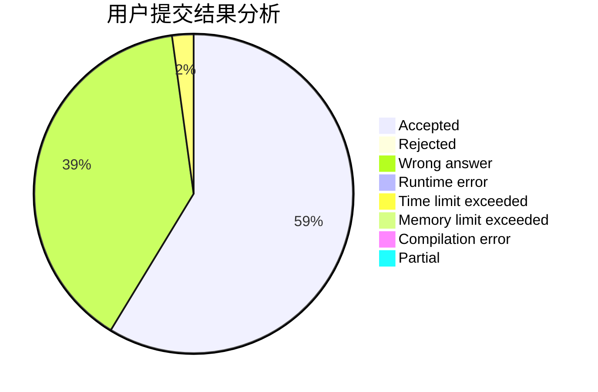
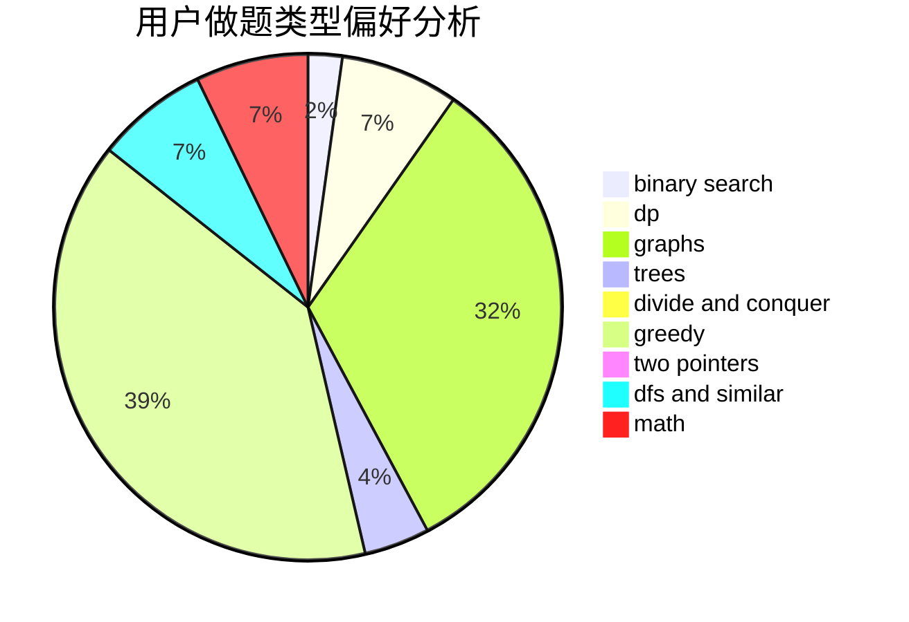

# nxzhoubz

<!-- tabs:start -->

#### **用户提交结果分析**

#### **用户做题类型偏好分析**

<!-- tabs:end -->
# 推荐题目
[901C](https://codeforces.com/contest/901/problem/C)
[1217B](https://codeforces.com/contest/1217/problem/B)
[576C](https://codeforces.com/contest/576/problem/C)
[1090D](https://codeforces.com/contest/1090/problem/D)
[954C](https://codeforces.com/contest/954/problem/C)
[69A](https://codeforces.com/contest/69/problem/A)
[925C](https://codeforces.com/contest/925/problem/C)
[78C](https://codeforces.com/contest/78/problem/C)
[468E](https://codeforces.com/contest/468/problem/E)
[947E](https://codeforces.com/contest/947/problem/E)
