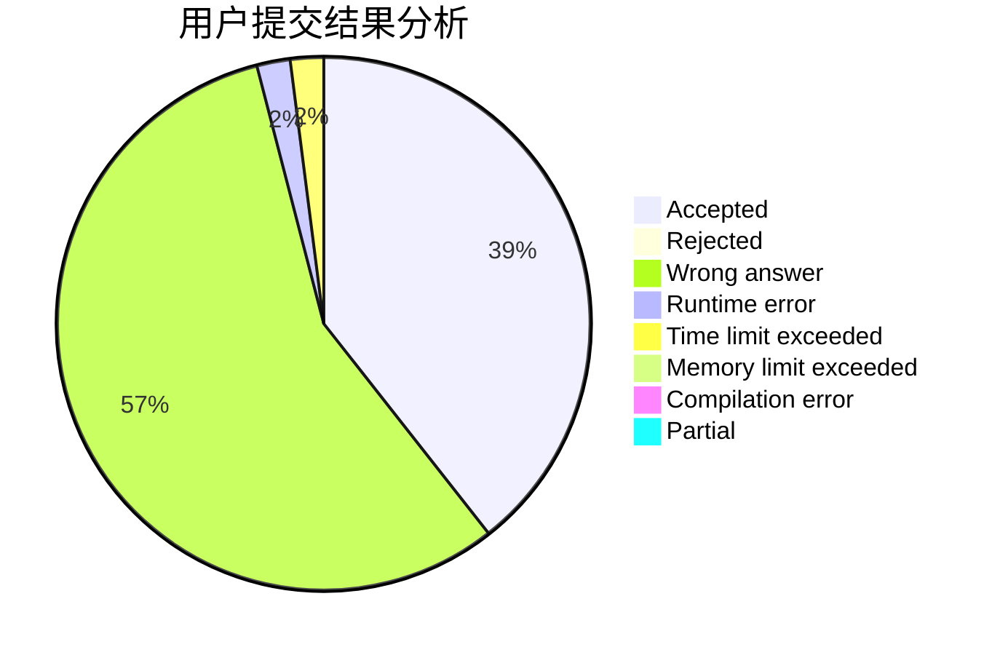
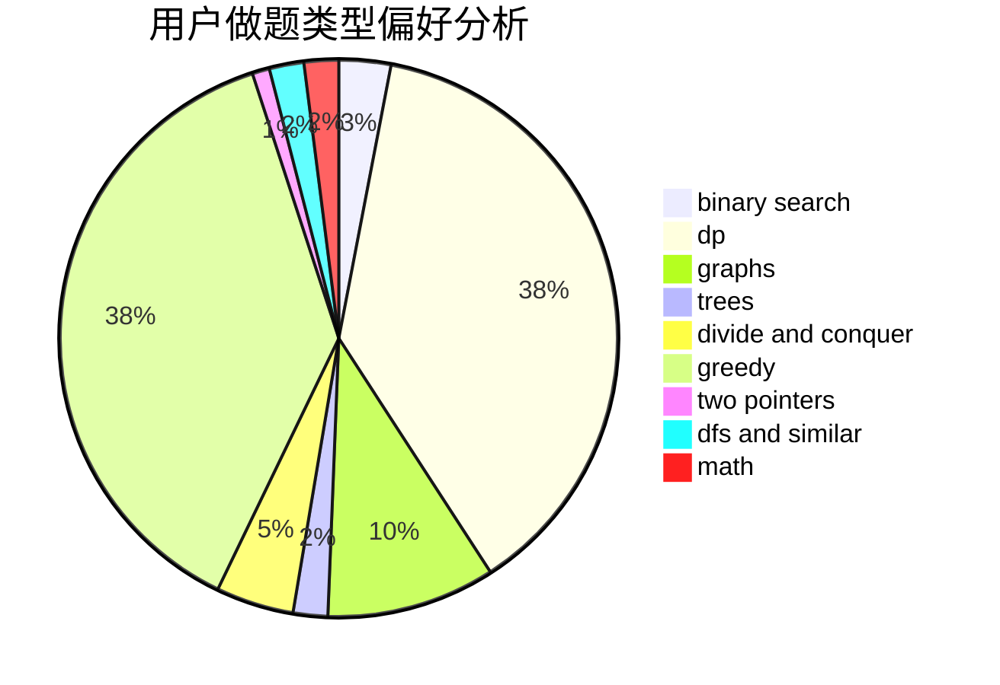

# octopus136

<!-- tabs:start -->

#### **用户提交结果分析**

#### **用户做题类型偏好分析**

<!-- tabs:end -->
# 推荐题目
[906C](https://codeforces.com/contest/906/problem/C)
[1315D](https://codeforces.com/contest/1315/problem/D)
[665C](https://codeforces.com/contest/665/problem/C)
[1030C](https://codeforces.com/contest/1030/problem/C)
[1182F](https://codeforces.com/contest/1182/problem/F)
[11302](https://codeforces.com/contest/1130/problem/2)
[1423C](https://codeforces.com/contest/1423/problem/C)
[1236E](https://codeforces.com/contest/1236/problem/E)
[363B](https://codeforces.com/contest/363/problem/B)
[811A](https://codeforces.com/contest/811/problem/A)
