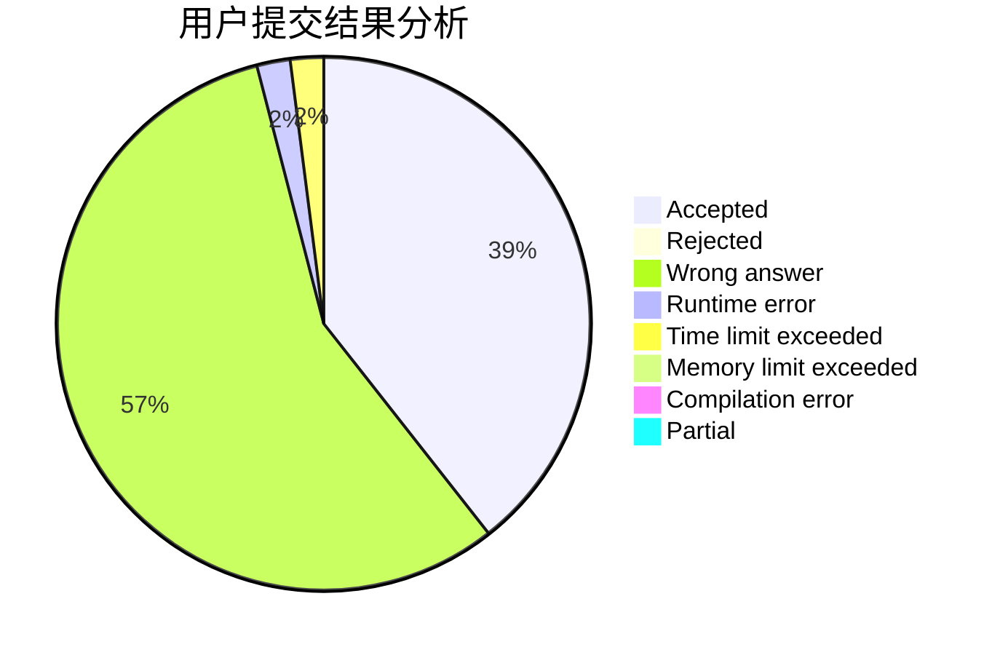
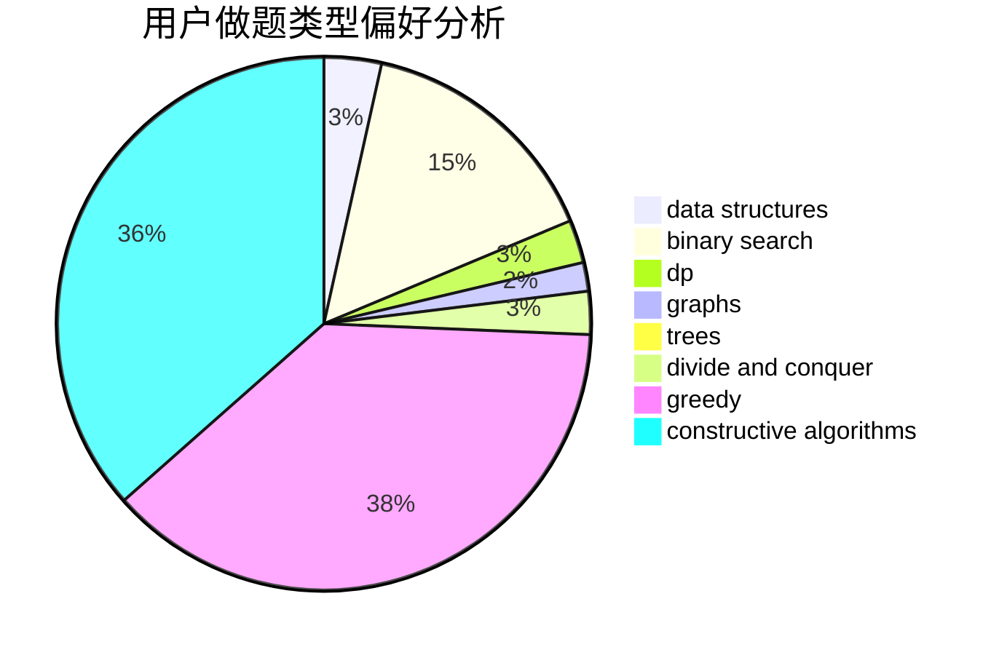

# octopus136

<!-- tabs:start -->

#### **用户提交结果分析**

#### **用户做题类型偏好分析**

#### **用户错题知识点分析**

<!-- tabs:end -->
# 推荐题目
[887B](https://codeforces.com/contest/887/problem/B)		brute force,
                        implementation		  
[1307C](https://codeforces.com/contest/1307/problem/C)		brute force,
                        dp,
                        math,
                        strings		  
[633A](https://codeforces.com/contest/633/problem/A)		brute force,
                        math,
                        number theory		  
[102B](https://codeforces.com/contest/102/problem/B)		implementation		  
[117D](https://codeforces.com/contest/117/problem/D)		divide and conquer,
                        math		  
[1120F](https://codeforces.com/contest/1120/problem/F)		data structures,
                        dp,
                        greedy		  
[1413F](https://codeforces.com/contest/1413/problem/F)		data structures,
                        trees		  
[1227G](https://codeforces.com/contest/1227/problem/G)		constructive algorithms		  
[335F](https://codeforces.com/contest/335/problem/F)		dp,
                        greedy		  
[797B](https://codeforces.com/contest/797/problem/B)		dp,
                        greedy,
                        implementation		  
