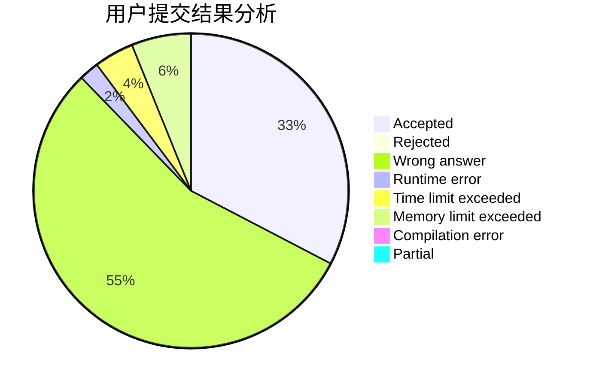
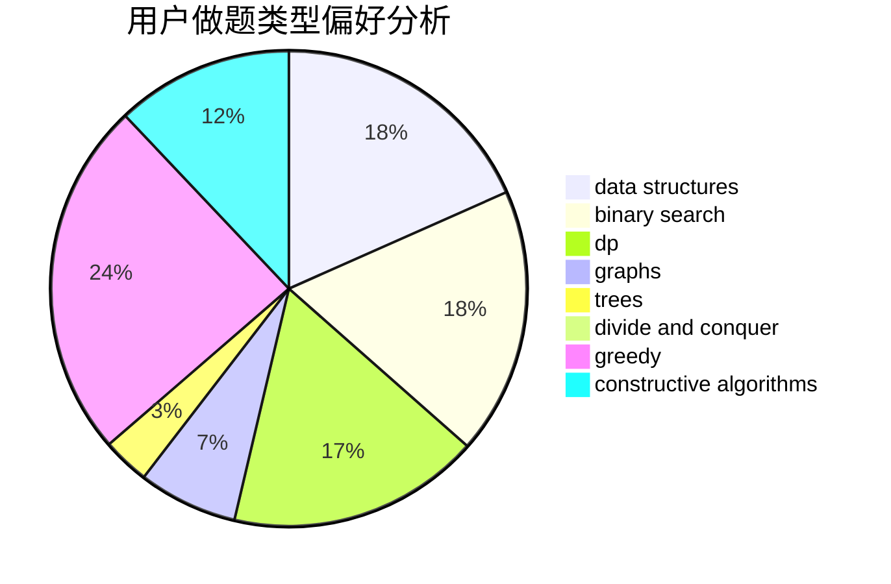
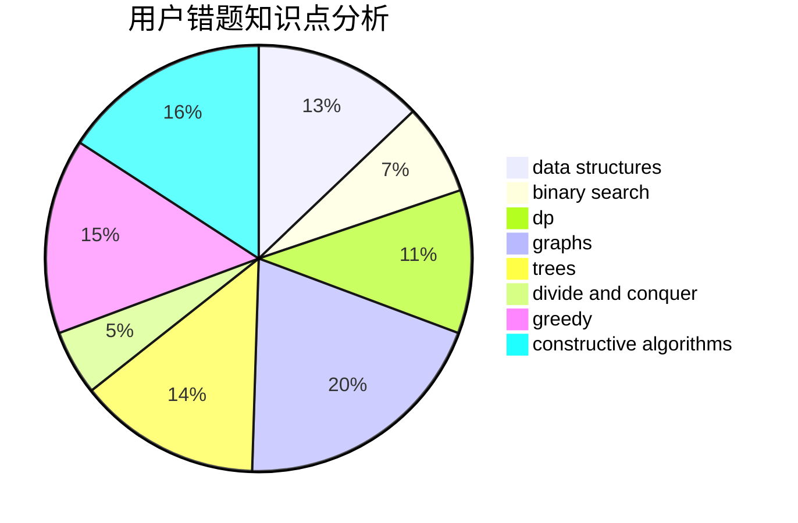

# oier_pb

<!-- tabs:start -->

#### **用户提交结果分析**

#### **用户做题类型偏好分析**

#### **用户错题知识点分析**

<!-- tabs:end -->
# 推荐题目
[1475F](https://codeforces.com/contest/1475/problem/F)		2-sat,
                        brute force,
                        constructive algorithms		  
[1380B](https://codeforces.com/contest/1380/problem/B)		greedy		  
[331C3](https://codeforces.com/contest/331C/problem/3)		dp		  
[1434E](https://codeforces.com/contest/1434/problem/E)		dsu,
                        games		  
[1184E3](https://codeforces.com/contest/1184E/problem/3)		data structures,
                        dsu,
                        graphs,
                        trees		  
[1473F](https://codeforces.com/contest/1473/problem/F)		flows,
                        math		  
[404C](https://codeforces.com/contest/404/problem/C)		dfs and similar,
                        graphs,
                        sortings		  
[430B](https://codeforces.com/contest/430/problem/B)		brute force,
                        two pointers		  
[450B](https://codeforces.com/contest/450/problem/B)		implementation,
                        math		  
[833B](https://codeforces.com/contest/833/problem/B)		binary search,
                        data structures,
                        divide and conquer,
                        dp,
                        two pointers		  
