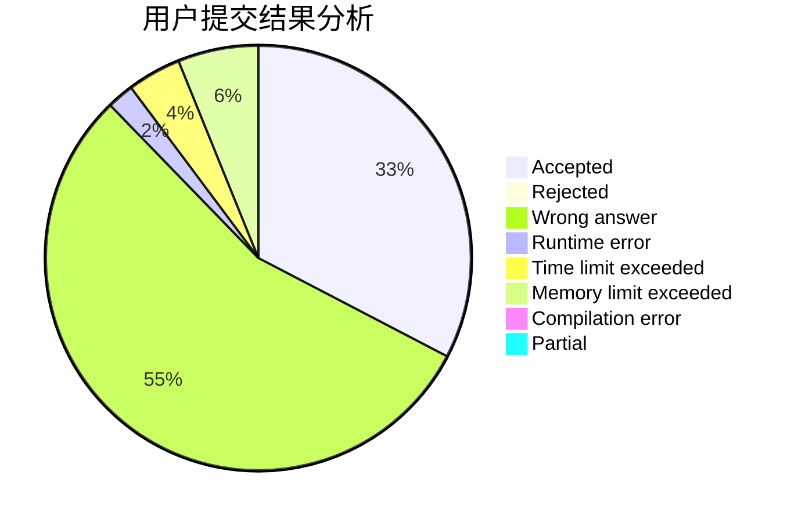
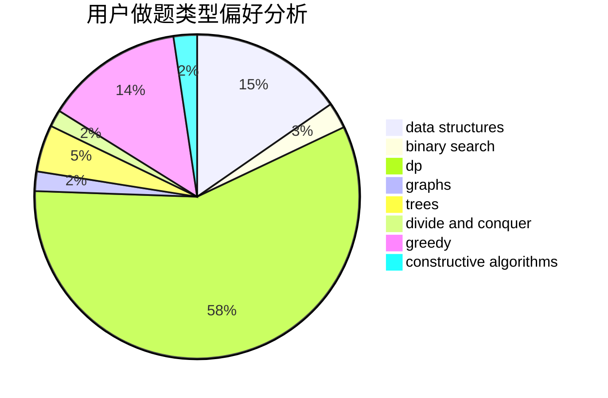
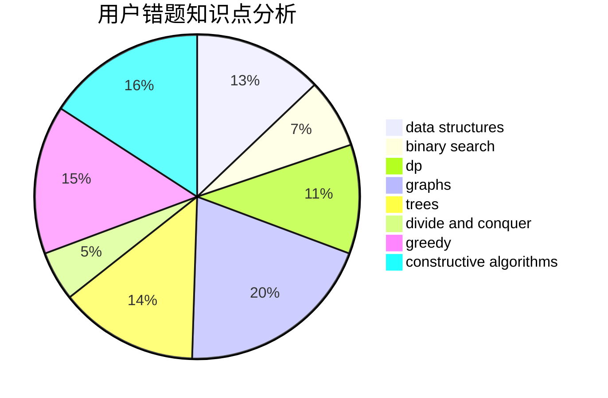

# oier_pb

<!-- tabs:start -->

#### **用户提交结果分析**

#### **用户做题类型偏好分析**

#### **用户错题知识点分析**

<!-- tabs:end -->
# 推荐题目
[1484C](https://codeforces.com/contest/1484/problem/C)		dsu,graphs,sortings,trees		  
[1389E](https://codeforces.com/contest/1389/problem/E)		math,
                        number theory		  
[359C](https://codeforces.com/contest/359/problem/C)		math,
                        number theory		  
[1444E](https://codeforces.com/contest/1444/problem/E)		brute force,
                        dfs and similar,
                        dp,
                        interactive,
                        trees		  
[1188E](https://codeforces.com/contest/1188/problem/E)		combinatorics		  
[1482C](https://codeforces.com/contest/1482/problem/C)		brute force,
                        constructive algorithms,
                        greedy,
                        implementation		  
[433B](https://codeforces.com/contest/433/problem/B)		dp,
                        implementation,
                        sortings		  
[452C](https://codeforces.com/contest/452/problem/C)		combinatorics,
                        math,
                        probabilities		  
[472C](https://codeforces.com/contest/472/problem/C)		greedy		  
[851B](https://codeforces.com/contest/851/problem/B)		geometry,
                        math		  
