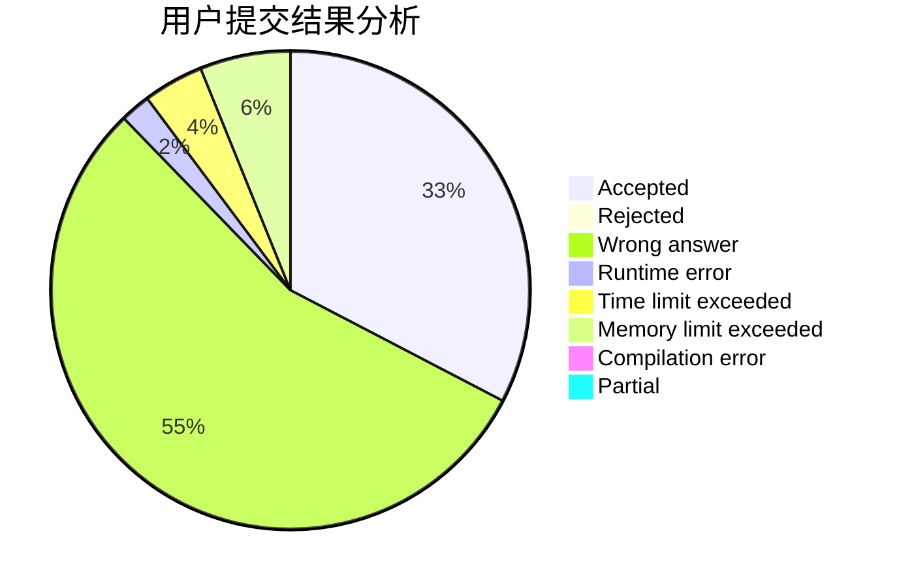
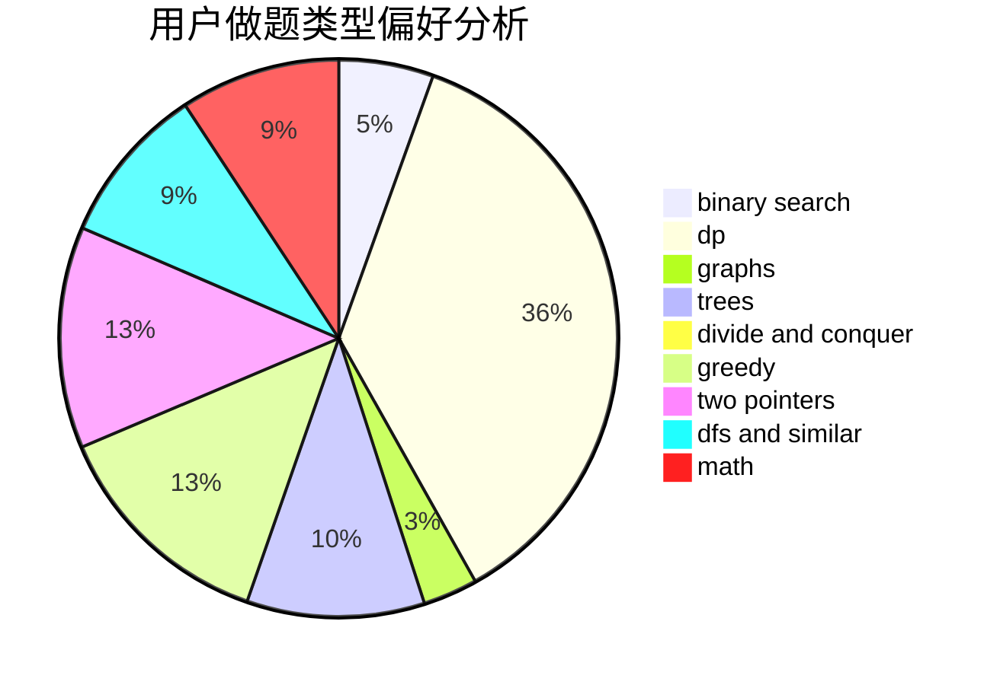

# oier_pb

<!-- tabs:start -->

#### **用户提交结果分析**

#### **用户做题类型偏好分析**

<!-- tabs:end -->
# 推荐题目
[1484C](https://codeforces.com/contest/1484/problem/C)
[1389E](https://codeforces.com/contest/1389/problem/E)
[359C](https://codeforces.com/contest/359/problem/C)
[1444E](https://codeforces.com/contest/1444/problem/E)
[1188E](https://codeforces.com/contest/1188/problem/E)
[1482C](https://codeforces.com/contest/1482/problem/C)
[433B](https://codeforces.com/contest/433/problem/B)
[452C](https://codeforces.com/contest/452/problem/C)
[472C](https://codeforces.com/contest/472/problem/C)
[851B](https://codeforces.com/contest/851/problem/B)
