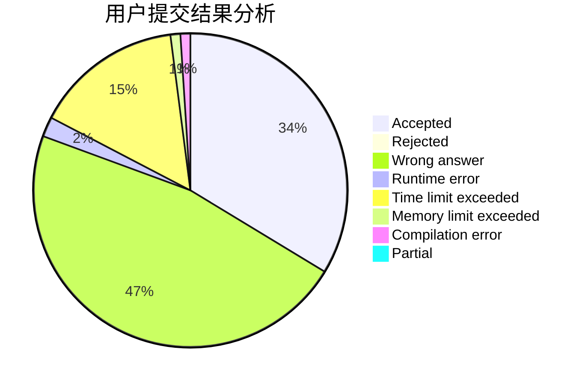
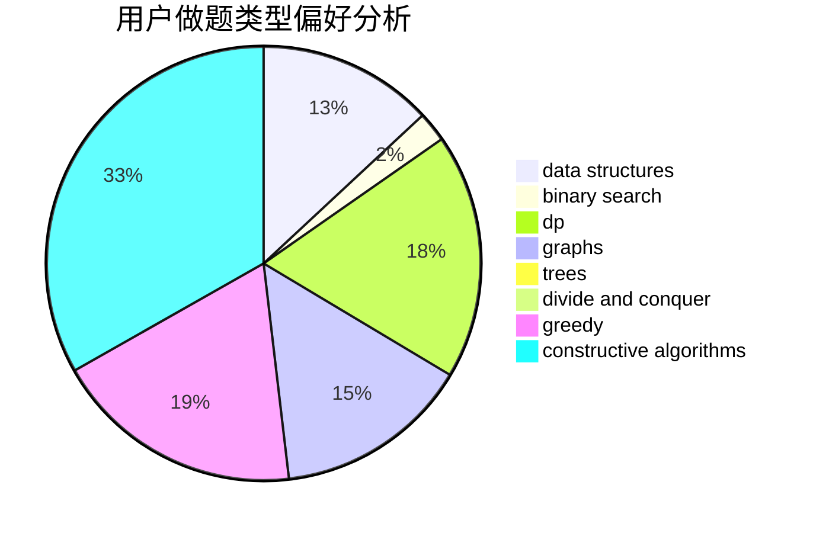
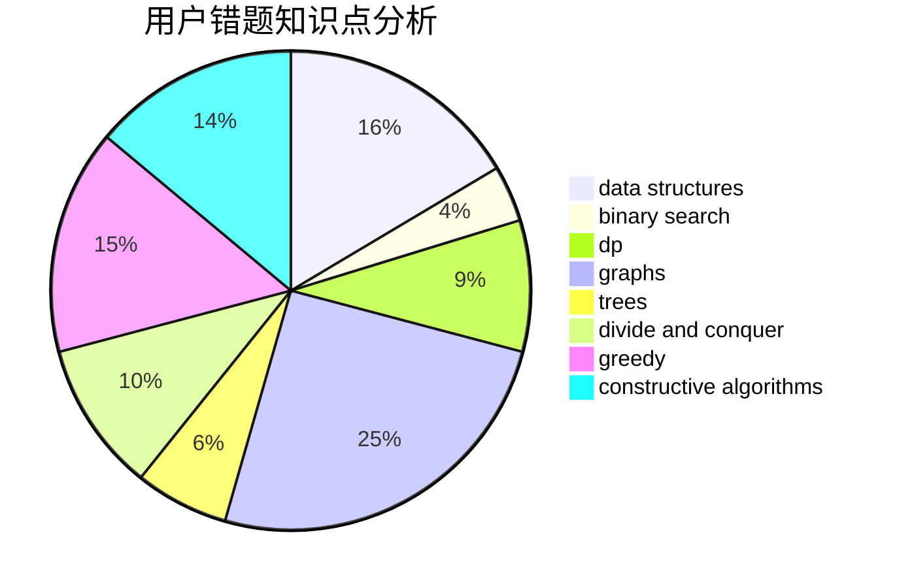

# oiervictor

<!-- tabs:start -->

#### **用户提交结果分析**

#### **用户做题类型偏好分析**

#### **用户错题知识点分析**

<!-- tabs:end -->
# 推荐题目
[708E](https://codeforces.com/contest/708/problem/E)		dp,
                        math		  
[653A](https://codeforces.com/contest/653/problem/A)		brute force,
                        implementation,
                        sortings		  
[268A](https://codeforces.com/contest/268/problem/A)		brute force		  
[1013E](https://codeforces.com/contest/1013/problem/E)		dsu,graphs,sortings,trees		  
[1397E](https://codeforces.com/contest/1397/problem/E)		dsu,graphs,sortings,trees		  
[acmsguru6](https://codeforces.com/contest/acmsguru/problem/6)		dsu,graphs,sortings,trees		  
[614A](https://codeforces.com/contest/614/problem/A)		brute force,
                        implementation		  
[851D](https://codeforces.com/contest/851/problem/D)		dsu,graphs,sortings,trees		  
[212A](https://codeforces.com/contest/212/problem/A)		flows,
                        graphs		  
[471A](https://codeforces.com/contest/471/problem/A)		implementation		  
