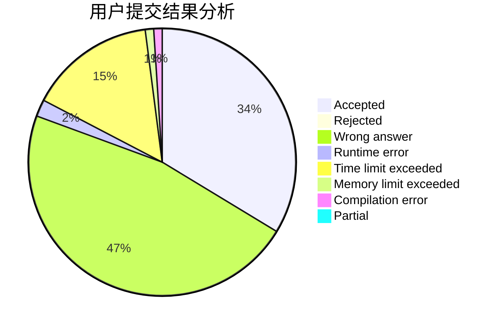
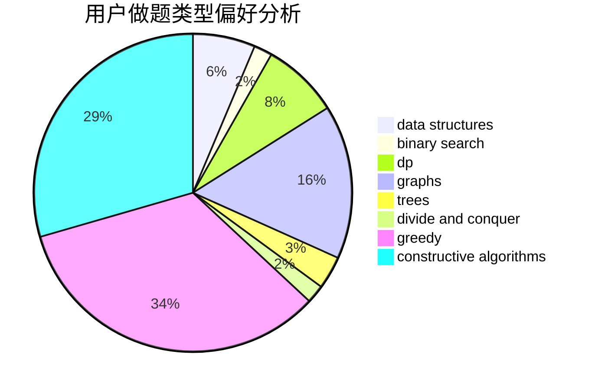
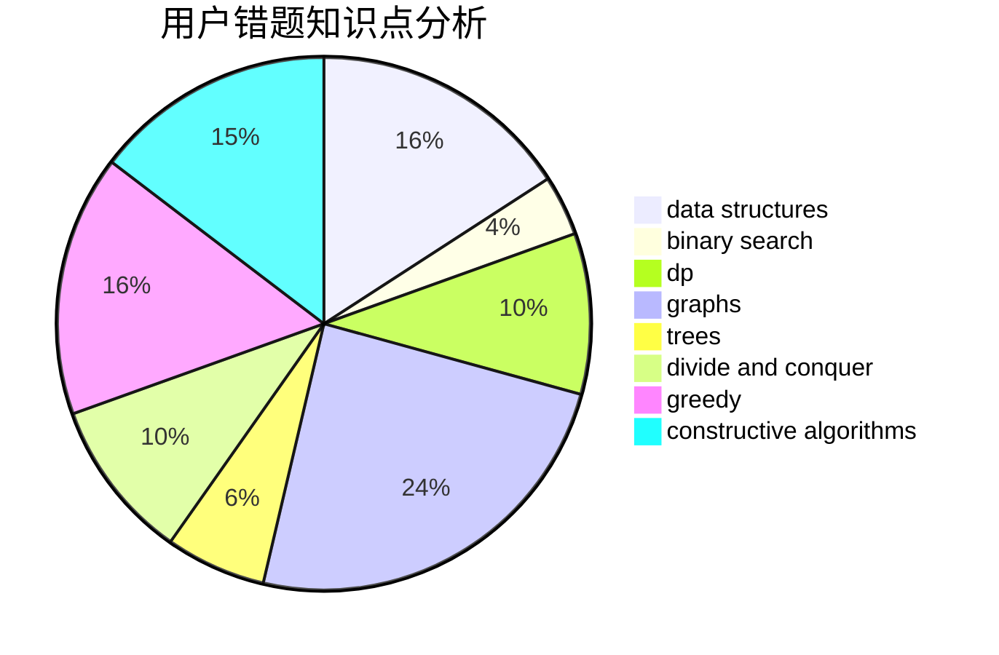

# oiervictor

<!-- tabs:start -->

#### **用户提交结果分析**

#### **用户做题类型偏好分析**

#### **用户错题知识点分析**

<!-- tabs:end -->
# 推荐题目
[687A](https://codeforces.com/contest/687/problem/A)		dfs and similar,
                        graphs		  
[626F](https://codeforces.com/contest/626/problem/F)		dp		  
[246E](https://codeforces.com/contest/246/problem/E)		binary search,
                        data structures,
                        dfs and similar,
                        dp,
                        sortings		  
[1013B](https://codeforces.com/contest/1013/problem/B)		greedy		  
[1388B](https://codeforces.com/contest/1388/problem/B)		greedy,
                        math		  
[986D](https://codeforces.com/contest/986/problem/D)		fft,
                        math		  
[597B](https://codeforces.com/contest/597/problem/B)		dp,
                        greedy,
                        sortings		  
[833D](https://codeforces.com/contest/833/problem/D)		data structures,
                        divide and conquer,
                        implementation,
                        trees		  
[186C](https://codeforces.com/contest/186/problem/C)		dsu,graphs,sortings,trees		  
[44B](https://codeforces.com/contest/44/problem/B)		implementation		  
