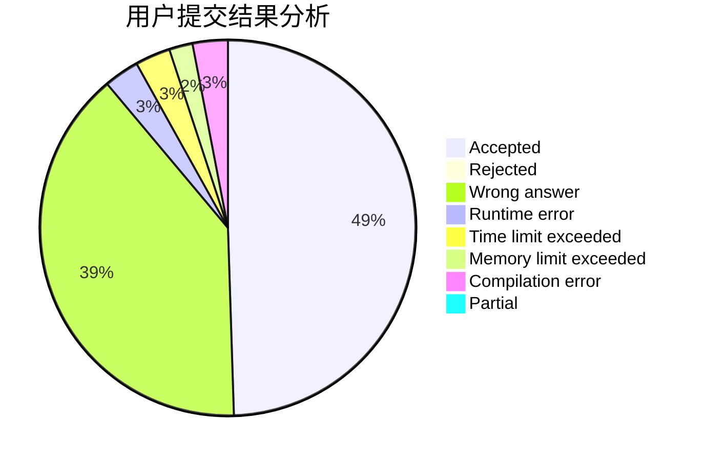
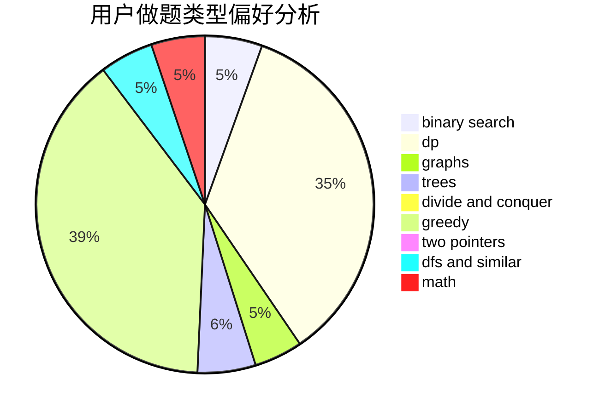

# oisdoaiu

<!-- tabs:start -->

#### **用户提交结果分析**

#### **用户做题类型偏好分析**

<!-- tabs:end -->
# 推荐题目
[185A](https://codeforces.com/contest/185/problem/A)
[449D](https://codeforces.com/contest/449/problem/D)
[1051D](https://codeforces.com/contest/1051/problem/D)
[1187E](https://codeforces.com/contest/1187/problem/E)
[576C](https://codeforces.com/contest/576/problem/C)
[916C](https://codeforces.com/contest/916/problem/C)
[931F](https://codeforces.com/contest/931/problem/F)
[981D](https://codeforces.com/contest/981/problem/D)
[101D](https://codeforces.com/contest/101/problem/D)
[1102F](https://codeforces.com/contest/1102/problem/F)
