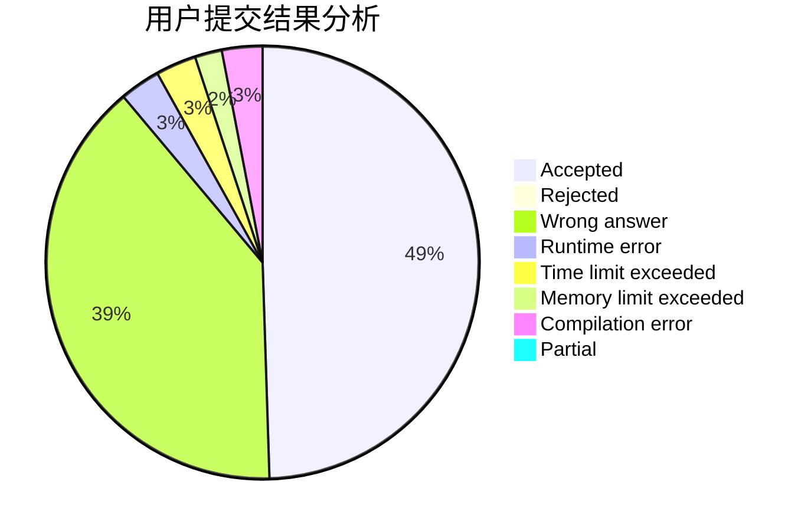
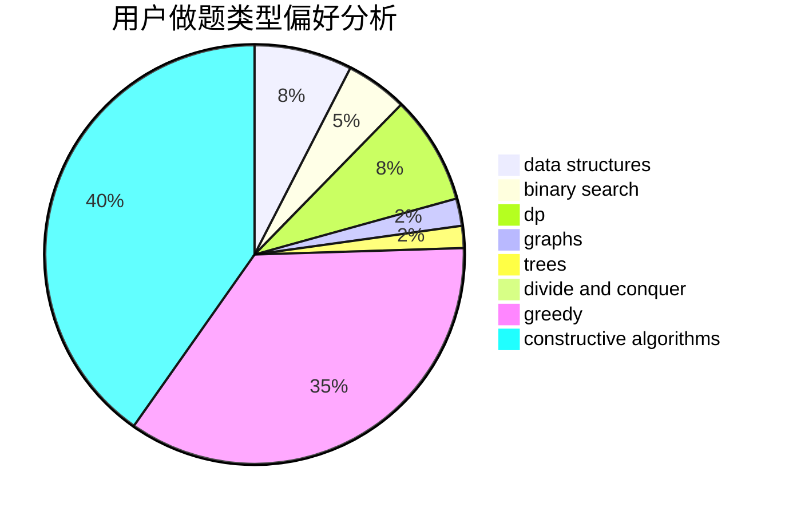
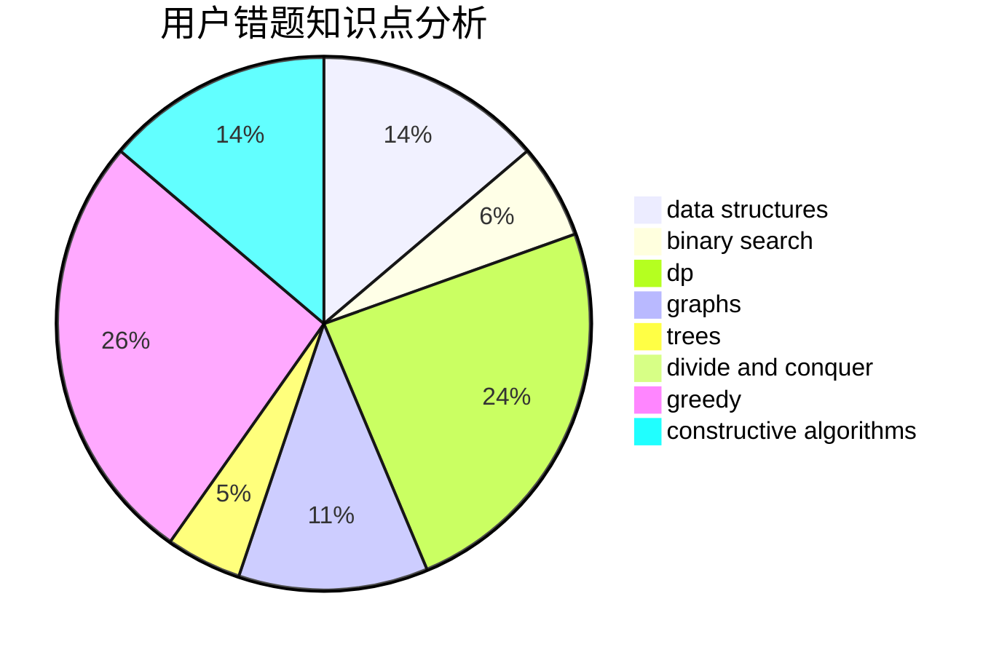

# oisdoaiu

<!-- tabs:start -->

#### **用户提交结果分析**

#### **用户做题类型偏好分析**

#### **用户错题知识点分析**

<!-- tabs:end -->
# 推荐题目
[160B](https://codeforces.com/contest/160/problem/B)		greedy,
                        sortings		  
[426B](https://codeforces.com/contest/426/problem/B)		implementation		  
[1051A](https://codeforces.com/contest/1051/problem/A)		greedy,
                        implementation,
                        strings		  
[1184B2](https://codeforces.com/contest/1184B/problem/2)		flows,
                        graph matchings,
                        graphs,
                        shortest paths,
                        sortings		  
[551B](https://codeforces.com/contest/551/problem/B)		brute force,
                        constructive algorithms,
                        implementation,
                        strings		  
[8E](https://codeforces.com/contest/8/problem/E)		dp,
                        graphs		  
[913B](https://codeforces.com/contest/913/problem/B)		implementation,
                        trees		  
[959F](https://codeforces.com/contest/959/problem/F)		bitmasks,
                        dp,
                        math,
                        matrices		  
[1019D](https://codeforces.com/contest/1019/problem/D)		binary search,
                        geometry,
                        sortings		  
[1102C](https://codeforces.com/contest/1102/problem/C)		games		  
