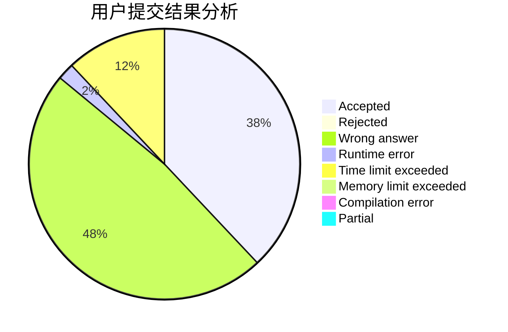
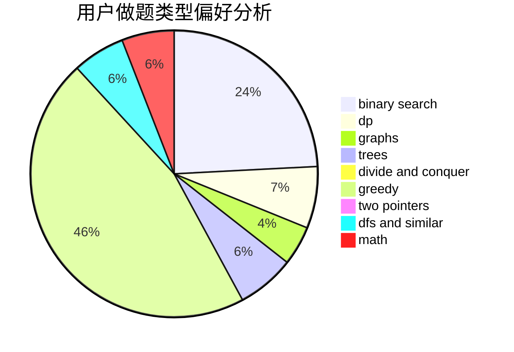

# BuShangGMBuGaiMing

<!-- tabs:start -->

#### **用户提交结果分析**

#### **用户做题类型偏好分析**

<!-- tabs:end -->
# 推荐题目
[1294A](https://codeforces.com/contest/1294/problem/A)
[1457A](https://codeforces.com/contest/1457/problem/A)
[1097G](https://codeforces.com/contest/1097/problem/G)
[58B](https://codeforces.com/contest/58/problem/B)
[3912](https://codeforces.com/contest/391/problem/2)
[1166F](https://codeforces.com/contest/1166/problem/F)
[58E](https://codeforces.com/contest/58/problem/E)
[1302F](https://codeforces.com/contest/1302/problem/F)
[1070H](https://codeforces.com/contest/1070/problem/H)
[383D](https://codeforces.com/contest/383/problem/D)
