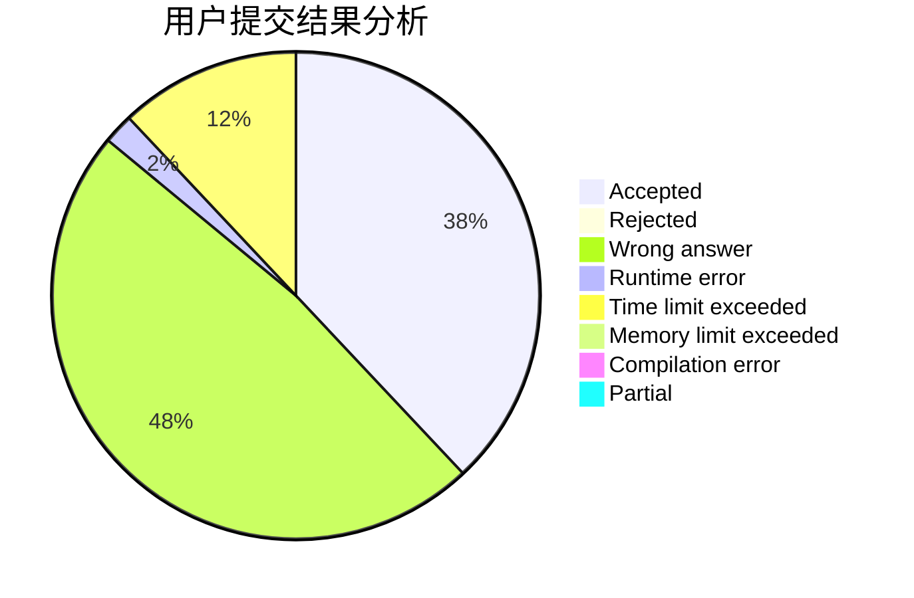
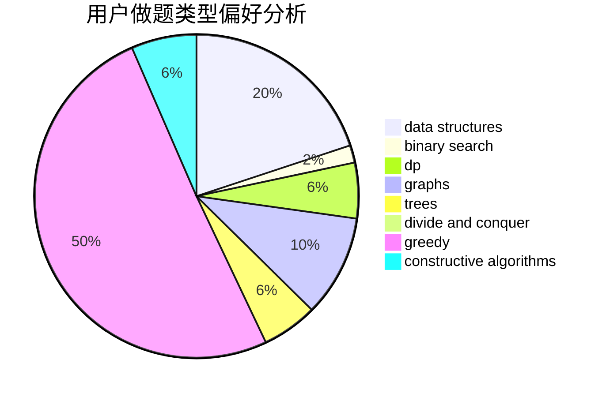
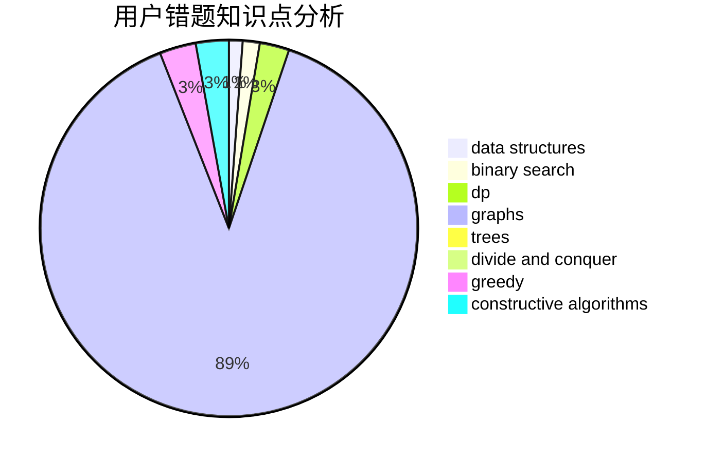

# BuShangGMBuGaiMing

<!-- tabs:start -->

#### **用户提交结果分析**

#### **用户做题类型偏好分析**

#### **用户错题知识点分析**

<!-- tabs:end -->
# 推荐题目
[1286D](https://codeforces.com/contest/1286/problem/D)		data structures,
                        math,
                        matrices,
                        probabilities		  
[1447D](https://codeforces.com/contest/1447/problem/D)		dsu,graphs,sortings,trees		  
[1097D](https://codeforces.com/contest/1097/problem/D)		dp,
                        math,
                        number theory,
                        probabilities		  
[569B](https://codeforces.com/contest/569/problem/B)		greedy,
                        math		  
[364C](https://codeforces.com/contest/364/problem/C)		brute force,
                        number theory		  
[1164P](https://codeforces.com/contest/1164/problem/P)		dsu,graphs,sortings,trees		  
[56B](https://codeforces.com/contest/56/problem/B)		implementation		  
[1295D](https://codeforces.com/contest/1295/problem/D)		math,
                        number theory		  
[1070E](https://codeforces.com/contest/1070/problem/E)		binary search,
                        data structures		  
[358B](https://codeforces.com/contest/358/problem/B)		brute force,
                        strings		  
